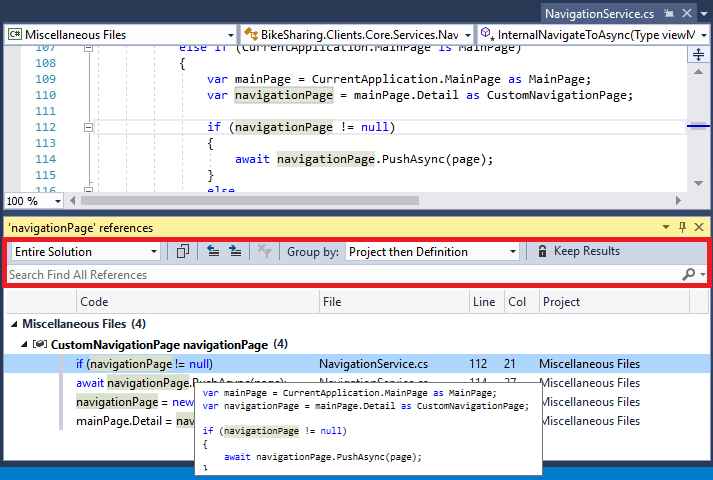
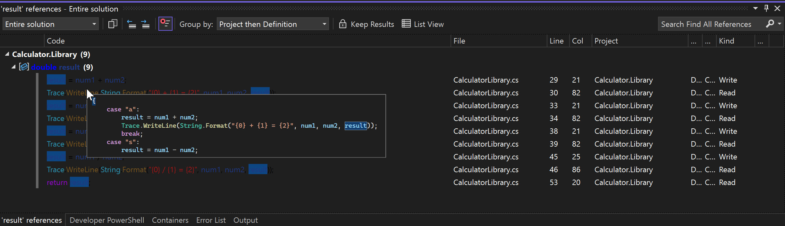
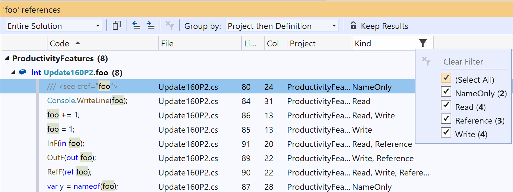
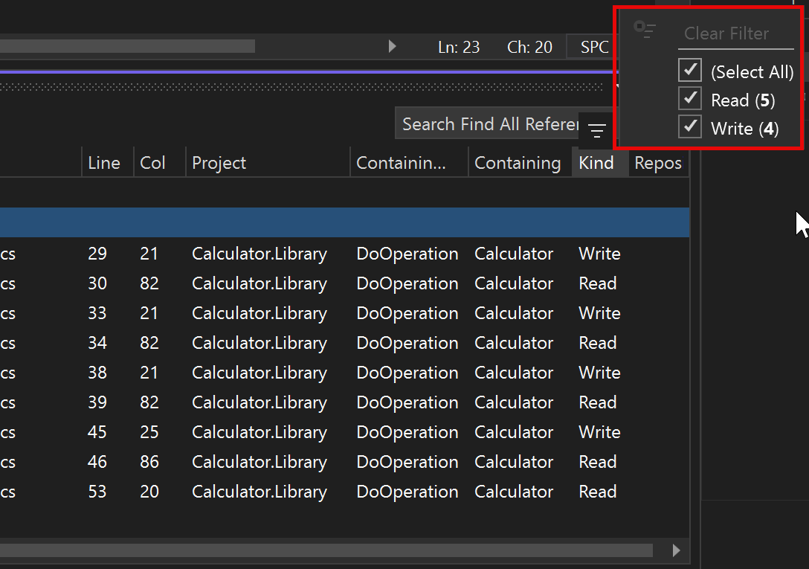

# Find references in your code

You can use the **Find All References** command to find where particular code elements are referenced throughout your codebase. The **Find All References** command is available on the context (right-click) menu of the element you want to find references to. Or, press **Shift**+**F12**.

The results appear in a tool window named **\<element> references**, where *element* is the name of the item you're searching for. A toolbar in the **references** window enables you to do the following:

- Change the scope of the search in a drop-down list box. You can choose to look only in open or changed documents, all the way up to the entire solution.
- Copy the selected referenced item(s) by choosing the **Copy** button. All the values in all the columns for all selected rows are copied to the clipboard, preceded by the column headings. This makes it easy to paste into a spreadsheet.
- Choose buttons to go to the next or previous location in the list, or press the **F8** and **Shift+F8** keys to do so.
- Remove any filters on the returned results by choosing the **Clear All Filters** button.
- Change how returned items are grouped by choosing a setting in the **Group by:** drop-down list box.
- Keep the current search results window by choosing the **Keep Results** button. When you choose this button, the current search results stay in this window, and new search results appear in a new tool window.
- **List View** toggles between the treeview and a plaintext list. Some functionality is disabled in list view mode.
- Search for strings within the search results by entering text in the **Search Find All References** text box.

You can also hover the mouse over any search result to see the reference in the context of the surrounding code.

:::moniker range="vs-2019"

:::moniker-end
:::moniker range="vs-2022"

:::moniker-end

## Navigate to references

You can use the following methods to navigate to references in the **references** window:

- Press the **Enter** key on a reference, or double-click it, to go to it in code.
- On the right-click menu (context menu) of a reference, choose the **Go To Previous Location** or **Go To Next Location** commands.
- Use the **Up Arrow** and **Down Arrow** keys.

## Change reference groupings

By default, references are grouped by project, then by definition. However, you can change this grouping order by changing the setting in the **Group by:** drop-down list box on the toolbar. For example, you can change it from the default setting of **Project then definition** to **Definition then project**, as well to other settings.

**Definition** and **Project** are the two default groupings used, but you can add others by choosing the **Grouping** command on the selected item's right-click or context menu. Adding more groupings can be helpful if your solution has numerous files and paths.

Grouping is not available in **List View** mode.

## Filter by reference type in .NET

In C# or Visual Basic, the **Find References** window has a **Kind** column where it lists what type of reference it found. You can use this column to filter by reference type. Select the filter icon that appears when you hover over the column header. You can filter references by Read, Write, Reference, Name, Namespace, and Type, but the filter only shows the kinds that are relevant in the current set of results.

:::moniker range="vs-2019"

:::moniker-end
:::moniker range=">=vs-2022"

:::moniker-end
After you apply a filter or a filter set, you can easily remove it by using the **Clear All Filters** button.

## Customize the experience

To customize the experience, on the menu bar, choose **Tools** > **Options** > **Environment** > **Tabs and Windows**, and then in the **Preview Tab** section, if you select the **Allow new files to be opened in the preview tab** checkbox, you can select or unselect the **Preview selected files in Find Results** checkbox. When selected, the file is opened in the editor at the place where the reference occurs. When unset, the file is only opened if you explicitly press **Enter** or double-click on the row.

## Related content

- [Navigating code](../ide/navigating-code.md)
