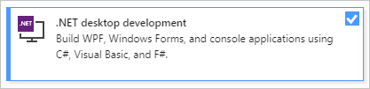
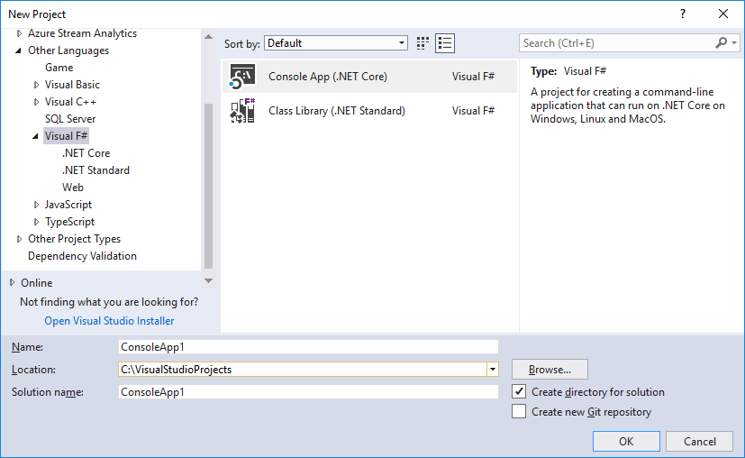
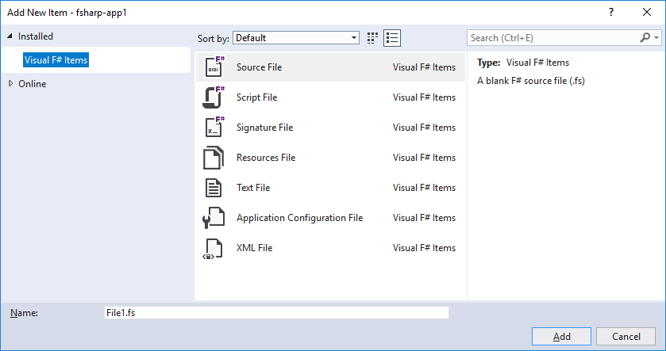

# Develop with Visual F# in Visual Studio

This article includes information about Visual Studio features for F# development.

## Install F# support

To develop with F# in Visual Studio, first install the **.NET desktop development** workload if you haven't already. You install Visual Studio workloads through Visual Studio Installer, which you can open by selecting **Tools** > **Get Tools and Features**.

## F# project features

Various project and item templates are available for F# in Visual Studio. The following image shows some of the F# project templates for .NET Core and .NET Standard:

The following image shows some of the F# item templates:

For more information about the item templates for data access, see [F# type providers](/dotnet/fsharp/tutorials/type-providers/index).

The following table summarizes features in project properties for F#:

|Project setting|Supported in F#?|Notes|
|---------------|----------------|-----|
|Resource files|Yes||
|Build, debug, and reference settings|Yes||
|Multitargeting|Yes||
|Icon and manifest|No|Available through compiler command-line options.|
|ASP.NET Client Services|No||
|ClickOnce|No|Use a client project in another .NET language, if applicable.|
|Strong naming|No|Available through compiler command-line options.|
|Assembly publishing and versioning|No||
|Code analysis|No|Code analysis tools can be run manually or as part of a post-build command.|
|Security (change trust levels)|No||

## Project Designer

**Project Designer** consists of several project property pages grouped by related functionality. The pages available for F# projects are mostly a subset of those available for other languages, and are described in the following table. Links are provided to the corresponding C# **Project Designer** page.

|Project Designer page|Related links|Description|
| - |-------------|-----------|
|Application|[Application Page, Project Designer](reference/application-page-project-designer-csharp.md)|Enables you to specify application-level settings and properties, such as whether you are creating a library or an executable file, what version of .NET the application targets, and information about where the resource files that the application uses are stored.|
|Build|[Build Page, Project Designer](reference/build-page-project-designer-csharp.md)|Enables you to control how the code is compiled.|
|Build Events|[Build Events Page, Project Designer](reference/build-events-page-project-designer-csharp.md)|Enables you to specify commands to run before or after a compilation.|
|Debug|[Debug Page, Project Designer](/previous-versions/visualstudio/visual-studio-2017/ide/reference/debug-page-project-designer)|Enables you to control how the application runs during debugging. This includes what commands to use and what your application's starting directory is, and any special debugging modes you want to enable, such as native code and SQL.|
|Package (.NET SDK only)|N/A|Enables you to define NuGet Package metadata when publishing as a NuGet package.|
|Reference Paths|[Manage references in a project](managing-references-in-a-project.md)|Enables you to specify where to search for assemblies that the code depends on.|
|Resources (.NET SDK only)|N/A|Enables you to generate and manage a default resources file.|

### F#-specific settings

The following table summarizes settings that are specific to F#:

|Project Designer page|Setting|Description|
| - |-------|-----------|
|Build|Generate tail calls|If selected, enables the use of the tail Microsoft Intermediate Language (MSIL) instruction. This causes the stack frame to be reused for tail recursive functions. Equivalent to the `--tailcalls` compiler option.|
|Build|Other flags|Allows you to specify additional compiler command-line options.|

## Code and text editor features

The following features of the Visual Studio code and text editors are supported in F#:

|Feature|Description|Supported in F#?|
|-------|-----------|----------------|
|Automatically comment|Enables you to comment or uncomment sections of code.|Yes|
|Automatically format|Reformats code with standard indentation and style.|No|
|Bookmarks|Enables you to save places in the editor.|Yes|
|Change indentation|Indents or unindents selected lines.|Yes|
|Smart indentation|Automatically indents and de-indents the cursor according to F# scoping rules.|Yes|
|[Find and replace text](finding-and-replacing-text.md)|Enables you to search in a file, project, or solution, and potentially change text.|Yes|
|Go to definition for the .NET API|When the cursor is positioned on a .NET API, shows code generated from .NET metadata.|No|
|Go to definition for user-defined API|When the cursor is on a program entity that you defined, moves the cursor to the location in your code where the entity is defined.|Yes|
|Go To Line|Enables you to go to a specific line in a file, by line number.|Yes|
|Navigation bars at top of file|Enables you to jump to locations in code, by, For example, function name.|Yes|
|Block Structure Guidelines|Shows guidelines that indicate F# scopes, which can be hovered over for a preview.|Yes|
|[Outlining](outlining.md)|Enables you to collapse sections of your code to create a more compact view.|Yes|
|Tabify|Converts spaces to tabs.|Yes|
|Type colorization|Shows defined type names in a special color.|Yes|
|Quick Find. See Quick Find, Find and Replace Window.|Enables you to search in a file or project.|Yes|
|**Ctrl**+**click** to Go to Definition|Allows you to hold **Ctrl** and click on an F# symbol to invoke Go to Definition.|Yes|
|Go to Definition from QuickInfo|Clickable symbols inside tooltips that invoke Go to Definition.|Yes|
|Go to All|Enables global, fuzzy-matching navigation for all F# constructs via **Ctrl**+**T**.|Yes|
|Inline Rename|Renames all occurrences of a symbol inline.|Yes|
|Find all References|Finds all occurrences of a symbol in a codebase.|Yes|
|Simplify Name code fix|Removes unnecessary qualifiers for F# symbols.|Yes|
|Remove unused `open` statement code fix|Removes all unnecessary `open` statements in a document.|Yes|
|Unused value code fix|Suggests renaming an unused identifier to underscore.|Yes|

For general information about editing code in Visual Studio, and features of the text editor, see [Write code in the editor](writing-code-in-the-code-and-text-editor.md).

## IntelliSense features

The following table summarizes IntelliSense features supported and not supported in F#:

|Feature|Description|Supported in F#?|
|-------|-----------|----------------|
|Automatically implement interfaces|Generates code stubs for interface methods.|Yes|
|Code snippets|Injects code from a library of common coding constructs into topics.|No|
|Complete Word|Saves typing by completing words and names as you type.|Yes|
|Automatic completion|When enabled, causes the word completion to select the first match as you type, instead of waiting for you to select one or press **Ctrl**+**Space**.|Yes|
|Offer completion for symbols in unopened namespaces|With automatic completion, a matching symbol that resides in an unopened namespace is suggested, offering to complete with the corresponding `open` statement when selected.|Yes|
|Generate code elements|Enables you to generate stub code for a variety of constructs.|No|
|List Members|When you type the member access operator (.), shows members for a type.|Yes|
|Organize Usings/Open|Organizes namespaces referenced by **using** statements in C# or **open** directives in F#.|No|
|Parameter Info|Shows helpful information about parameters as you type a function call.|Yes|
|Quick Info|Displays the complete declaration for any identifier in your code.|Yes|
|Automatic brace completion|Automatically completes F# brace-like syntax constructs in a transactional manner.|Yes|

For general information about IntelliSense, see [Use IntelliSense](using-intellisense.md).

## Debugging features

The following table summarizes features that are available when you debug F# code:

|Feature|Description|Supported in F#?|
|-------|-----------|----------------|
|Autos window|Shows automatic or temporary variables.|No|
|Breakpoints|Enables you to pause code execution at specific points during debugging.|Yes|
|Conditional breakpoints|Enables breakpoints that test a condition that determines whether execution should pause.|Yes|
|Edit and Continue|Enables code to be modified and compiled as you debug a running program without stopping and restarting the debugger.|No|
|Expression evaluator|Evaluates and executes code at run time.|No, but the C# expression evaluator can be used, although you must use C# syntax.|
|Historical debugging|Enables you to step into previously executed code.|Yes|
|Locals window|Shows locally defined values and variables.|Yes|
|Run To Cursor|Enables you to execute code until the line that contains the cursor is reached.|Yes|
|Step Into|Enables you to advance execution and move into any function call.|Yes|
|Step Over|Enables you to advance execution in the current stack frame and move past any function call.|Yes|

For general information about the Visual Studio debugger, see [Debugging in Visual Studio](../debugger/index.yml).

## Additional tools

The following table summarizes the support for F# in Visual Studio tools.

|Tool|Description|Supported in F#?|
|----|-----------|----------------|
|Call Hierarchy|Displays the nested structure of function calls in your code.|No|
|Code Metrics|Gathers information about your code, such as line counts.|No|
|Class View|Provides a type-based view of the code in a project.|No|
|[Error List window](reference/error-list-window.md)|Shows a list of errors in code.|Yes|
|[F# Interactive](/dotnet/fsharp/tutorials/fsharp-interactive/)|Enables you to type (or copy and paste) F# code and run it immediately, independently of the building of your project. The F# Interactive window is a Read, Evaluate, Print Loop (REPL).|Yes|
|Object Browser|Enables you to view the types in an assembly.|F# types as they appear in compiled assemblies do not appear exactly as you author them. You can browse through the compiled representation of F# types, but you cannot view the types as they appear from F#.|
|[Output window](reference/output-window.md)|Displays build output.|Yes|
|Performance analysis|Provides tools for measuring the performance of your code.|Yes|
|Properties window|Displays and enables editing of properties of the object in the development environment that has focus.|Yes|
|Server Explorer|Provides ways to interact with a variety of server resources.|Yes|
|Solution Explorer|Enables you to view and manage projects and files.|Yes|
|Task List|Enables you to manage work items pertaining to your code.|No|
|Test projects|Provides features that help you test your code.|No|
|Toolbox|Displays tabs that contain draggable objects such as controls and sections of text or code.|Yes|

## See also

- [F# guide (.NET Framework)](/dotnet/fsharp/)
- [Get started with F# in Visual Studio](/dotnet/fsharp/get-started/get-started-visual-studio)
