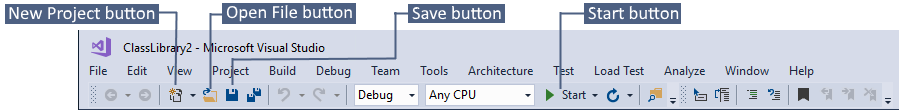

Visual Studio is a powerful tool for developing your apps. If you haven't done so already, go ahead and download and install [Visual Studio](https://aka.ms/vs/15/preview/vs_enterprise). See the video [Getting Started with Visual Studio – Setting up your IDE](https://www.youtube.com/watch?v=xLCedknQkN0&list=PLReL099Y5nRfw6VNvzMkv0sabT2crbSpK&index=1) for more information about downloading Visual Studio and configuring it the way you want.

## Visual Studio tour
Visual Studio has a group of tool windows, menus, and toolbars collectively known as the integrated development environment, or IDE. The Visual Studio IDE helps you accomplish your development tasks. Here's a quick overview of IDE items you will likely use most often.

### Code editor
One of the most heavily-used tool windows in Visual Studio, this is where you write, view, and navigate through your code.

As you enter code, the code editor helps you more quickly and easily write and find your code by providing features such as statement completion, syntax colorization, map mode, and more. For more information, see the video [Getting Started with Visual Studio - Editing and navigating your code](https://www.youtube.com/watch?v=4glwwioCVjA&list=PLReL099Y5nRfw6VNvzMkv0sabT2crbSpK&index=5)

Some solution types may include forms, such as WPF or Windows Forms. In those cases, you will also see a visual designer in this space that lets you visually add controls to the form, such as buttons and list boxes.

### Solution Explorer

A tool window called **Solution Explorer** lists all your code files. Solution Explorer can help organize your code by grouping its files into solutions and projects. The project in bold is called the startup project. It’s the first code that runs when you start your solution. You can change the startup project. See the video [Getting Started with Visual Studio – Building blocks of the IDE](https://www.youtube.com/watch?v=JHc3_gsCmZg&index=2&list=PLReL099Y5nRfw6VNvzMkv0sabT2crbSpK) for more information.

 In addition to solutions and projects, Solution Explorer lists all the files in each project when you expand the project's node. Each project contains one or more files, such as source code files and resource files such as images or libraries.

To see properties for solutions, projects, and files, choose the **Properties** command on the shortcut (right-click) menu, or choose **View, Properties Window** on the menu.

You don't have to create a solution or project, however, to get started coding. You can simply jump right in and open code files in Visual Studio, such as files cloned from a Git repo, and start editing them right away. The files will appear in Solution Explorer and get syntax colorization, basic statement completion, and more, just like traditional solutions. See [Open Any Folder with Visual Studio “15” Preview](https://blogs.msdn.microsoft.com/visualstudio/2016/04/12/open-any-folder-with-visual-studio-15-preview/) for more information.

### Toolbar and menus
To run your project, create new solutions, save files, and more, use the Visual Studio toolbar and menu commands. For example, once your code is ready to run for debugging, you can choose the **Start** button on the toolbar, or you can choose **Debug, Start Debugging** on the menu. To create a new solution, choose the **New Project** button, or choose **File, New, Project** on the menu, and so forth.

Note that toolbar icons and menu commands can change depending on the context, meaning the item currently selected.

### Team Explorer
**Team Explorer** enables you to connect to source control tools such as [Git](https://git-scm.com/) and [Team Foundation Version Control (TFVC)](https://www.visualstudio.com/en-us/docs/tfvc/overview) to store your code locally or share it with others on a hosted service. You can also use it to track tasks and more.

See the videos [Getting Started with Visual Studio – Building blocks of the IDE](https://www.youtube.com/watch?v=JHc3_gsCmZg&index=2&list=PLReL099Y5nRfw6VNvzMkv0sabT2crbSpK) and [Getting Started with Visual Studio – Opening a project from Source Control](https://www.youtube.com/watch?v=pc9vX_4RGV4&list=PLReL099Y5nRfw6VNvzMkv0sabT2crbSpK&index=3) for more information.

### Output window
The **Output** window is where Visual Studio sends its notifications, such as debugging and error messages, compiler warnings, publishing status messages, and more. Each message type has its own tab.

To learn more about how to use the Output window for debugging, see [The Output window while debugging with Visual Studio](https://blogs.msdn.microsoft.com/visualstudioalm/2015/02/09/the-output-window-while-debugging-with-visual-studio/).

## First steps
- **Setup** - To learn about how to download and set up Visual Studio, see [Setup & Installation](https://go.microsoft.com/fwlink/?linkid=833223).
- **The basics** - To learn more about how Visual Studio works, see [Get started with Visual Studio](https://go.microsoft.com/fwlink/?linkid=833058).
- **Settings** - Customize Visual Studio for how you like to work. See [Personalizing the Visual Studio IDE](https://msdn.microsoft.com/en-us/library/mt269425.aspx).
- **Tutorials** - To learn more about code development workflow in Visual Studio, go through a tutorial, such as [Getting Started with Visual C# and Visual Basic](https://msdn.microsoft.com/en-us/library/dd492171.aspx) and [Getting Started with C++ in Visual Studio](https://msdn.microsoft.com/en-us/library/jj620919.aspx).
- **Videos** - To learn more about other aspects of Visual Studio, check out videos on the [Microsoft Visual Studio channel](https://www.youtube.com/user/VisualStudio/videos) on YouTube, or videos on [Channel 9](https://channel9.msdn.com/Tags/visual+studio).

## Access cloud-based resources

If you want to use cloud-based resources in your app or game, you can do that by  including [Azure services](https://azure.microsoft.com/en-us/services/). To use Azure services in Visual Studio, download and install the [Azure SDK](https://azure.microsoft.com/en-us/downloads/). After installing Azure SDK, you get a new tool window available in Visual Studio called **Cloud Explorer**. Cloud Explorer enables you to browse and manage your Azure assets and resources from within Visual Studio. If a particular operation requires Azure, Cloud Explorer provides links that take you to the exact place in Azure you need to go.

To learn more about using Cloud Explorer, see [Managing Azure resources with Cloud Explorer](https://azure.microsoft.com/en-us/documentation/articles/vs-azure-tools-resources-managing-with-cloud-explorer/).
Installing Azure SDK also gives you [Visual Studio Tools for Azure](https://www.visualstudio.com/vs/azure-tools/) as well as other tools.

## Tips and tricks
For shortcuts and handy tips and tricks on how to get more out of Visual Studio, see the following.
- [Getting Started with Visual Studio - Tips & Tricks](https://www.youtube.com/watch?v=vmXqGwn1Glk&list=PLReL099Y5nRfw6VNvzMkv0sabT2crbSpK&index=4)
- [Productivity Tips for Visual Studio](https://msdn.microsoft.com/en-us/library/jj153218.aspx)
- [Visual Studio Tips and Tricks](https://channel9.msdn.com/events/TechEd/2013/DEV-B353)
- [C++ Debugging Tips and Tricks](https://channel9.msdn.com/Shows/Visual-Studio-Toolbox/C-Plus-Plus-Debugging-Tips-and-Tricks)
- [Getting Started with Visual Studio - Installing Visual Studio extensions](https://www.youtube.com/watch?v=MWLLQaknRZY&list=PLReL099Y5nRfw6VNvzMkv0sabT2crbSpK&index=7)
