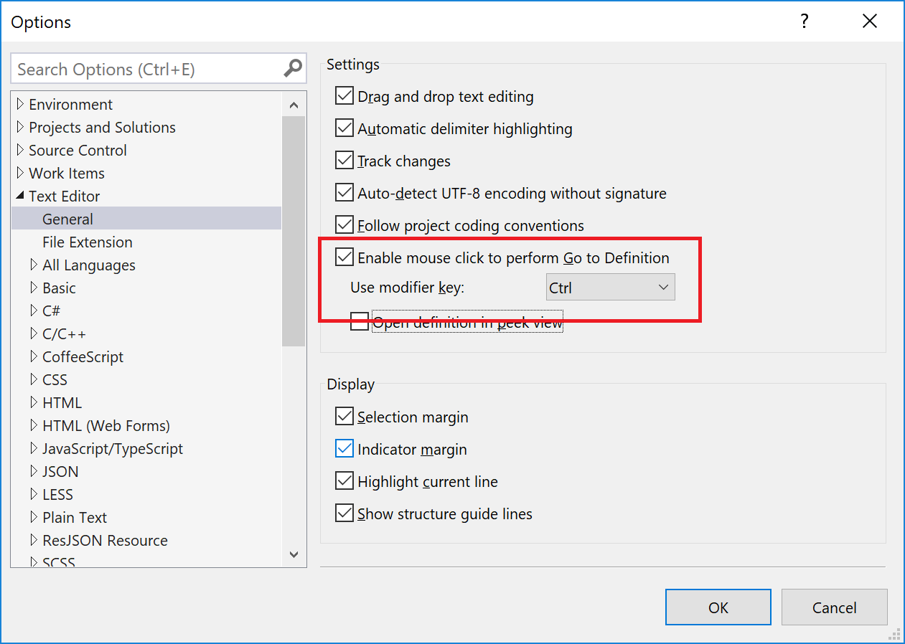
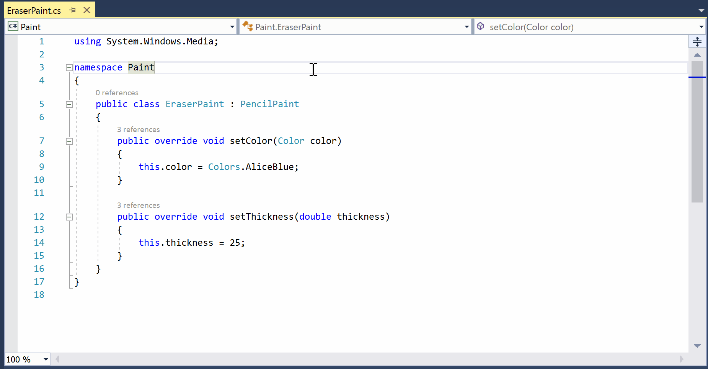
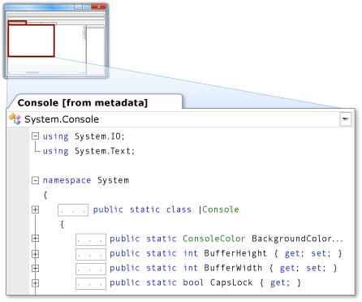
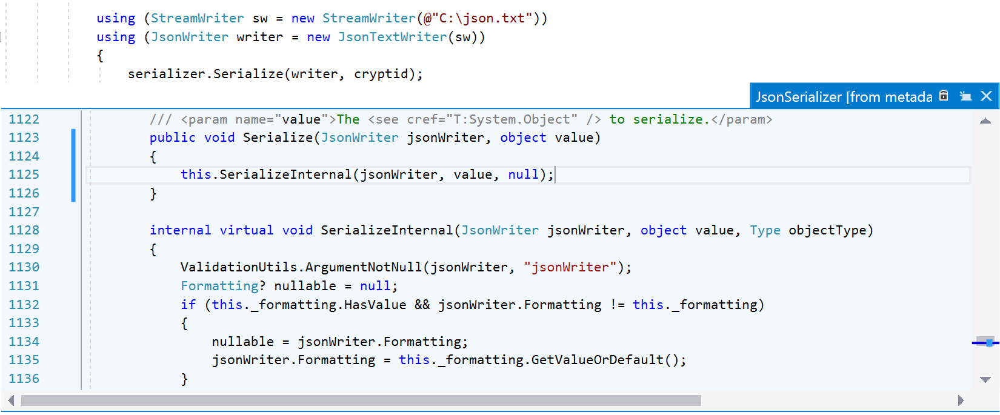

# View type and member definitions

Developers often need to view the source code definitions for types or class members they use in their code. In Visual Studio, the **Go To Definition** and **Peek Definition** features enable you to easily view the definition of a type or member. If the source code is not available, metadata is displayed instead.

## Go To Definition

The **Go To Definition** feature navigates to the source of a type or member, and opens the result in a new tab. If you are a keyboard user, place your text cursor somewhere inside the symbol name and press **F12**. If you are a mouse user, either select **Go To Definition** from the right-click menu or use the **Ctrl-click** functionality described in the following section.

### Ctrl-click Go To Definition

**Ctrl**+**click** is a shortcut for mouse users to quickly access **Go To Definition**. Symbols become clickable when you press **Ctrl** and hover over the type or member. To quickly navigate to the definition of a symbol, press the **Ctrl** key and then click on it. It's that easy!

You can change the modifier key for mouse-click **Go To Definition** by going to **Tools** > **Options** > **Text Editor** > **General**, and selecting either **Alt** or **Ctrl**+**Alt** from the **Use modifier key** drop-down. You can also disable mouse-click **Go To Definition** by unchecking the **Enable mouse click to perform Go To Definition** checkbox.

## Peek Definition

The **Peek Definition** feature lets you preview the definition of a type without leaving your current location in the editor. If you are a keyboard user, place your text cursor somewhere inside the type or member name and press **Alt + F12**. If you are a mouse user, you can select **Peek Definition** from the right-click menu.

To enable **Ctrl**+**click** functionality, go to **Tools** > **Options** > **Text Editor** > **General**. Select the option **Open definition in peek view** and click **OK** to close the **Options** dialog box.

Then, press **Ctrl** (or whichever modifier key is selected in **Options**), and click on the type or member.

If you peek another definition from the popup window, you start a breadcrumb path that you can navigate using the circles and arrows that appear above the popup.

For more information, see [How to: View and edit code by using Peek Definition (Alt+F12)](how-to-view-and-edit-code-by-using-peek-definition-alt-plus-f12.md).

## View metadata as source code (C#)

When you view the definition of C# types or members whose source code is not available, their metadata is displayed instead. You can see the declarations of the types and members, but not their implementations.

When you run the **Go To Definition** or **Peek Definition** command for an item whose source code is unavailable, a tabbed document that contains a view of that item's metadata, displayed as source code, appears in the code editor. The name of the type, followed by **[from metadata]**, appears on the document's tab.

For example, if you run the **Go To Definition** command for <xref:System.Console>, metadata for <xref:System.Console> appears in the code editor as C# source code. The code resembles its declaration, but does not show an implementation.

> [!NOTE]
> When you try to run the **Go To Definition** or **Peek Definition** command for types or members that are marked as internal, Visual Studio does not display their metadata as source code, regardless of whether the referencing assembly is a friend or not.

### View decompiled source definitions instead of metadata (C#)

You can set an option to see decompiled source code when you view the definition of a C# type or member whose source code is unavailable. To turn on this feature, choose **Tools** > **Options** from the menu bar. Then, expand **Text Editor** > **C#** > **Advanced**, and select **Enable navigation to decompiled sources**.

> [!NOTE]
> Visual Studio reconstructs method bodies using ILSpy decompilation. The first time you access this feature, you must agree to a legal disclaimer regarding software licensing and copyright and trademark laws.

## See also

- [Navigate code](../ide/navigating-code.md)
- [How to: View and edit code by using Peek Definition (Alt+F12)](how-to-view-and-edit-code-by-using-peek-definition-alt-plus-f12.md)