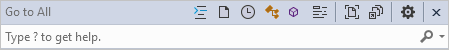
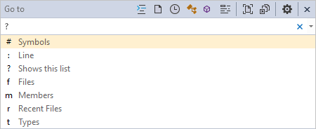
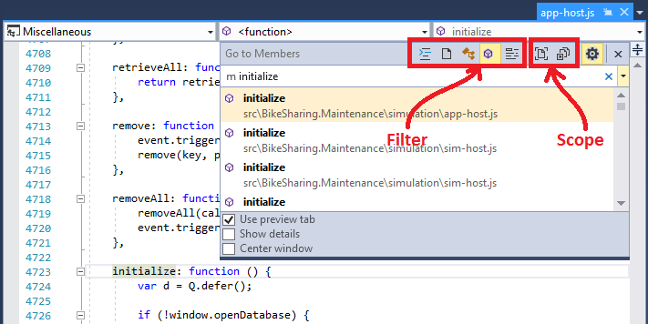
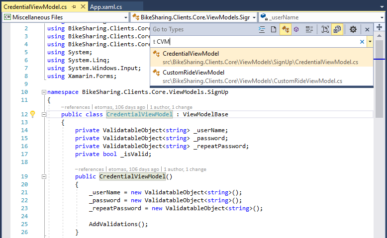

# Find code using Go To commands

Visual Studio's **Go To** commands perform a focused search of your code to help you quickly find specified items. You can go to a specific line, type, symbol, file, and member from a simple, unified interface.

:::moniker range=">=vs-2022"

In Visual Studio 2022, a new search experience replaces much of the functionality described here. For example, **Go to type** or **Ctrl**+**T** goes (by default) to the new search experience in Visual Studio 2022, rather than opening the **Go to type** window. The new search experience is documented at [Visual Studio search](visual-studio-search.md).

:::moniker-end

## How to use it

Input | Function
------------ | ---
**Keyboard** | Press **Ctrl**+**T** or **Ctrl**+**,**
**Mouse** | Select **Edit** > **Go To** > **Go To All**

A small window is displayed at the top right of your code editor.

As you type in the text box, the results appear in a drop-down list below the text box. To go to an element, choose it in the list.

You can also enter a question mark (**?**) to get additional help.

## Filtered searches

By default, the specified item is searched for in all solution items. However, you can limit your code search to specific element types by prefacing the search terms with certain characters. You can also quickly change the search filter by choosing buttons on the **Go To** dialog box toolbar. Buttons that change the type filters are on the left side, and buttons that change the scope of the search are on the right side.

### Filter to a specific type of code element

To narrow your search to a specific type of code element, you can either specify a prefix in the search box, or select one of the five filter icons:

Prefix | Icon | Shortcut | Description
:-: | - | - | -
:|  | **Ctrl**+**G** | Go to the specified line number
f|  | **Ctrl**+**1**, **Ctrl**+**F** | Go to the specified file
r|  | **Ctrl**+**1**, **Ctrl**+**R** | Go to the specified, recently visited file
t|  | **Ctrl**+**1**, **Ctrl**+**T** | Go to the specified type
m|  | **Ctrl**+**1**, **Ctrl**+**M** | Go to the specified member
\#|  | **Ctrl**+**1**, **Ctrl**+**S** | Go to the specified symbol

### Filter to a specific location

To narrow your search to a specific location, select one of the two document icons:

Icon | Description
---- | ---
 | Search current document only
 | Search external documents in addition to those located in the project/solution

## Camel casing

If you use [camel casing](https://en.wikipedia.org/wiki/Camel_case) in your code, you can find code elements faster by entering only the capital letters of the code element name. For example, if your code has a type called `CredentialViewModel`, you can narrow down the search by choosing the **Type** filter (**t**) and then entering just the capital letters of the name (`CVM`) in the Go To dialog box. This feature can be helpful if your code has long names.

## Settings

Selecting the gear icon  lets you change how this feature works:

Setting | Description
------- | ---
Use preview tab | Display the selected item immediately in the IDE's preview tab
Show details | Display project, file, line, and summary information from documentation comments in the window
Center window | Move this window to the top-center of the code editor, instead of the top-right

## Related content

- [Navigate code](../ide/navigating-code.md)
- [Go To Line dialog box](../ide/reference/go-to-line.md)
- [Go To Definition and Peek Definition](../ide/go-to-and-peek-definition.md)
