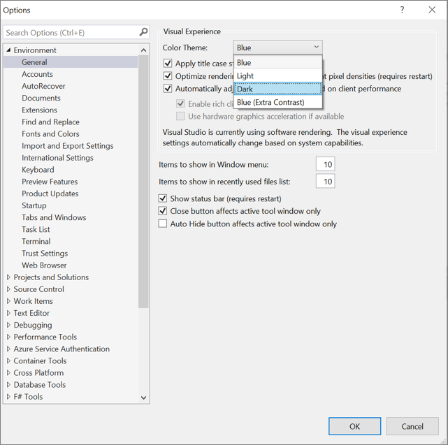
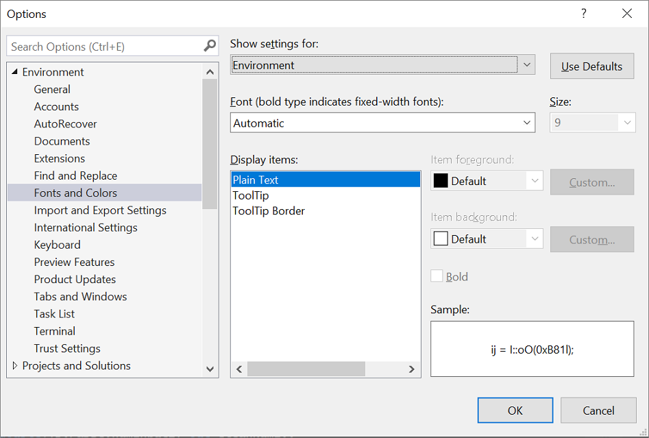
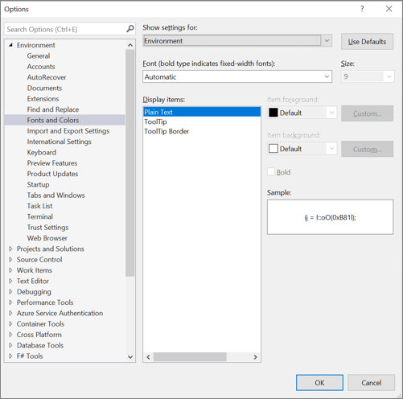
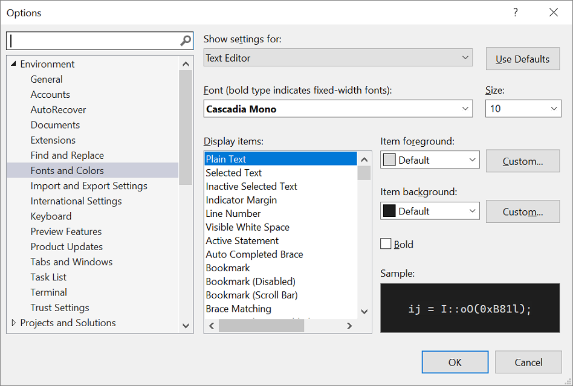
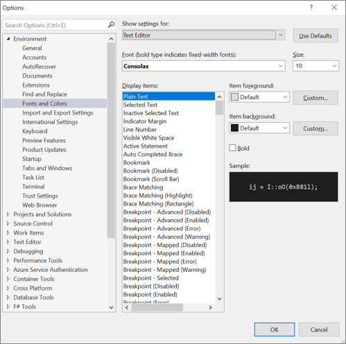

# Change fonts, colors, and themes in Visual Studio

::: moniker range=">=vs-2022"

You can change the fonts and the colors in Visual Studio in several ways. For example, you can change the default dark theme (also referred to as "dark mode") to a light theme, a blue theme, an extra-contrast theme, or a theme that matches your system settings. You can also change the default font and text size in both the IDE and the code editor.

> [!TIP]
> See the [**We’ve upgraded the UI in Visual Studio 2022**](https://devblogs.microsoft.com/visualstudio/weve-upgraded-the-ui-in-visual-studio-2022/) blog post to learn more about the subtle color contrast ratio adjustments and a new [Cascadia Code](#use-the-cascadia-code-font) font we've added to make Visual Studio more accessible for everyone.

::: moniker-end

::: moniker range="<=vs-2019"

You can change the fonts and the colors in Visual Studio in many ways. For example, you can change the default blue color theme to the dark theme (also referred to as "dark mode"). You can also select an extra-contrast theme if that best suits your needs. And, you can change the default font and text size in both the IDE and the code editor.

::: moniker-end

## Change the color theme

Here's how to change the color theme of the IDE frame and the tool windows in Visual Studio.

::: moniker range=">=vs-2022"

1. On the menu bar, select **Tools** > **Options**.

1. In the options list, select **Environment** > **General**.

1. In the **Color theme** list, select either the default **Dark** theme, the **Light** theme, the **Blue** theme, or the **Blue (Extra Contrast)** theme.

   You can also choose to use the theme that Windows uses by selecting **Use system setting**.

   :::image type="content" source="media/vs-2022/fonts-colors-theme.png" alt-text="Screenshot of the Options dialog box where you can change the color theme.":::

Visual Studio remembers the color theme and other UI settings, and synchronizes them across all Visual Studio environments depending on your [account setup](signing-in-to-visual-studio.md#sign-in-to-your-account-1).
With Visual Studio 2022 version 17.12, your [font settings are preserved across theme changes](#preserve-font-settings-across-theme-changes).

   > [!TIP]
   > Want even more themes to choose from? Check out the wide range of custom themes on the [**Visual Studio Marketplace**](https://marketplace.visualstudio.com/search?target=VS&category=Tools&vsVersion=&subCategory=Themes&sortBy=Installs). And to see examples of new Visual Studio 2022 custom themes based on VS Code, take a look at the [**Introducing a collection of new Visual Studio themes**](https://devblogs.microsoft.com/visualstudio/custom-themes/) blog post. 

If you download themes from the [Visual Studio Marketplace](https://marketplace.visualstudio.com/search?target=VS&category=Tools&vsVersion=&subCategory=Themes&sortBy=Installs), restart your Visual Studio instance to view them. Then, navigate to **Tools -> Theme**. The list will now include your newly installed themes. Select the desired theme to apply it.

::: moniker-end

::: moniker range="<=vs-2019"

1. On the menu bar, select **Tools** > **Options**.

1. In the options list, select **Environment** > **General**.

1. In the **Color theme** list, select either the default **Blue** theme, the **Light** theme, the **Dark** theme, or the **Blue (Extra Contrast)** theme.

   

   > [!NOTE]
   > When you change a color theme, text in the IDE reverts to the default or previously customized fonts and sizes for that theme.

    > [!TIP]
    > You can create and edit your own Visual Studio themes by using an extension. Choose from either of the following two options, depending on the version of Visual Studio you're using:
    > - [Color Theme Designer for Visual Studio 2019](https://marketplace.visualstudio.com/items?itemName=ms-madsk.ColorThemeDesigner).
    > - [Color Theme Editor for Visual Studio 2017](https://marketplace.visualstudio.com/items?itemName=VisualStudioPlatformTeam.VisualStudio2017ColorThemeEditor)

::: moniker-end

## Change fonts and text size

You can change the font and text size for all the IDE frame and tool windows, or for only certain windows or text elements. You can also change the font and text size in the editor, too.

### To change the font and text size in the IDE

::: moniker range=">=vs-2022"

1. On the menu bar, select **Tools** > **Options**.

1. In the options list, select **Environment** > **Fonts and Colors**.

1. In the **Show settings for** list, select **Environment**.

   

    > [!NOTE]
    > If you want to change the font for tool windows only, in the **Show settings for** list, select **All Text Tool Windows**.

1. Modify the **Font** and **Size** options to change the font and text size for the IDE.

1. Select the appropriate item in **Display items**, and then modify the **Item foreground** and **Item background** options.

To learn more about setting default font settings for the user interface (UI) in an application you're building with Visual Studio, check out the tutorials on [Create a simple Windows Forms app](create-csharp-winform-visual-studio.md) or [Create a WPF application](../get-started/csharp/tutorial-wpf.md).

::: moniker-end

::: moniker range="<=vs-2019"

1. On the menu bar, select **Tools** > **Options**.

1. In the options list, select **Environment** > **Fonts and Colors**.

1. In the **Show settings for** list, select **Environment**.

   

    > [!NOTE]
    > If you want to change the font for tool windows only, in the **Show settings for** list, select **All Text Tool Windows**.

1. Modify the **Font** and **Size** options to change the font and text size for the IDE.

1. Select the appropriate item in **Display items**, and then modify the **Item foreground** and **Item background** options.

::: moniker-end

### To change the font and text size in the editor

::: moniker range=">=vs-2022"

1. On the menu bar, select **Tools** > **Options**.

1. In the options list, select **Environment** > **Fonts and Colors**.

1. In **Show settings for** list, select **Text Editor**.

   

1. Modify the **Font** and **Size** options to change the font and text size for the editor.

1. Select the appropriate item in **Display items**, and then modify the **Item foreground** and **Item background** options.

### Preserve font settings across theme changes

With Visual Studio 2022 version 17.12, you can now preserve your font and font size preferences across theme changes. This functionality is enabled by default. When you switch themes in Visual Studio, your custom font face and size settings remain unchanged, while the font color updates with the new theme.

If you prefer to have font selections change with the theme, select **Tools** > **Manage Preview Features** and uncheck **Separate font settings from color themes selection (requires restart)**. 

:::image type="content" source="media/vs-2022/preserve-font-settings-across-themes.png" alt-text="Screenshot of the setting that enables preserving font settings across themes.":::

::: moniker-end

::: moniker range="<=vs-2019"

1. On the menu bar, select **Tools** > **Options**.

1. In the options list, select **Environment** > **Fonts and Colors**.

1. In **Show settings for** list, select **Text Editor**.

   

1. Modify the **Font** and **Size** options to change the font and text size for the editor.

1. Select the appropriate item in **Display items**, and then modify the **Item foreground** and **Item background** options.

::: moniker-end

Changes to font settings for Printer affect the appearance of text in printed documents. To modify the font for printing, in the **Show settings for** list, select **Printer and Cut/Copy**. If you're getting garbage characters when printing, please refer to the [Dev Community ticket ](https://developercommunity.visualstudio.com/t/Printing-problem-for-listings-Visual-Stu/10314328) on the issue.

For more information about how to change fonts and colors for accessibility, see the [Set accessibility options](#set-accessibility-options) section of this page. And, for details about all the user interface (UI) elements where you can change font and color schemes, see the [Fonts and Colors, Environment, Options Dialog Box](../ide/reference/fonts-and-colors-environment-options-dialog-box.md) page.

## Set language-specific editor options

You can make various changes to the code editor to suit your programming language of choice. For example, you can change [brace formatting](reference/options-text-editor-csharp-formatting.md#new-lines-page) in C# to appear inline or on a new line, and more. To learn how to customize the code editor, see [Set language-specific editor options](reference/setting-language-specific-editor-options.md).

## Set accessibility options

::: moniker range=">=vs-2022"

In a neurodiverse world, we want to support our different learners and low-vision users by offering the following font options and color themes:

- You can use the [Cascadia Code](#use-the-cascadia-code-font) font, which adds more weight to the proportions of letters, numerals, and characters to help disambiguate them. Cascadia Code also includes coding ligatures.
- You can choose to use a [high-contrast](#use-windows-high-contrast) color theme for *all* the apps and UI on a computer, or an [extra-contrast](#use-visual-studio-extra-contrast) color theme for Visual Studio only.

### Use the Cascadia Code font

The new [**Cascadia Code**](https://github.com/microsoft/cascadia-code#welcome) font includes **Cascade Mono**, which is the default font in Visual Studio 2022. Not only are both of these fonts easier to read, but the Cascadia Code font also includes coding ligatures that turn a sequence of characters into a glyph. Coding ligatures, or glyphs, make it easier for people to cognitively associate the meaning behind them.

The following screenshot shows an example of the default Cascadia Mono font and lists a series of characters, to include mathematical symbols, that you might find yourself using while you code.

:::image type="content" source="media/vs-2022/cascadia-mono-font.png" alt-text="Screenshot of an example of the Cascadia Mono font in the Editor.":::

The following screenshot shows an example of the Cascadia Code font, where the same series of characters shown previously are now converted to coding ligatures, or glyphs.

:::image type="content" source="media/vs-2022/cascadia-code-font.png" alt-text="Screenshot of an example of the Cascadia Code font in the Editor.":::

Notice that the last line of text in the Cascadia Code screenshot shows how the space between duplicate characters is reduced, which also makes them easier to read.

Here's how to toggle between the Cascadia fonts:

1. Go to **Tools** > **Options** > **Environment** > **Fonts and colors**.

1. From the **Font** dropdown list, select either the **Cascadia Code** font or the **Cascadia Mono** font you want, and then select **OK**.

    :::image type="content" source="media/vs-2022/cascadia-font-options.png" alt-text="Screenshot of the Cascadia fonts available from the Options dialog box.":::

::: moniker-end

::: moniker range="<=vs-2019"

There are color theme options for you if you experience low vision. You can use a high-contrast option for *all* the apps and UI on a computer, or an extra contrast option for Visual Studio only.

::: moniker-end

### Use Windows high contrast

Use either of the following procedures to toggle the Windows high contrast option:

- In Windows or in any Microsoft application, press the **Left Alt**+**Left Shift**+**PrtScn** keys.

- In Windows, select **Start** > **Settings** > **Ease of Access**. Then, under the **Vision** section in Windows 10 and later, select **High contrast**.

    > [!WARNING]
    > The Windows high contrast setting affects all applications and UI on the computer.

### Use Visual Studio extra contrast

Use the following procedures to toggle the Visual Studio extra contrast option:

1. On the menu bar in Visual Studio, select **Tools** > **Options**, and then, in the options list, select **Environment** > **General**.

1. In the **Color theme** drop-down list, select the **Blue (Extra Contrast)** theme, and then select **OK**.

> [!TIP]
> If there is an accessibility option for colors or fonts that you think might be useful but isn't currently available in Visual Studio, please let us know by selecting **Suggest a feature** in the [Visual Studio Developer Community](https://aka.ms/feedback/suggest?space=8). For more information about this forum and how it works, see the [Suggest a feature](../ide/suggest-a-feature.md) page.

### More accessibility features in Visual Studio

Visual Studio also includes features to help people who have limited dexterity to write. For example, Visual Studio supports Dvorak keyboard layouts, which make the most frequently typed characters more accessible.

You can also customize the default keyboard shortcuts available with Visual Studio. For more information, see the following pages:

- [Identify and customize keyboard shortcuts](identifying-and-customizing-keyboard-shortcuts-in-visual-studio.md)
- [How to use the keyboard exclusively](reference/how-to-use-the-keyboard-exclusively.md)
- [Keyboard shortcuts in Visual Studio](default-keyboard-shortcuts-in-visual-studio.md)

Visual Studio also includes autocompletion for methods and parameters; for more information, see [IntelliSense in Visual Studio](using-intellisense.md).

There are more ways to customize Visual Studio to be more accessible to you. For example, you can change the behavior of pop-up windows, text-based tool windows, toolbar buttons, margin indicators, and more.

> [!NOTE]
> The dialog boxes and menu commands you see might differ from those described here, which can vary depending on your active settings or edition. To change your settings, select **Import and Export Settings** on the **Tools** menu. For more information, see [Reset settings](personalizing-the-visual-studio-ide.md#reset-all-settings).

#### Change the behavior of pop-up windows

Visual Studio displays pop-up windows in the editor. These pop-up windows include information that makes coding easier, such as parameters to complete a function or statement. The pop-up windows can also be helpful if you have difficulty typing. However, some users might find that they interfere with focus in the code editor, which can be problematic.

Here's how to turn off the pop-up windows:

1. From the **Tools** menu, select **Options**.

1. Select **Text Editor** > **All Languages** > **General**.

1. Clear the **Auto list members** and **Parameter information** checkboxes.

You can rearrange the windows in the integrated development environment (IDE) to best suit the way you work. You can dock, float, hide, or automatically hide each tool window. For more information about how to change window layouts, see [Customize window layouts](customizing-window-layouts-in-visual-studio.md).

#### Change the settings of text-based tool windows

You can change the settings for text-based tool windows, such as the **Command** window, **Immediate** window, and **Output** window by using **Tools** > **Options** > **Environment** > **Fonts and Colors**.

When you select **[All Text Tool Windows]** in the **Show settings for** drop-down list, the default setting is listed as **Default** in the **Item foreground** and **Item background** drop-down lists. Select the **Custom** button to change these settings.

You can also change the settings for how text is displayed in the editor. Here's how.

1. From the **Tools** menu, select **Options**.

1. Select **Environment** > **Fonts and Colors**.

1. Select an option on the **Show settings for** drop-down menu.

    To change the font size for text in an editor, select **Text Editor**.

    To change the font size for text in text-based tool windows, select **[All Text Tool Windows]**.

    To change the font size for ToolTip text in an editor, select **Editor Tooltip**.

    To change the font size for text in statement completion pop-ups, select **Statement Completion**.

1. From **Display items**, select **Plain Text**.

1. In **Font**, select a new font type.

1. In **Size**, select a new font size.

    > [!TIP]
    > To reset the text size for text-based tool windows and editors, select **Use Defaults**.

7. Select **OK**.

#### Change the colors for text, margin indicators, white space, and code elements

You can choose to change the default colors for text, margin indicators, white space, and code elements in the editor. Here's how.

1. From the **Tools** menu, select **Options**.

1. In the **Environment** folder, select **Fonts and Colors**.

1. In **Show settings for**, select **Text Editor**.

1. From **Display items**, select an item whose display you need to change, such as **Plain Text**, **Line Number**, **Indicator Margin**, **Visible White Space**, **HTML Attribute Name**, or **XML Attribute**.

1. Select display settings from the following options: **Item foreground**, **Item background**, and **Bold**.

1. Select **OK**.

Some languages have their own specific fonts and colors settings. If you're a C++ developer and you want to change the color used for functions, for example, you can look for **C++ Functions** in the **Display items** list. 

> [!TIP]
> To use high contrast colors for all application windows on your operating system, press **Left Alt**+**Left Shift**+**PrtScn**. If Visual Studio is open, close and then reopen it to fully implement high contrast colors.

#### Add text to toolbar buttons or modify the text

To improve toolbar usability and accessibility, you can add text to toolbar buttons.

###### To assign text to toolbar buttons

1. From the **Tools** menu, select **Customize**.

1. In the **Customize** dialog box, select the **Commands** tab.

1. Select **Toolbar**, and then select the toolbar name that contains the button you intend to display text for.

1. In the list, select the command you intend to change.

1. Select **Modify Selection**.

1. Select **Image and Text**.

###### To modify the displayed text in a button

1. Reselect **Modify Selection**.

1. In **Name**, enter a new caption for the selected button.

### Accessibility support

For more information about features, products, and services that make Windows more accessible for people with disabilities, see [Accessibility products and services from Microsoft](https://www.microsoft.com/accessibility). And, for more information about how to obtain more accessible formats of documentation for Microsoft products, you can view an index of accessible product documentation on the [Microsoft Accessibility](https://www.microsoft.com/accessibility) website.

The accessibility information included on this page might apply only to users who license Microsoft products in the United States. If you obtained this product outside of the United States, visit the [Microsoft Accessibility](https://www.microsoft.com/accessibility/) website for a list of Microsoft support services telephone numbers and addresses. You can contact your subsidiary to find out whether the type of products and services described on this page are available in your area. Information about accessibility is also available in other languages.

## Related content

- [Features of the code editor in Visual Studio](writing-code-in-the-code-and-text-editor.md)
- [Fonts and Colors, Environment, Options dialog box](./reference/fonts-and-colors-environment-options-dialog-box.md)
- [Change text case in the editor](how-to-change-text-case-in-the-editor.md)
- [Customize window layouts and personalize tabs](customizing-window-layouts-in-visual-studio.md)
