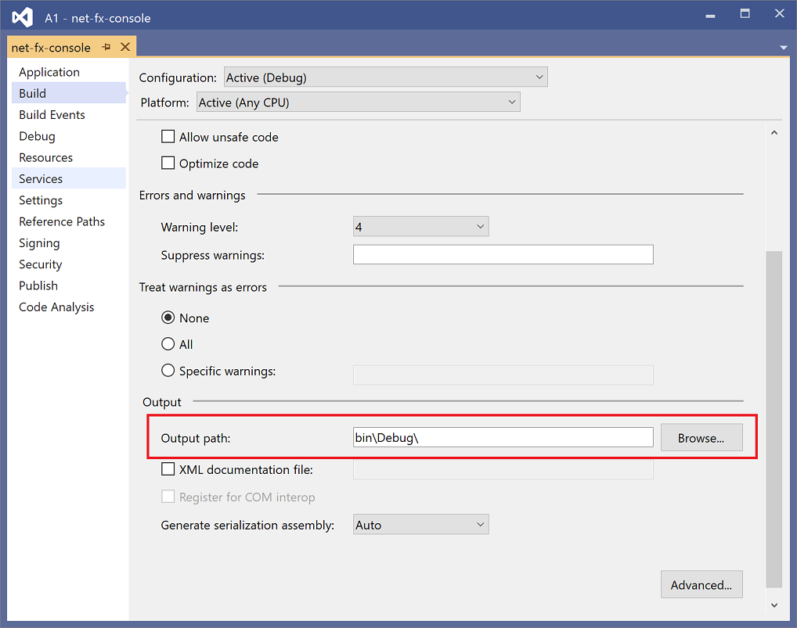
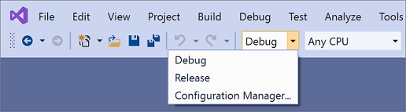
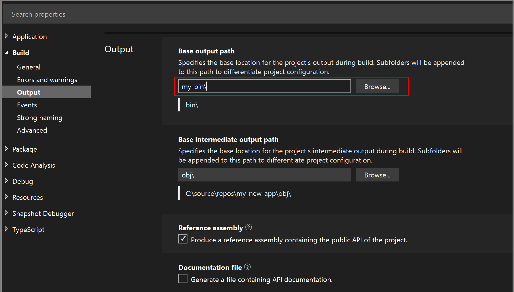
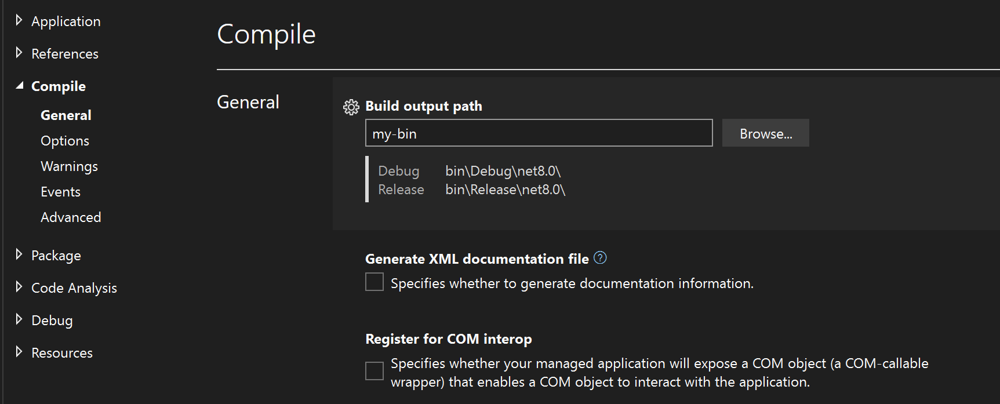
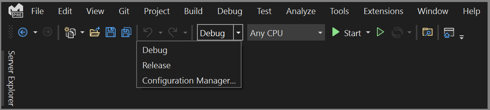
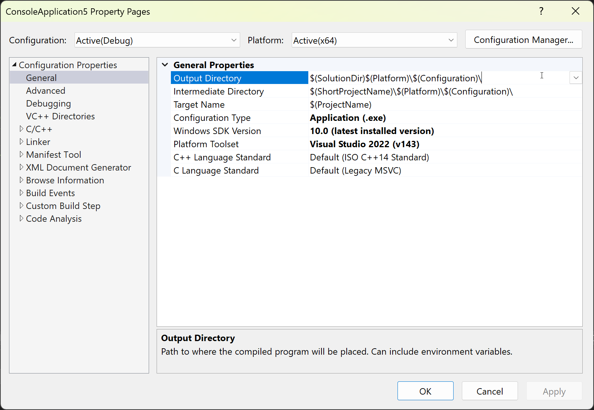

# Change the build output directory

You can specify the location of output generated by your project on a per-configuration basis (for debug, release, or both). With default settings, output folders vary by project type and SDK, with some projects using platform-specific or framework-specific subfolders.

Visual Studio provides properties that let you place intermediate and final output in custom folders either by specifying the paths relative to the project folder, or an absolute path anywhere in the filesystem. In addition to settings you specify in the Visual Studio project properties, you can also customize output further by editing the project file and using the capabilities of MSBuild and the .NET SDK for complete control over all aspects of project output, either for individual projects or at the solution level for many projects.

:::moniker range="vs-2019"

## Change the build output directory

1. Clean the project or solution to remove any existing output files (**Build** > **Clean solution**).

1. To open the project's property pages, right-click on the project node in **Solution Explorer** and select **Properties**.

1. Select the appropriate tab based on your project type:

   - For C#, select the **Build** tab.
   - For Visual Basic, select the **Compile** tab.
   - For C++ or JavaScript, select the **General** tab.

1. In the configuration drop-down at the top, choose the configuration whose output file location you want to change (**Debug**, **Release**, or **All Configurations**).

1. Find the output path entry on the page&mdash;it differs depending on your project type:

   - **Output path** for C# and JavaScript projects
   - **Build output path** for Visual Basic projects
   - **Output directory** for Visual C++ projects

   Type in the path to generate output to (absolute, or relative to the root project directory), or choose **Browse** to browse to that folder.

   
   
   > [!NOTE]
   > Some projects (.NET and ASP.NET Core) will by default include the framework version or runtime identifier in the build path. To change this, right-click the project node in **Solution Explorer**, select **Edit Project File**, and add the following:

   > ```xml
   > <PropertyGroup>
   >   <AppendTargetFrameworkToOutputPath>false</AppendTargetFrameworkToOutputPath>
   >   <AppendRuntimeIdentifierToOutputPath>false</AppendRuntimeIdentifierToOutputPath>
   > </PropertyGroup>
   > ```

> [!TIP]
> If the output is not being generated to the location that you specified, make sure you're building the corresponding configuration (for example, **Debug** or **Release**) by selecting it on the menu bar of Visual Studio.
>
> 

## Build to a common output directory

By default, Visual Studio builds each project in a solution in its own folder inside the solution. You can change the build output paths of your projects to force all outputs to be placed in the same folder.

### To place all solution outputs in a common directory

1. Clean the solution to remove any existing output files (**Build** > **Clean solution**).

1. Click on one project in the solution.

1. On the **Project** menu, click **Properties**.

1. In each project, depending on its type, select either **Compile** or **Build**, and set the **Output path** or **Base output path** to a folder to use for all projects in the solution.

1. Open the project file for the project, and add the following property declaration to the first property group.

   ```xml
   <PropertyGroup>
     <!-- existing property declarations are here -->
     <UseCommonOutputDirectory>true</UseCommonOutputDirectory>
   </PropertyGroup>
   ```

   Setting `UseCommonOutputDirectory` to `true` tells Visual Studio and its underlying build engine (MSBuild) that you're putting multiple project outputs in the same folder, and so MSBuild omits the copying step that normally happens when projects depend on other projects.

1. Repeat steps 2-5 for all projects in the solution. You can skip some projects if you have some exceptional projects that should not use the common output directory.

### To set the intermediate output directory for a project (.NET projects)

1. Clean the project to remove any existing output files.

1. Open the project file.

1. Add the following property declaration to the first property group.

   ```xml
   <PropertyGroup>
     <!-- existing property declarations are here -->
     <IntermediateOutputPath>path</IntermediateOutputPath>
   </PropertyGroup>
   ```

   The path is relative to the project file, or you can use an absolute path. If you want to put the project name in the path, you can reference it by using the MSBuild properties `$(MSBuildProjectName)`, `$(MSBuildProjectDirectory)`. For more properties you can use, see [MSBuild reserved and well-known properties](../msbuild/msbuild-reserved-and-well-known-properties.md).

1. Visual Studio still creates the obj folder under the project folder when you build, but it's empty. You can delete it as part of the build process. One way to do that is to add a post-build event to run the following command:

   ```cmd
   rd "$(ProjectDir)obj" /s /q
   ```

   See [Specify custom build events](specifying-custom-build-events-in-visual-studio.md).

:::moniker-end

:::moniker range=">=vs-2022"

In Visual Studio 2022, there are different Project Designer user interfaces, depending on your project type. .NET Framework projects use the legacy .NET Project Designer, but .NET Core (and .NET 5 and later) projects use the current .NET Project Designer. C++ projects use their own property pages user interface. The steps in this section depend on what Project Designer you're using.

## Change the build output directory

### [.NET](#tab/netcore)

This procedure applies to projects in Visual Studio 2022 targeting .NET Core or .NET 5 and later.

1. Clean the project or solution to remove any existing output files (**Build** > **Clean solution**).

1. Right-click on the project node in **Solution Explorer** and select **Properties**.

1. For C# projects, expand the **Build** section and scroll down to the **Output** subsection. For Visual Basic, expand the **Compile** section, and look under **General**.

1. Find the **Base output path**, and type in the path to generate output to (absolute or relative to the root project directory), or choose **Browse** to browse to that folder instead. Note that the configuration name is appended to the base output path to generate the actual output path.

   C#:

   

   Visual Basic:

   

   > [!NOTE]
   > Some projects (.NET and ASP.NET Core) will by default include the framework version or runtime identifier in the final output path. To change this, right-click the project node in **Solution Explorer**, select **Edit Project File**, and add the following:

   > ```xml
   > <PropertyGroup>
   >   <AppendTargetFrameworkToOutputPath>false</AppendTargetFrameworkToOutputPath>
   >   <AppendRuntimeIdentifierToOutputPath>false</AppendRuntimeIdentifierToOutputPath>
   > </PropertyGroup>
   > ```

### Build to a common output directory

By default, Visual Studio builds each project in a solution in its own folder inside the solution. You can change the build output paths of your projects to force all outputs to be placed in the same folder.

1. Clean the solution to remove any existing output files (**Build** > **Clean solution**).

1. Click on one project in the solution.

1. On the **Project** menu, click **Properties**.

1. In each project, depending on its type, select either **Compile** or **Build**, and set the **Output path** or **Base output path** to a folder to use for all projects in the solution.

1. Open the project file for the project, and add the following property declaration to the first property group.

   ```xml
   <PropertyGroup>
     <!-- existing property declarations are here -->
     <UseCommonOutputDirectory>true</UseCommonOutputDirectory>
   </PropertyGroup>
   ```

   Setting `UseCommonOutputDirectory` to `true` tells Visual Studio and its underlying build engine (MSBuild) that you're putting multiple project outputs in the same folder, and so MSBuild omits the copying step that normally happens when projects depend on other projects.

1. Repeat steps 2-5 for all projects in the solution. You can skip some projects if you have some exceptional projects that should not use the common output directory.

> [!TIP]
> If the output is not being generated to the location that you specified, make sure you're building the corresponding configuration (for example, **Debug** or **Release**) by selecting it on the menu bar of Visual Studio.
>
> 

### [.NET Framework](#tab/netfx)

This procedure applies to .NET Framework projects.


1. Clean the project or solution to remove any existing output files (**Build** > **Clean solution**).

1. Right-click on the project node in **Solution Explorer** and select **Properties**.

1. Select the appropriate tab based on your project type:

   - For C#, select the **Build** tab.
   - For Visual Basic, select the **Compile** tab.

1. In the configuration drop-down at the top, choose the configuration whose output file location you want to change (**Debug**, **Release**, or **All Configurations**).

1. Find the output path entry on the page&mdash;it differs depending on your project type:

   - **Output path** for C# and JavaScript projects
   - **Build output path** for Visual Basic projects

   Type in the path to generate output to (absolute or relative to the root project directory), or choose **Browse** to browse to that folder instead.

   

### Build to a common output directory

By default, Visual Studio builds each project in a solution in its own folder inside the solution. You can change the build output paths of your projects to force all outputs to be placed in the same folder.

1. Clean the solution to remove any existing output files (**Build** > **Clean solution**).

1. Click on one project in the solution.

1. On the **Project** menu, click **Properties**.

1. In each project, depending on its type, select either **Compile** or **Build**, and set the **Output path** or **Base output path** to a folder to use for all projects in the solution.

1. Open the project file for the project, and add the following property declaration to the first property group.

   ```xml
   <PropertyGroup>
     <!-- existing property declarations are here -->
     <UseCommonOutputDirectory>true</UseCommonOutputDirectory>
   </PropertyGroup>
   ```

   Setting `UseCommonOutputDirectory` to `true` tells Visual Studio and its underlying build engine (MSBuild) that you're putting multiple project outputs in the same folder, and so MSBuild omits the copying step that normally happens when projects depend on other projects.

1. Repeat steps 2-5 for all projects in the solution. You can skip some projects if you have some exceptional projects that should not use the common output directory.

> [!TIP]
> If the output is not being generated to the location that you specified, make sure you're building the corresponding configuration (for example, **Debug** or **Release**) by selecting it on the menu bar of Visual Studio.
>
> 

### [C++](#tab/cpp)

To change the build output directory for a single C++ project:

1. Clean the project to remove any existing output files (**Build** > **Clean solution**).

1. Right-click on the project node in **Solution Explorer** and select **Properties**.

1. Select the **General** tab.

1. In the configuration drop-down at the top, choose the configuration whose output file location you want to change (**Debug**, **Release**, or **All Configurations**).

   If you are viewing **All Configurations** or **All Platforms**, you might see `<different options>` for some of the properties. Property values can be different for each combination of configuration and platform. While you can set them individually, the default settings use the same expression for all combinations, but they use the macros `$(Configuration)` and `$(Platform)` to produce a unique output path for each combination.

1. Find the output path in **Output directory**. The dropdown gives options for editing the expression, or browsing to a path, or (if relevant) **\<inherit from parent or project default\>**.

   Type in the path to generate output to (absolute or relative to the root project directory), or choose **Browse** to browse to that folder instead.

   

   For expressions that depend on macro values, click on **Macros >>** to view the available macros and their values. The dialog also shows you the final expanded value of the property with the current macro values.

   All environment variables are exposed in MSBuild as properties, so if you need to reference an environment variable, you can reference it using the syntax `$(VAR)` for the environment variable `VAR`. When building a path using macros and environment variables, be careful to consider whether a backslash is needed or not.

This procedure sets a property `OutDir` in the project file (`.vcxproj`). If you view the project file after setting this property, you see that code similar to the following was added:

```xml
  <PropertyGroup Condition="'$(Configuration)|$(Platform)'=='Debug|x64'">
    <OutDir>C:\MyOutputFolder</OutDir>
  </PropertyGroup>
```

For more information, see [General Property Page](/cpp/build/reference/general-property-page-project) and to be sure you're familiar with how to work with C++ property pages to understand how property values can depend on configurations and platforms, see [Working with project properties](/cpp/build/working-with-project-properties).

---

## Set the intermediate output directory for a project

### [.NET](#tab/netcore)

This procedure applies to projects in Visual Studio 2022 targeting .NET Core or .NET 5 and later.

1. Clean the project to remove any existing output files.

1. Open the project file.

1. Add the following property declaration to the first property group.

   ```xml
   <PropertyGroup>
     <!-- existing property declarations are here -->
     <IntermediateOutputPath>path</IntermediateOutputPath>
   </PropertyGroup>
   ```

   The path is relative to the project file, or you can use an absolute path. If you want to put the project name in the path, you can reference it by using the MSBuild properties `$(MSBuildProjectName)`, `$(MSBuildProjectDirectory)`. For more properties you can use, see [MSBuild reserved and well-known properties](../msbuild/msbuild-reserved-and-well-known-properties.md).

1. Visual Studio still creates the obj folder under the project folder when you build, but it's empty. You can delete it as part of the build process. One way to do that is to add a post-build event to run the following command:

   ```cmd
   rd "$(ProjectDir)obj" /s /q
   ```

   See [Specify custom build events](specifying-custom-build-events-in-visual-studio.md).

### [.NET Framework](#tab/netfx)

This procedure applies to .NET Framework projects.

1. Clean the project to remove any existing output files.

1. Open the project file.

1. Add the following property declaration to the first property group.

   ```xml
   <PropertyGroup>
     <!-- existing property declarations are here -->
     <IntermediateOutputPath>path</IntermediateOutputPath>
   </PropertyGroup>
   ```

   The path is relative to the project file, or you can use an absolute path. If you want to put the project name in the path, you can reference it by using the MSBuild properties `$(MSBuildProjectName)`, `$(MSBuildProjectDirectory)`. For more properties you can use, see [MSBuild reserved and well-known properties](../msbuild/msbuild-reserved-and-well-known-properties.md).

1. Visual Studio still creates the obj folder under the project folder when you build, but it's empty. You can delete it as part of the build process. One way to do that is to add a post-build event to run the following command:

   ```cmd
   rd "$(ProjectDir)obj" /s /q
   ```

   See [Specify custom build events](specifying-custom-build-events-in-visual-studio.md).

### [C++](#tab/cpp)

Use the **Intermediate Directory** property to set the directory for intermediate output such as `.obj` files.

In the project file, the property is `IntDir`. To set the paths for intermediate and final output in the project file, add a property group like the following:

```xml
  <PropertyGroup>
    <OutDir>$(SolutionDir)out\$(Platform)\$(Configuration)\</OutDir>
    <IntDir>$(SolutionDir)int\$(MSBuildProjectName)\$(Platform)\$(Configuration)\</IntDir>
  </PropertyGroup>
```

---

## Use Directory.Build.props to set the output directory

### [.NET](#tab/netcore)

If you have a large number of projects, and you want to change the output folder for them all, it would be tedious and error-prone to change each one using the methods described earlier in this article. In such cases, you can create a file in the solution folder, *Directory.Build.props*, to set the appropriate MSBuild properties in one place, to apply to all the projects in the solution. By placing a file with this particular name in the parent folder of all the projects you want to be affected, you can easily maintain customizations in a single place and make it easy to change the values. See [Customize the build by folder](../msbuild/customize-by-directory.md).

### [.NET Framework](#tab/netfx)

If you have a large number of projects, and you want to change the output folder for them all, it would be tedious and error-prone to change each one using the methods described earlier in this article. In such cases, you can create a file in the solution folder, *Directory.Build.props*, to set the appropriate MSBuild properties in one place, to apply to all the projects in the solution. By placing a file with this particular name in the parent folder of all the projects you want to be affected, you can easily maintain customizations in a single place and make it easy to change the values. See [Customize the build by folder](../msbuild/customize-by-directory.md).

### [C++](#tab/cpp)

If you have a large number of projects, and you want to change the output folder for them all, it would be tedious and error-prone to change each one using the methods described earlier in this article. In such cases, you can create a file in the solution folder, *Directory.Build.props*, to set the appropriate MSBuild properties in one place, to apply to all the projects in the solution. By placing a file with this particular name in the parent folder of all the projects you want to be affected, you can easily maintain customizations in a single place and make it easy to change the values. See [Customize C++ builds](../msbuild/customize-cpp-builds.md).

To set both the intermediate and final output paths in *Directory.build.props*, it is best to use `$(MSBuildThisFileDirectory)` instead of `$(SolutionDir)` to support command-line project builds, where `$(SolutionDir)` is not defined. The following code sets both in a way that works for Visual Studio builds and command-line builds  of individual projects:

```xml
<Project>
<PropertyGroup>
    <SolutionDir Condition="'$(SolutionDir)' == ''">$(MSBuildThisFileDirectory)</SolutionDir>
    <OutDir>$(SolutionDir)out\$(Platform)\$(Configuration)\</OutDir>
    <IntDir>$(SolutionDir)int\$(MSBuildProjectName)\$(Platform)\$(Configuration)\</IntDir>
  </PropertyGroup>
</Project>
```

---

## Use artifacts to organize build output

For .NET 8 projects, you can use the artifacts functionality to arrange output in a highly customizable and flexible way. See [Artifacts output layout](/dotnet/core/sdk/artifacts-output).

:::moniker-end

## Related content

- [Build page, Project Designer (C#)](../ide/reference/build-page-project-designer-csharp.md)
- [General Property page (project)](/cpp/build/reference/general-property-page-project)
- [Compile and build](../ide/compiling-and-building-in-visual-studio.md)
