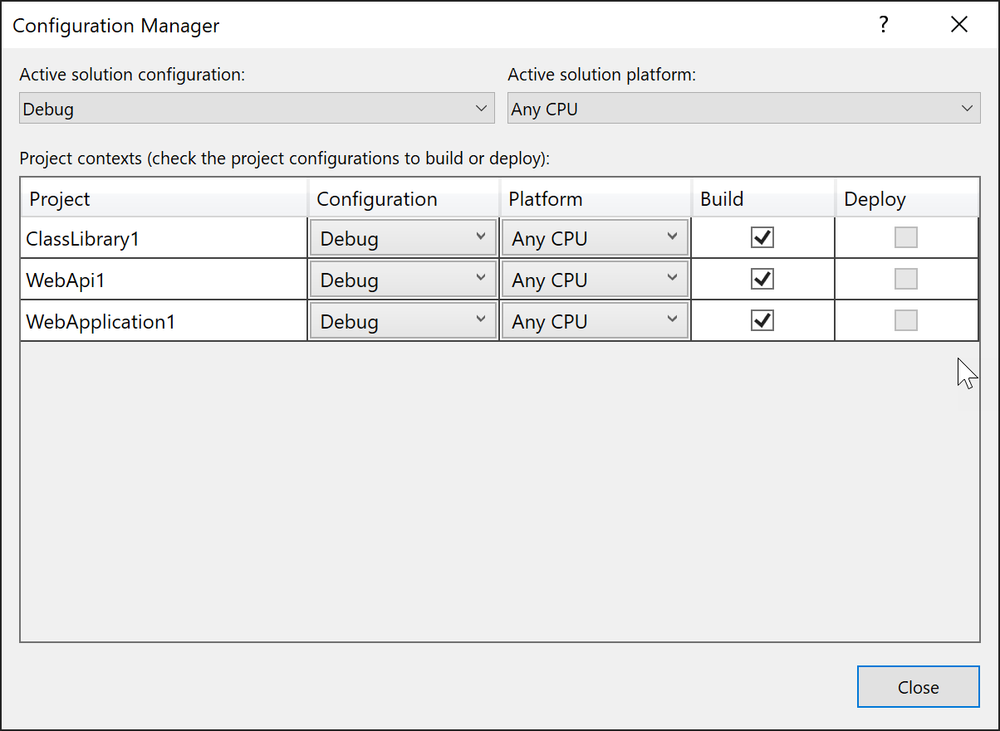
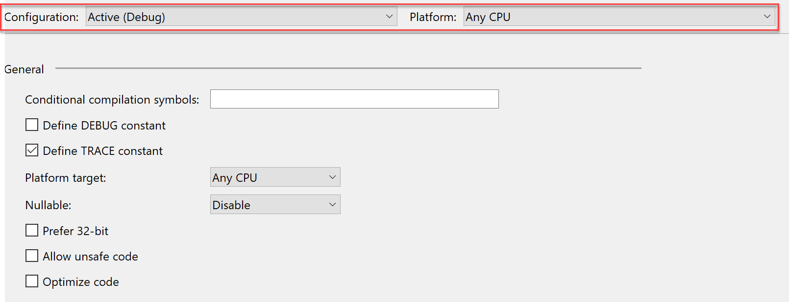
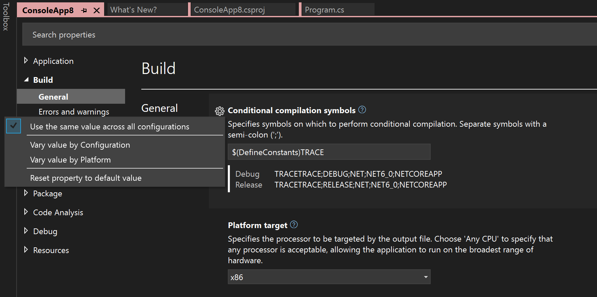

# Create and edit configurations

You can create several build configurations for a solution, in addition to the built-in configurations **Debug** and **Release**. For example, you can create a **Test** configuration for internal testing builds, and you can configure different kinds of builds that you can distribute to different customers.

## Create build configurations

You can use the **Configuration Manager** dialog box to select or modify existing build configurations, or to create new ones.

To open the **Configuration Manager** dialog box, in **Solution Explorer**, right-click on the solution node to open the shortcut menu for the solution, and then choose **Configuration Manager**.

You can also open the **Configuration Manager** by clicking on the dropdown list on the Visual Studio  toolbar that lets you choose the current configuration (for example, **Debug** or **Release**).

There are two levels of configuration, the solution configuration and the project configuration. The solution configuration is what you choose when you switch active configurations using the toolbar in Visual Studio. The project configuration is the specific configuration on each project. To see why this distinction is helpful, consider a case where you're developing and debugging one project in a large solution. You can select which projects you actually need debug builds for, or which ones you want to skip building because they're not relevant to the work at hand. That way, switching between Debug and Release solution configurations doesn't apply to every other project, whether or not you're actively debugging it or not.

In the **Configuration Manager** dialog box, you can use the **Active solution configuration** drop-down list to select a solution-wide build configuration, modify an existing one, or create a new configuration. You can use the **Active solution platform** drop-down list to select the platform that the configuration targets, modify an existing one, or add a platform. If you add a solution platform, it must be supported by at least one of the projects.

The **Project contexts** pane lists the projects in the solution. For each project, you can select a project-specific configuration and platform, modify existing ones, or create a new configuration or add a new platform from a list of platforms supported by Visual Studio. You can also select check boxes that indicate whether each project is included when you use the solution-wide configuration to build or deploy the solution.

> [!WARNING]
> Visual Studio does not enforce any requirement that the project platforms you choose in this dialog match the solution platform. For example, there is nothing stopping you from setting all the project platforms to `x86` when the active solution platform is `x64`, so make sure to avoid confusion and choose project platforms that match the solution platform whenever possible.

### Set properties based on configurations

To set properties based on configurations, in **Solution Explorer**, open the shortcut menu for a project and then choose **Properties**.

:::moniker range="<=vs-2019"

Most project properties are not dependent on the configuration or the platform, but some are. For a **Release** configuration, you can specify that code is optimized when the solution is built, and for a **Debug** configuration, you can specify that the `DEBUG` conditional compilation symbol is defined. You can also choose which warnings you want to suppress, or elevate to errors, differently based on the configuration or platform, as well as control certain settings that affect some compiler options, **Arithmetic overflow**, **File alignment**, and the `/deterministic` compiler option.

In the project property pages, the pages that have settings that depend on the configuration and the platform have dropdown boxes that let you choose the configuration and platform that the current values of the settings apply to.

:::moniker-end

:::moniker range=">=vs-2022"
Most project properties are not dependent on the configuration or the platform, but some are. For a **Release** configuration, you can specify that code is optimized when the solution is built, and for a **Debug** configuration, you can specify that the `DEBUG` conditional compilation symbol is defined. You can also choose which warnings you want to suppress, or elevate to errors, differently based on the configuration or platform, as well as control certain settings that affect some compiler options, **Arithmetic overflow**, **File alignment**, and the `/deterministic` compiler option.

Properties that you can set differently based on the configuration and the platform have a gear icon next to them on the project settings page. If you click on the gear icon, a menu pops up that gives you options for having the same or different values based on either the configuration, the platform, or both.

:::moniker-end

For more information about property page settings, see [Manage project and solution properties](../ide/managing-project-and-solution-properties.md).

## Create a project configuration

You create a new project configuration when you want to add a new type of build. For example, instead of **Debug** and **Release**, you could create **Development**, **Testing**, and **Production** configurations.

1. Open the **Configuration Manager** dialog box.

2. Select a project in the **Project** column.

3. In the **Configuration** drop-down list for that project, choose **New**.

     The **New Project Configuration** dialog box opens.

4. In the **Name** box, enter a name for the new configuration.

5. To use the property settings from an existing project configuration,  in the **Copy settings from** drop-down list, choose a configuration. You can customize the settings later in the project property pages.

6. To create a solution-wide configuration at the same time, select the **Create new solution configuration** check box. 

## Rename a project configuration

1. Open the **Configuration Manager** dialog box.

2. In the **Project** column, select the project that has the project configuration you want to rename.

3. In the **Configuration** drop-down list for that project, choose **Edit**.

     The **Edit Project Configurations** dialog box opens.

4. Select the project configuration name you want to change.

5. Select **Rename**, and then enter a new name.

## Create and modify solution-wide build configurations

### To create a solution-wide build configuration

1. Open the **Configuration Manager** dialog box.

2. In the **Active solution configuration** drop-down list, choose **New**.

     The **New Solution Configuration** dialog box opens.

3. In the **Name** text box, enter a name for the new configuration.

4. To use the settings from an existing solution configuration, in the **Copy settings from** drop-down list, choose a configuration.

5. If you want to create project configurations at the same time, select the **Create new project configurations** check box.

### To rename a solution-wide build configuration

1. Open the **Configuration Manager** dialog box.

2. In the **Active solution configuration** drop-down list, choose **Edit**.

     The **Edit Solution Configurations** dialog box opens.

3. Select the solution configuration name you want to change.

4. Select **Rename**, and then enter a new name.

### To modify a solution-wide build configuration

1. Open the **Configuration Manager** dialog box.

2. In the **Active solution configuration** drop-down list, select the configuration you want.

3. In the **Project contexts** pane, for every project, select the **Configuration** and **Platform** you want, and select whether to **Build** it and whether to **Deploy** it.

## Related content

- [Understand build configurations](../ide/understanding-build-configurations.md)
- [Configure projects to target platforms](how-to-configure-projects-to-target-platforms.md)
- [Build and clean projects and solutions in Visual Studio](../ide/building-and-cleaning-projects-and-solutions-in-visual-studio.md)
- [Manage project and solution properties](managing-project-and-solution-properties.md)
