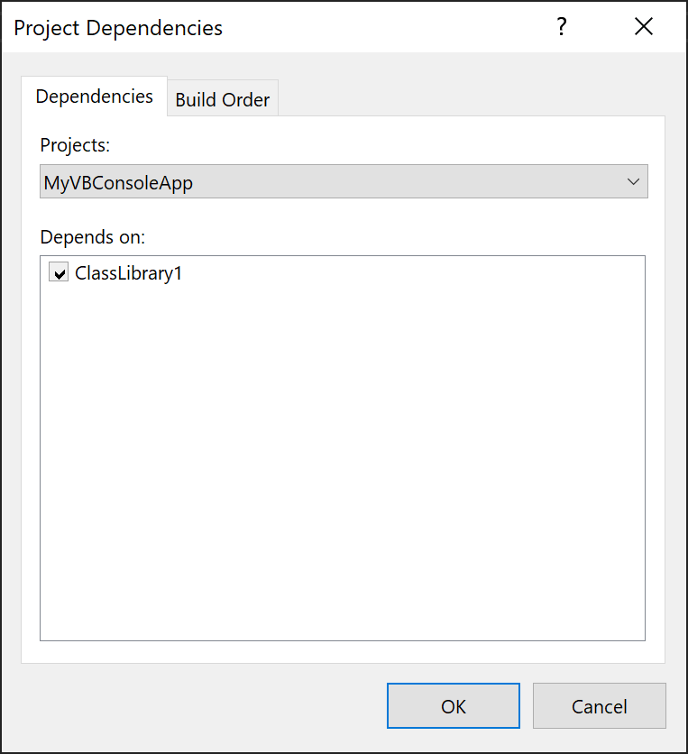
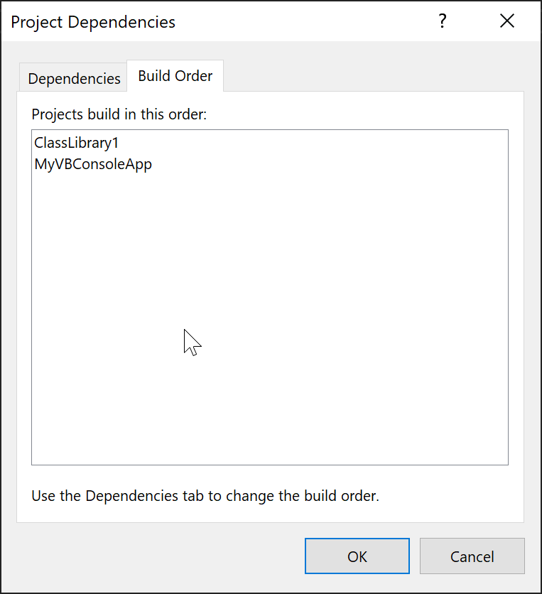

# Create and remove project dependencies

When building a solution that contains multiple projects, it can be necessary to build certain projects first, to generate compiled binaries used by other projects. When a project consumes output generated by another project, the project that generates the output is referred to as a project dependency of the project that consumes the output. Such dependency relationships can be defined in the **Project Dependencies** dialog box.

> [!TIP]
> The feature discussed in this article, manually managing project dependencies, is distinct from project-to-project references used in modern project types, and reflects a method of handling dependencies between projects that predates MSBuild. If you're working with a .NET or C++ project or another project type that uses MSBuild, it's not necessary to explicitly add project dependencies as described in this article. A project dependency is automatically created when you add a project-to-project reference from one project to another project. In most cases, you should instead create a project-to-project reference, which in addition to creating a dependency relationship between the projects, also creates a reference that you can use to build code that uses classes, interfaces, and other code entities from the other project. See [Managing references in a project](managing-references-in-a-project.md#project-to-project-references).
>
> There are cases where a project requires another project to build first for some other reason than a project-to-project reference. For example, a project might require a build task that's built in another project. In that case, the steps described in this article provide a way to expressing that dependency.

## To assign dependencies to projects

1. In **Solution Explorer**, select a project.

2. On the **Project** menu, choose **Build Dependencies > Project Dependencies**.

    The **Project Dependencies** dialog box opens.

    

3. On the **Dependencies** tab, select a project from the **Project** drop-down menu.

4. In the **Depends on** field, select the check box of any other project that must build before this project does.

   Your solution must consist of more than one project before you can create project dependencies.

## To remove dependencies from projects

1. In **Solution Explorer**, select a project.

2. On the **Project** menu, choose **Build Dependencies > Project Dependencies**.

     The **Project Dependencies** dialog box opens.

3. On the **Dependencies** tab, select a project from the **Project** drop-down menu.

4. In the **Depends on** field, clear the check boxes beside any other projects that are no longer dependencies of this project.

## To view the build order

From the **Project Dependencies** dialog, you can switch to the **Build order** tab to the view the build order for the solution.

To view the build order in a solution at any time, right-click on the solution node and choose **Build Dependencies, Project Build Order**.

You can use the **Build order** tab to view the order that projects will be built, but you can't directly change the order from this tab.

The order you see listed is the desired logical build order, but in practice, Visual Studio further optimizes the build process by building multiple projects in parallel. However, as long as you've specified the project dependencies, any dependent projects will not start building until after their dependencies have completed.

## Related content

- [Build and clean projects and solutions in Visual Studio](../ide/building-and-cleaning-projects-and-solutions-in-visual-studio.md)
- [Compile and build](../ide/compiling-and-building-in-visual-studio.md)
- [Understand build configurations](../ide/understanding-build-configurations.md)
- [Manage project and solution properties](managing-project-and-solution-properties.md)
