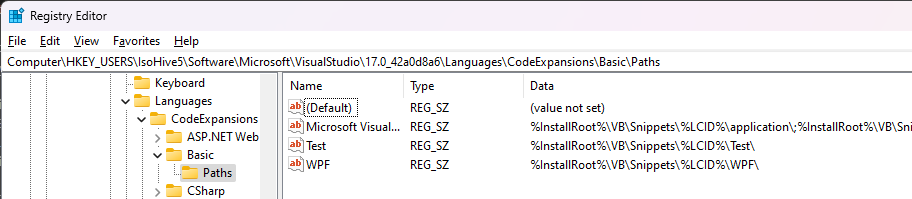

# Distribute code snippets as a Visual Studio extension

You can give your code snippets to your friends and have them install the snippets on their own computers by using **Code Snippets Manager**. However, if you have several snippets to distribute or would like to distribute them more widely, you can include your snippet files in a Visual Studio extension. Visual Studio users can then install the extension to obtain the snippets.

## Prerequisites

Install the **Visual Studio extension development** workload to get access to the **VSIX Project** project templates.


## Set up the extension directory structure

In this procedure, you'll use the same Hello World code snippet that's created in [Walkthrough: Create a code snippet](../ide/walkthrough-creating-a-code-snippet.md). This article provides the snippet XML, so you don't have to go back and create a snippet.

1. Create a new project from the **Empty VSIX Project** template and name the project `TestSnippet`.

2. In the **TestSnippet** project, add a new XML file and call it `VBCodeSnippet.snippet` (*.snippet* is the new file extension). Replace the content with the following XML:

    ```xml
    <?xml version="1.0" encoding="utf-8"?>
    <CodeSnippets
        xmlns="http://schemas.microsoft.com/VisualStudio/2005/CodeSnippet">
      <CodeSnippet Format="1.0.0">
        <Header>
          <Title>Hello World VB</Title>
          <Shortcut>HelloWorld</Shortcut>
          <Description>Inserts code</Description>
          <Author>MSIT</Author>
          <SnippetTypes>
            <SnippetType>Expansion</SnippetType>
            <SnippetType>SurroundsWith</SnippetType>
          </SnippetTypes>
        </Header>
        <Snippet>
          <Code Language="VB">
            <![CDATA[Console.WriteLine("Hello, World!")]]>
          </Code>
        </Snippet>
      </CodeSnippet>
    </CodeSnippets>
    ```

1. In **Solution Explorer**, select the project node and add a folder that has the name you want the snippet to have in **Code Snippets Manager**. In this case, it should be **HelloWorldVB**.

2. Move the *.snippet* file to the *HelloWorldVB* folder.

3. Select the *.snippet* file in **Solution Explorer**, and in the **Properties** window make sure **Build Action** is set to **Content**, **Copy to Output Directory** is set to **Copy always**, and **Include in VSIX** is set to **true**.

## Add the .pkgdef file

1. Add a text file to the *HelloWorldVB* folder and name it *HelloWorldVB.pkgdef*. This file is used to add certain keys to the registry. For more information, see [View the registry for the snippet (Optional)](#view-the-registry-for-the-snippet-optional).

2. Add the following lines to the file.

    ```txt
    // Visual Basic
    [$RootKey$\Languages\CodeExpansions\Basic\Paths]
    "HelloWorldVB"="$PackageFolder$"
    ```

    If you examine this key, you can see how to specify languages other than Visual Basic.

3. Select the *.pkgdef* file in **Solution Explorer**, and in the **Properties** window make sure that:

   - **Build Action** is set to **Content**
   - **Copy to Output Directory** is set to **Copy always**
   - **Include in VSIX** is set to **true**

4. Add the *.pkgdef* file as an asset in the VSIX manifest. In the *source.extension.vsixmanifest* file, go to the **Assets** tab and click **New**.

5. In the **Add New Asset** dialog, set the **Type** to **Microsoft.VisualStudio.VsPackage**, the **Source** to **File on filesystem**, and the **Path** to **HelloWorldVB.pkgdef** (which should appear in the dropdown). Select **OK** to save this new asset.

## Register the snippet

1. Go to **Tools** > **Code Snippets Manager** and set the **Language** to **Basic**.

2. Select **Add...**, browse to your solution directory's *HelloWorldVB* folder, and select **Select Folder**.

3. *HelloWorldVB* is now one of the code snippet folders. Expand the folder to see the *HelloWorldVB* snippet. Select **OK** to save this newly added folder.

## Test the snippet

Now you can make sure that the code snippet works in the experimental instance of Visual Studio. The experimental instance is a second copy of Visual Studio that is separate from the one you use to write code. It allows you to work on an extension without affecting your development environment.

1. Build the project and start debugging.

   A second instance of Visual Studio appears.

1. Test the snippet. In the experimental instance, open a Visual Basic project and open one of the code files. Place your cursor somewhere in the code, right-click, and on the context menu select **Snippet**, then **Insert Snippet**.

1. Double-click the *HelloWorldVB* folder. You should see a pop-up **Insert Snippet: HelloWorldVB >** that has a dropdown **HelloWorldVB**. Double-click the **HelloWorldVB** dropdown.

   The following line is added to the code file:

    ```vb
    Console.WriteLine("Hello, World!")
    ```

## View the registry for the snippet (Optional)

The *.pkgdef* file is used to add certain keys to the registry. After you register the snippet, if you need to view the registry keys in the [private registry hive](https://github.com/microsoft/VSProjectSystem/blob/master/doc/overview/examine_registry.md), you can find them under the following subkey:

::: moniker range=">= vs-2022"
Visual Studio 2022:
**HKEY_USERS\IsolatedHiveName\Software\Microsoft\VisualStudio\17.0_configID\Languages\CodeExpansions\Basic\Paths**
::: moniker-end

Visual Studio 2019:
**HKEY_USERS\IsolatedHiveName\Software\Microsoft\VisualStudio\16.0_configID\Languages\CodeExpansions\Basic\Paths**

To view the registry keys in this location, first close Visual Studio, open the registry editor, and then load the private registry hive into **HKEY_USERS**.

> [!IMPORTANT]
> If you check the registry, make sure you unload the private registry hive before starting Visual Studio.

For example, the registry keys may appear as shown here.



## Related content

- [What are Code snippets?](../ide/code-snippets.md)
