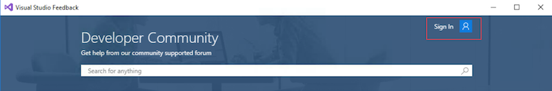
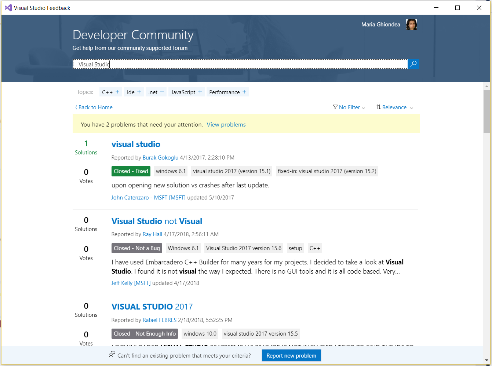
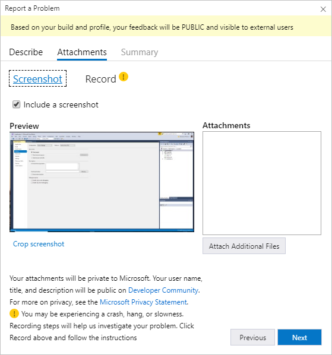
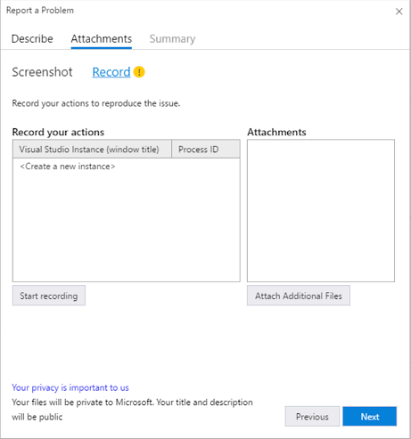

# How to report a problem with Visual Studio

If you experience a problem with Visual Studio, we want to know about it. Here's how to report the problem to [Developer Community](https://developercommunity.visualstudio.com/) so that we can diagnose and fix it.

> [!NOTE]
> This topic applies to Visual Studio on Windows. For Visual Studio for Mac, see [How to report a problem in Visual Studio for Mac](/visualstudio/mac/report-a-problem).

## Report a problem by using Visual Studio

To report a problem for Visual Studio, you must initiate the report from Visual Studio or the Visual Studio Installer. You can't do it directly through the [Developer Community](https://developercommunity.visualstudio.com/) website. Reporting through Visual Studio allows for diagnostic information to be automatically included in the report.

1. In Visual Studio, select **Help** > **Send Feedback** > **Report a Problem**.

   > [!TIP]
   > If you can't complete the Visual Studio installation or you can't access the feedback tool within Visual Studio, you can report a problem by using the **Visual Studio Installer**. To do so, choose the feedback icon in the upper-right corner of the **Visual Studio Installer**.

1. If you are not signed in, select **Sign In**; it's on the right-hand side of the tool, as shown in the following screenshot. Follow the instructions on-screen to sign in.

   

   When you sign in, you can report a problem that you're experiencing. You can also vote or comment on any other problem that you see posted.

1. Once signed in, you will be able to see your **Problems** and **Activity** in the **Items I follow** screen

    

1. Visual Studio provides an interface to search for your problem and see if others have reported it. If someone has reported it, "up-vote" it to let us know.
   > [!NOTE]
   > In order to search, please input the desired text into the search box and either click Enter or press the Search icon.

   

1. If you don’t find the problem you encountered, choose **Report new problem** at the bottom of the screen.

   > [!NOTE]
   > The **Report new problem** button only appears in the Visual Studio interface for Developer Community. You can't report a problem directly on the [Developer Community](https://developercommunity.visualstudio.com/) website.

1. Create a descriptive title for the problem that helps us route it to the correct Visual Studio team.

1. Give us any additional details, and if possible, provide us with the steps to reproduce the problem.

   

1. Select **Next** to move to the **Attachments** tab. Here, you can capture your current screen to send it to Microsoft. To attach additional screenshots or other files, choose **Attach Additional Files**.

   

1. If you don't want to attach a screenshot or [record a repro](#record-a-repro), select **Next** to move to the **Summary** tab.

1. Select **Submit** to send your report, along with any images and trace or dump files. (If the **Submit** button is grayed out, make sure that you've provided a title and description for the report.)

   For information about what data is collected, see [Data we collect](developer-community-privacy.md#data-we-collect).

## Record a repro

Trace and heap dump files are useful in helping us diagnose problems. We appreciate it when you use the **Report a Problem** tool to record your repro steps and send the data to Microsoft. Here's how to do so:

1. After you enter a title and description for your problem, select **Next** to move to the **Attachments** tab.

1. Select the **Record** tab.

1. Under **Record your actions**, select the current instance of Visual Studio if you can reproduce the problem there. If you can't, for example if Visual Studio is hung, select **\<Create a new instance>** to record the actions in a new instance of Visual Studio.

1. Select **Start Recording**. Give permission to run the tool.

   

1. When the **Steps Recorder** tool appears, perform the steps that reproduce the problem.

1. When you're done, choose the **Stop Record** button.

1. Wait a few minutes for Visual Studio to collect and package the information that you recorded.

   For information about what data is collected, see [Data we collect](developer-community-privacy.md#data-we-collect).

## When further information is needed (Need More Info)

Starting in Visual Studio 2017 Version 15.5, there's a new workflow to help users provide additional information about problem reports.

1. When a Microsoft engineer sets the [Visual Studio Developer Community](https://developercommunity.visualstudio.com/) problem to the **Need More Info** state, any user that posted, voted, followed, or commented on the problem gets a notification in the **Report A Problem** tool in Visual Studio.

   

1. Click on the **View Problems** link to filter and sort the view to the problems that need attention. These problems also have an indicator next to them, to differentiate them in general search.

1. Click on a problem to see the problem details view.

   

1. To view the **Need More Info** request, click the **View their request and respond** link in the problem details view. A dialog box shows the request.

   

1. You can provide more information by adding comments, attachments, or recording steps. This experience is similar to reporting a new problem or providing additional information when voting on a problem.

1. The requesting Microsoft engineer receives a notification about the extra information provided. If they have enough information to investigate, the problem state changes. Otherwise, the engineer asks for even further information.

   > [!NOTE]
   > * When you reply, the notification goes away. In its place, you see a banner that thanks you and facilitates a way to provide even more information.
   > * Once the issue changes state, the notification goes away for everyone that's following the issue.
   > * More than one person can reply on the same **Need More Info** request.
   > * There isn't a **Need More Info** workflow on [Developer Community](https://developercommunity.visualstudio.com/) when you access it directly through a web browser, but you can also provide comments and attachments there.

## Search for solutions or provide feedback

If you don't want to or can't use Visual Studio to report a problem, there's a chance that the problem has already been reported and a solution posted on the [Visual Studio Developer Community](https://developercommunity.visualstudio.com/) page.

If you don't have a problem to report but want to suggest a feature, there's a place for that, too. For more information, see the [Suggest a feature](https://developercommunity.visualstudio.com/content/idea/post.html?space=8) page.

## See also

* [Talk to us](../ide/talk-to-us.md)
* [Report a problem with Visual Studio for Mac](/visualstudio/mac/report-a-problem)
* [Report a problem with C++](/cpp/how-to-report-a-problem-with-the-visual-cpp-toolset)
* [Visual Studio Developer Community](https://developercommunity.visualstudio.com/)
* [Developer Community data privacy](developer-community-privacy.md)