# Report a problem with the Visual Studio product or installer

You can report a problem from either Visual Studio or its installer. The built-in Feedback Tool allows you to easily add diagnostic information that helps the Visual Studio teams diagnose and fix the issues. 

Here are the steps to report a problem.

1. **In Visual Studio**, select the feedback icon in the upper-right corner and select Report a Problem. You can also access the feedback tool  from the menu **Help** > **Send Feedback** > **Report a Problem**.
    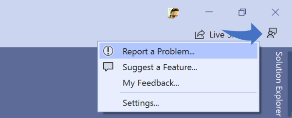

    Alternatively, if you can't install Visual Studio or are unable to access the feedback tool within Visual Studio you can report a problem in the **Visual Studio Installer**.  If you have Visual Studio open, go to **Tools > Get Tools > Features...** to launch the installer, or launch it from the Start menu. In the installer, select the feedback icon in the upper-right corner and select **Report a Problem**.

    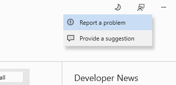

1. Selecting **Report a Problem** will open [Developer Community](https://developercommunity.microsoft.com/VisualStudio) in your default browser and sign you in using the same account you're signed in to Visual Studio with.

   Note: If you are using an ad-blocker you may experience issues during sign-in. Disable the ad-blocker and try to sign in again.

   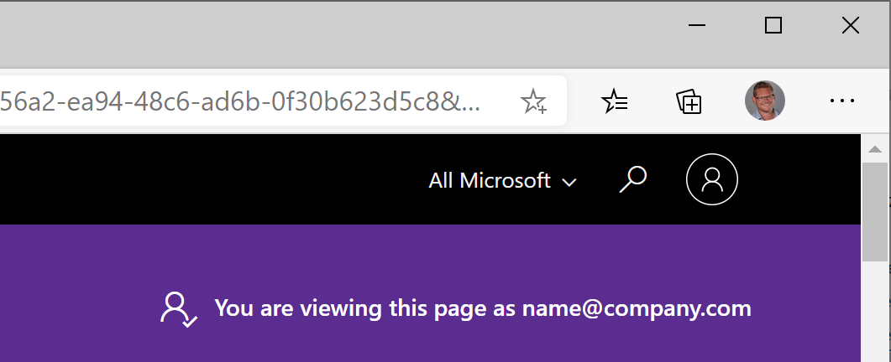

1. Start by entering the descriptive title of your bug report. It must be at least 25 characters long.

    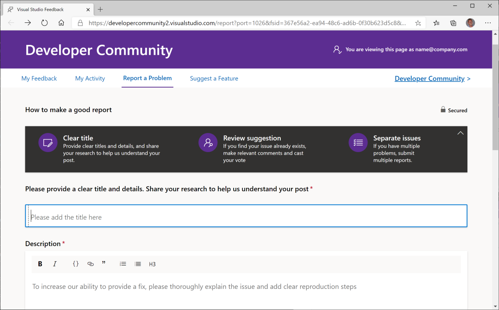

1. Once you start typing, possible duplicates are shown under the title field

    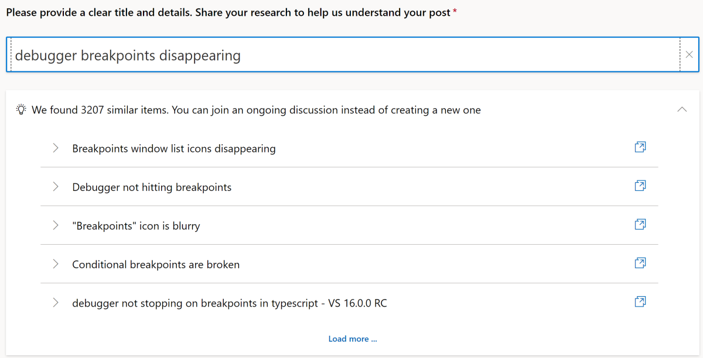

1. Select the possible duplicate bug reports to see if there is one matching your own problem. If there is, vote for it instead of creating your own ticket.

    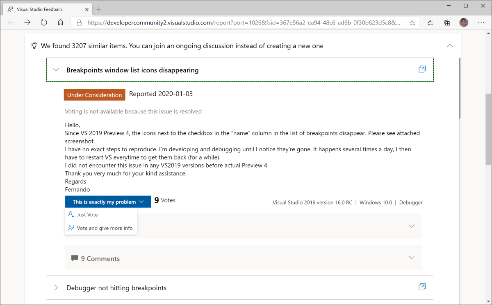

1. If no duplicates were found, continue by entering a description of the problem. It's important to be as clear as possible to increase the chances of us being able to reproduce the bug. Make sure to include clear reproduction steps.

1. If relevant to the bug report, take a screenshot by checking the *Include Visual Studio screenshot* checkbox.  You can even crop the screenshot directly in the browser to remove any sensitive or unrelated parts.

    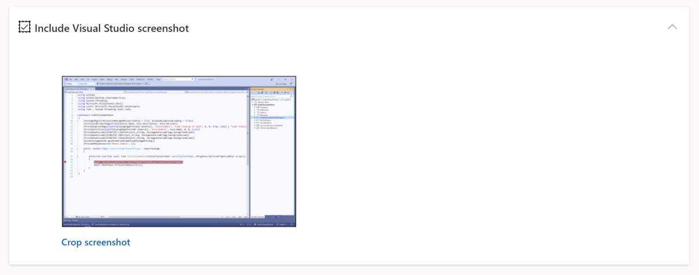
    *Only Microsoft engineers can see the screenshot*

1.  Record your actions to reproduce the issue.

   One of the best ways to help the Visual Studio engineering team solve the problem is to provide a trace and heap dump files for them to look through. You can do that by recording the steps that resulted in the bug. A screenshot will be captured every time the mouse is clicked, but keyboard entry will not record screenshots.
   1. Click **Start recording**. Wait a moment for the permissions prompt.
   2. Go through your steps to record the issue. 
   3. When finished, find the small pop-up window and click **Stop recording**. 

   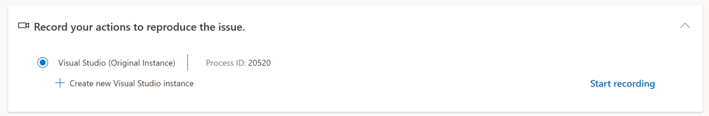
   *Only Microsoft engineers can see the recording*
    
   > [!Warning]
   > There may be a several seconds delay between clicking **Start recording** and the prompt where Windows asks for permission to start a program with elevated permissions.

1. Review the attached files and upload additional files if you believe it would help diagnose the issue.

    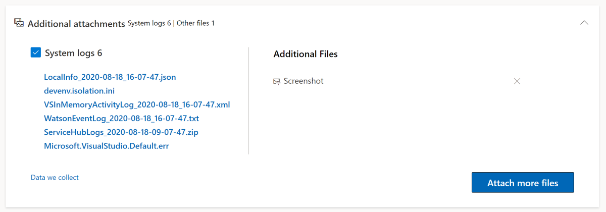
    *Only Microsoft engineers can see the attached files*

1. The last step is to hit the **Submit** button. Submitting the report will send it directly into the internal Visual Studio bug reporting system awaiting triage.

Each one of your problem reports becomes a work item in our core engineering system, empowering you to engage directly with our product teams to help us identify and resolve impactful issues. Your feedback submitted with rich diagnostic information is critical to improving the Visual Studio product family. We really appreciate you taking the time to report problems.

In addition, you can vote on feedback from other community members to bring more attention to a problem and help fix it faster.

## When further information is needed

When an issue is missing important information, we assign the **Needs More Info** state. We comment on the issue with the specific information we need, and you'll receive an email notification. You can provide more information by adding comments, attachments, log/dump files, or recording steps. If we don't receive the information within 7 days, then we send you a reminder. After that, we close the ticket after 14 days of inactivity.

If you need to leave a comment or add attachments, navigate to the issue from the email and comment/add attachments directly.

To add log/dump files or record steps:

1. Open Visual Studio and navigate to the feedback ticket via **Help > Send feedback > My feedback**

   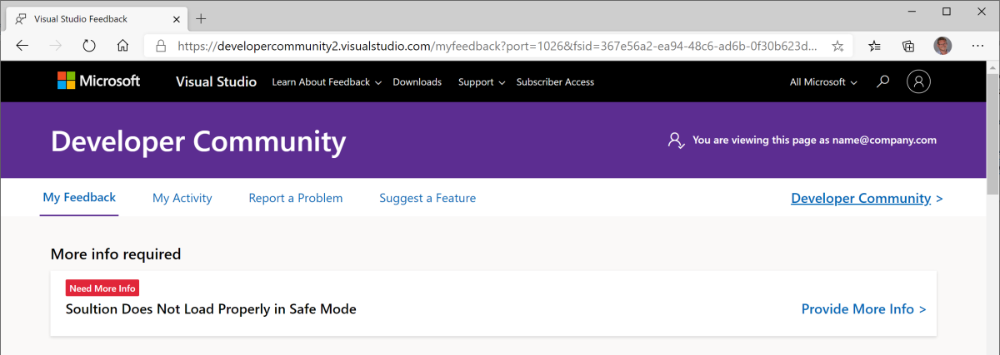

1. Selecting the Provide More Info link on the problem report navigates you to a new screen. From here, you can see what info is being requested.

   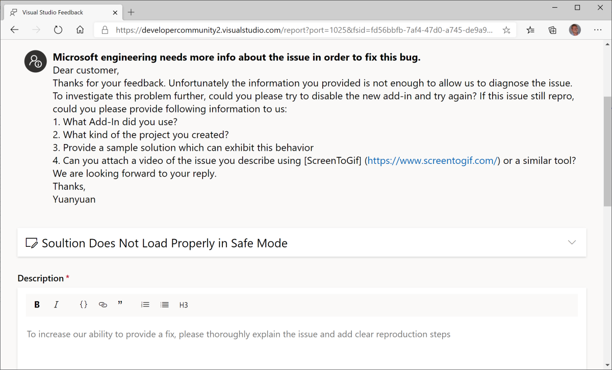

1. Attach your dump/log files or record steps, and then submit.

    

1. The requesting Microsoft engineer receives a notification about the extra information provided. If they have enough information to investigate, the problem state changes. Otherwise, the engineer asks for even further information.

You can see these requests on the **My Feedback** screen along with all your other **Problems** and **Suggestions**.

## Problem Status

After you report a problem, states indicate where your submissions are in their lifecycle. As Microsoft teams review your feedback, they set it with an appropriate state. Track the progress of your problem reports by referencing the states listed below, along with their meaning and color indicators.

| **State** | **Description**                                                                                                         |
|-------------|-------------------------------------------------------------------------------------------------------------------------|
|             | **New** indicates that the bug or issue is newly reported, and no action has been taken on it yet.                    |
|     | **Triaged** indicates that preliminary steps such as moderation, translation, and  initial check for duplicates are  complete. Your ticket has been routed to the appropriate engineering team for consideration.                                     |
|    | **Under Consideration** indicates that Microsoft is reviewing your problem for community impact and will prioritize it accordingly. If the community impact isn't clear or significant yet, we'll continue to monitor the problem in this state.                                                                                           |
|     |  **Under Investigation** indicates that engineers are actively investigating your problem to find a resolution.                                                                                           |
|    | **Need More Info** indicates that we need more diagnostic information from you so that we can go forward with the investigation.  [Learn how to respond to Need More Info requests.](./how-to-report-a-problem-with-visual-studio.md#when-further-information-is-needed)                                                                                        |
|     | **Fixed - Pending Release** indicates that we have a fix for the problem and it will be available in an upcoming preview or release.  When the fix becomes available in a preview, the problem is tagged with a 'fixed in' tag specifying the preview version. |
|     | **Closed - Fixed** indicates that we've released a fix for the problem. The problem is also now tagged with a "fixed in:" tag specifying the release version. |
|     | **Closed - Duplicate** indicates that your issue has already been reported via another feedback. We'll provide you with the link where you can track the original problem report. |
|     | **Closed - Lower Priority** To focus on bringing each of you in our developer community the best value, we prioritize issues with the highest customer impact. Although we're unable to address this particular issue at this time, be assured that all your feedback is valuable and helps improve Visual Studio. |
|     | **Closed - Not a Bug**  indicates that we've determined that the reported functionality is by current design. |
|     | **Closed - Not Enough Info** indicates that we don't have enough information to investigate this for you. We'll be happy to reconsider the feedback after the necessary information is available. |
|     | **Closed - Other Product** indicates we've determined that your issue applies to another product. See the comment from Microsoft for which external product and any related links. |

## FAQ

#### How can I increase the chance of my problem getting resolved quickly?
We recommend using search to ensure that the problem you're about to report hasn't already been reported. If you find an existing item matching your problem, follow and vote on that problem ticket.

Provide all the information you can to help our teams reproduce what you're experiencing.  This information includes  necessary repro steps, code fragments, screenshots, repro recordings, log files, and other artifacts.

#### How is my feedback prioritized?
We receive a large number of valuable problems from our customers. To ensure that we're bringing the best value to each of you in our developer community, we prioritize action on feedback that has the highest community impact.

If we aren't able to respond personally to your feedback, know that we fully appreciate your input. Be assured that all your feedback gets to the right team.

We truly value the time you invest in making Visual Studio better.

#### What actions can I take if I'm not satisfied with the resolution?
Our teams do their best to diagnose and fix any issues you experience, however there may be times when you're not fully satisfied with our recommendation. Comment back on the feedback and let us know exactly what you're not satisfied with, and we'll try our best to ensure that we meet your needs.

#### How will I get notified of progress on my feedback?
Microsoft engineering teams will communicate with you by commenting on the feedback ticket and changing the state of your ticket as they make progress. Watch for e-mail notifications that are sent when  ticket state changes or a comment is posted.  You can manage frequency of notifications in Profile and Preferences settings on Developer Community site.

#### Why can't I add a problem for Visual Studio IDE on the Developer Community website?
Reporting a problem through Visual Studio allows for diagnostic information to automatically be included in the report. It's essential information that gives our engineers the context they need to fully understand your issue and work to resolve it.

When you report through Visual Studio, you can easily share rich diagnostic information with us, such as large log files, crash information, screenshots, repro recording, and other artifacts that help us deliver higher-quality resolutions faster to you.

You might encounter problems reporting an issue on Developer Community if you are using an ad blocker. Please disable your ad blocker and try again. Developer Community also does not currently support the Brave browser, so we recommend using a different browser.

## Search for solutions or provide feedback

If you don't want to or can't use Visual Studio to report a problem, there's a chance the problem has already been reported and a solution posted on the [Visual Studio Developer Community](https://developercommunity2.visualstudio.com/search?space=8) page.

If you don't have a problem to report but want to suggest a feature, there's a place for doing that too. For more information, see the [Suggest a feature](https://aka.ms/feedback/suggest?space=8) page.

## Related content

* [Visual Studio Developer Community](https://developercommunity.visualstudio.com/home)
* [Report a problem with .NET](https://developercommunity.microsoft.com/dotnet/report)
* [Report a problem with C++](https://developercommunity.microsoft.com/cpp/report)
* [Developer Community Guidelines](/visualstudio/ide/developer-community-guidelines)
* [Developer Community data privacy](/visualstudio/ide/developer-community-privacy)
