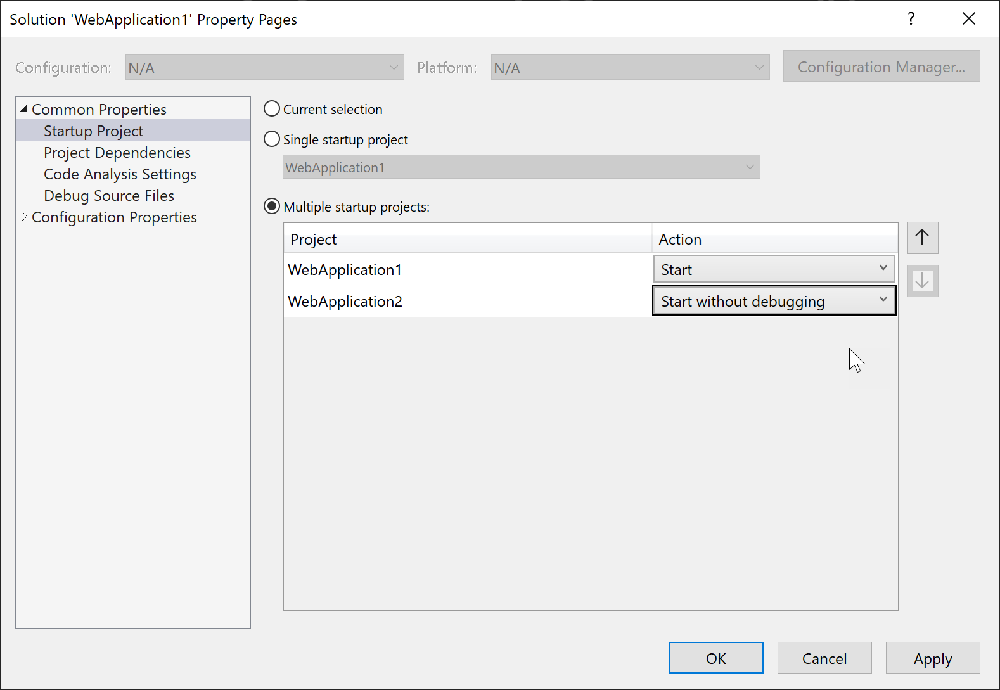
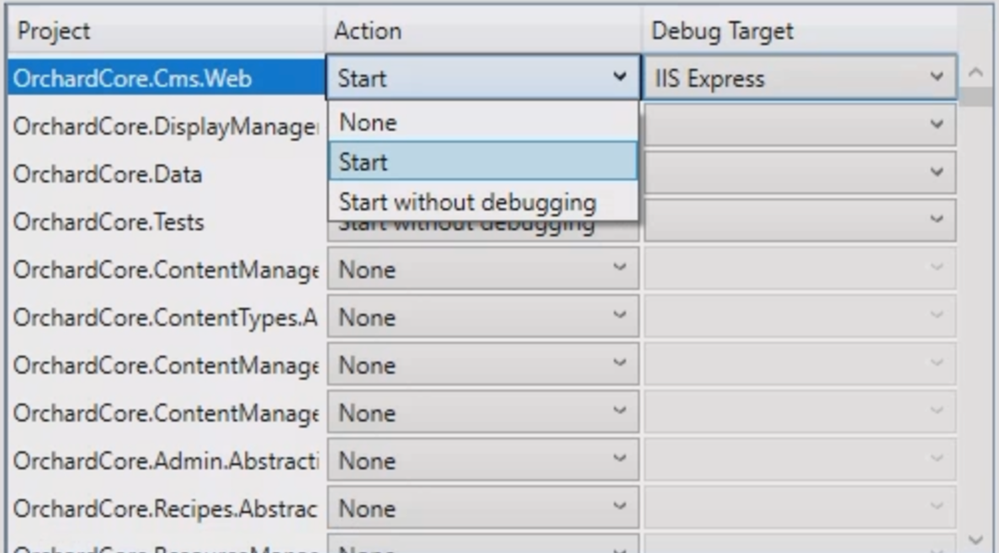
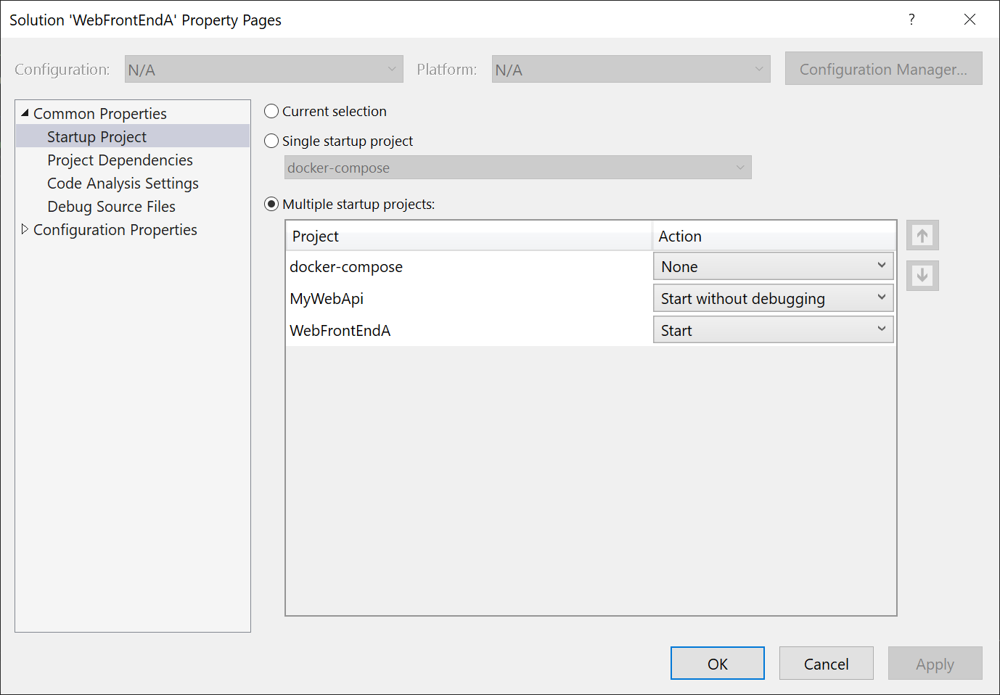

# Set multiple startup projects

Visual Studio allows you to specify how more than one project is run when you press **F5** (Start with Debugging), or **Ctrl**+**F5** (Start without debugging), or use the toolbar button to launch your application. In this way, you could start multiple sites, apps, or services that depend on each other to work correctly during a debug session or just running and testing locally.

Some project templates include multiple projects that are already configured to all be started when launched; for example, the **React and ASP.NET Core** project type includes both a client-side JavaScript project and a server-side ASP.NET Core project that both start when launched.

## To set multiple startup projects

1. In **Solution Explorer**, select the solution (the top node).

2. Choose the solution node's context (right-click) menu and then choose **Properties**. The **Solution Property Pages** dialog box appears.

   

3. Expand the **Common Properties** node, and choose **Startup Project**.

4. Choose the **Multiple Startup Projects** option and set the appropriate actions.

## Multi-project launch profiles

You can set up and save profiles for launching specific projects within a multi-project solution in predefined states for debugging. This simplifies the process of working with complex solutions, improves debugging efficiency, and enables easy sharing of configurations among team members.

### Enable multi-project launch profile

Multi-project launch profiles are available in Visual Studio 2022 17.11 and later. To enable or disable the **Multi-project Launch Profiles** feature, go to **Tools > Options > Preview Features** and toggle the checkbox for **Enable Multi Launch Profiles**.

:::image type="content" source="media/launch-multiple-projects/tools-options-enable-multi-project-launch.png" alt-text="Screenshot showing the option to enable Multi-project Launch Profiles in the Tools Options dialog." border="true":::

### Create a multi-project launch profile

1. Open your Visual Studio solution that contains multiple projects.
1. In Solution Explorer, right-click on your solution, and select **Configure Startup Projects...**.

   You can also press **Ctrl**+**Q** (Quick Launch) and search for "Configure startup projects" in Feature Search.

   :::image type="content" source="media/launch-multiple-projects/quick-launch-configure-startup-projects.png" alt-text="Screenshot showing searching for configure startup projects in Feature Search." border="true" :::

   The **Solution Property Pages** dialog appears.

1. In the Solution Property Pages, click on the **Common Properties** tab, and select **Configure Startup Projects**.
1. In the **Configure Startup Projects** section, choose the **Multiple startup projects** radio button.

     :::image type="content" source="media/launch-multiple-projects/solution-property-pages.jpg" alt-text="Screenshot showing the Multiple startup projects radio button." border="true" lightbox="media/launch-multiple-projects/solution-property-pages.jpg":::

   Below the radio button, you'll see a list of all the projects in your solution, and whether they are set to be launched or not when you press **F5**, and whether each project is started under the debugger or without debugging.

   You can use the up and down arrows to control the order in which projects will be launched.

1. Set the action for each project to either **Start**, **Start without debugging**, or **None**, and select a debug target depending on your requirements.

   

1. Enable the **Share Profile** checkbox if you want to share the profile with other Visual Studio users by checking it into the configuration file in the Source Control repo.
   Launch profiles are saved to a JSON file with the extension `.slnLaunch` in the same directory as the solution. The **Share Profile** checkbox determines whether the profile is saved to a user-specific file (unchecked) or to a file intended for source control tracking, such as in Git (checked).

   :::image type="content" source="media/launch-multiple-projects/share-profile.png" alt-text="Screenshot that shows the Share Profile checkbox on the Solution Property pages dialog." border="true":::

   Here's an example of the profile in the `.slnLaunch` file:

   ```json
   [
      {
         "Name": "Feature Profile",
         "Projects": [
            {
            "Path": "src\\OrchardCore.Cms.Web\\OrchardCore.Cms.Web.csproj",
            "Action": "Start"
            },
            {
            "Path": "src\\OrchardCore\\OrchardCore.DisplayManagement\\OrchardCore.DisplayManagement.csproj",
            "Action": "Start"
            },
            {
            "Path": "src\\OrchardCore\\OrchardCore.Data\\OrchardCore.Data.csproj",
            "Action": "StartWithoutDebugging"
            },
            {
            "Path": "src\\OrchardCore\\OrchardCore.ContentManagement.Display\\OrchardCore.ContentManagement.Display.csproj",
            "Action": "Start"
            }
         ]
      }
   ]
   ```

1. Once you've configured the startup action for each project, click the **OK** or **Apply** button to save the profile.
   The created launch profile appears in the toolbar dropdown list, allowing you to select the profile you want to debug.

   :::image type="content" source="media/launch-multiple-projects/profile-in-toolbar.png" alt-text="Screenshot showing launch profile in toolbar.":::

## With Docker Compose

When you're using Docker Compose to launch containerized projects on a local machine, you use a different method (launch profiles) to start multiple projects.

The following example shows a solution `WebFrontEndA` with three projects, a front-end web site, a Web API project, and a Docker Compose project. The following screenshot shows how to start two of the three projects, one with debugging and one without:



In this example and any other Docker Compose scenario, you choose `docker-compose` as the single startup project, but then you'll use a different way of specifying which projects or services to start. You'll use a Docker Compose launch profile to determine what services to start, and whether or not to attach the debugger, and there's a different dialog in Visual Studio for configuring it. See [Start a subset of services](../containers/launch-profiles.md). The **Solution Property Pages** dialog is only used for non-containerized solutions, or when you are *not* using Docker Compose to manage startup.

## Related content

- [Compile and build](../ide/compiling-and-building-in-visual-studio.md)
- [Work with solutions and projects](../ide/creating-solutions-and-projects.md)
- [Manage project and solution properties](../ide/managing-project-and-solution-properties.md)
