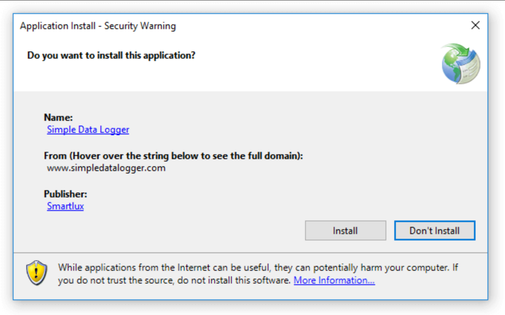

# Sign application and deployment manifests

If you want to publish an application by using ClickOnce deployment, the application and deployment manifests must be signed with a public/private key pair and signed using Authenticode technology. You can sign the manifests by using a certificate from the Windows certificate store or a key file.

The information in this article applies only if you're using the .NET Framework 4.8.1 or earlier. If you're using .NET 5 or later, follow the steps in [Deploy a .NET Windows desktop application using ClickOnce](../deployment/quickstart-deploy-using-clickonce-folder.md).

Signing the ClickOnce manifests is optional for *.exe*-based applications. For more information, see the "Generate unsigned manifests" section of this document.

For information about creating key files, see [How to: Create a public-private key pair](/dotnet/framework/app-domains/how-to-create-a-public-private-key-pair).

For information about signing assemblies and application manifests, see [Manage assembly and manifest signing](../ide/managing-assembly-and-manifest-signing.md).

> [!NOTE]
> Visual Studio supports only Personal Information Exchange (PFX) key files that have the *.pfx* extension. However, you can select other types of certificates from the current user's Windows certificate store by clicking **Select from Store** on the **Signing** page of project properties.

## Sign using a certificate

To use this method, you must have a certificate signed by a certificate authority (CA). Certificates are issued by third-party certification service providers, or by authorized organizations within an Enterprise.

1. Go to the project properties window (right-click the project node in **Solution Explorer** and select **Properties**). On the **Signing** tab, select the **Sign the ClickOnce manifests** check box.

1. Click the **Select from Store** button.

     The **Select a Certificate** dialog box appears and displays the contents of the Windows certificate store.

    > [!TIP]
    > If you click **Click here to view certificate properties**, the **Certificate Details** dialog box appears. This dialog box includes detailed information about the certificate and additional options. Click **Certificates** to view additional help information.

1. Select the certificate that you want to use to sign the manifests.

   > [!TIP]
   > If there aren't any certificates in the store, you can still [sign using a test certificate](#sign-using-a-test-certificate).

1. Additionally, you can specify the address of a timestamp server in the **Timestamp server URL** text box. This is a server that provides a timestamp specifying when the manifest was signed. It's usually provided by the same third party that offers certificates signed by a CA.

## Sign using an existing key file

1. Go to the project properties window (right-click the project node in **Solution Explorer** and select **Properties**). On the **Signing** tab, select the **Sign the ClickOnce manifests** check box.

1. Click the **Select from File** button.

     The **Select File** dialog box appears.

1. In the **Select File** dialog box, browse to the location of the key file (*.pfx*) that you want to use, and then click **Open**.

    > [!NOTE]
    > This option supports only files that have the *.pfx* extension. If you have a key file or certificate in another format, store it in the Windows certificate store and select the certificate is described in the previous procedure. The selected certificate's purpose should include code signing.

     The **Enter password to open file** dialog box appears. (If the *.pfx* file is already stored in your Windows certificate store or is not password protected, you aren't prompted to enter a password.)

1. Enter the password to access the key file, and then select **Enter**.

1. Select **More details...** to view the properties of the certificate. ClickOnce displays the value of the **Subject** field as the **Publisher** when it shows the certificate when a user installs your application. Here's an example of what the user sees when the ClickOnce application is installed:

   

> [!NOTE]
> The *.pfx* file cannot include certificate chaining information. If it does, the following import error will occur: **Cannot find the certificate and private key for decryption**. To remove the certificate chaining information, you can use *Certmgr.msc* and [disable the option](/previous-versions/aa730868(v=vs.80)) to **Include all certificates** when exporting the  *.pfx file.

## Sign using a test certificate

Test certificates are not signed by a Certificate Authority (CA) and should only be used for testing purposes. For details on test certificates, see [How using certificates authorities helps users](../deployment/clickonce-and-authenticode.md#how-using-certificate-authorities-helps-users).

1. Go to the project properties window (right-click the project node in **Solution Explorer** and select **Properties**). On the **Signing** tab, select the **Sign the ClickOnce manifests** check box.

1. To create a new certificate for testing, click the **Create Test Certificate** button.

1. In the **Create Test Certificate** dialog box, enter a password to help secure your test certificate.

> [!NOTE]
> Be sure to choose **sha256RSA** as the **Signature Algorithm**, unless you're targeting .NET 2.0.

## Generate unsigned manifests

Signing the ClickOnce manifests is optional for `.exe`-based applications. The following procedures show how to generate unsigned ClickOnce manifests.

> [!IMPORTANT]
> Unsigned manifests can simplify development and testing of your application. However, unsigned manifests introduce substantial security risks in a production environment. Only consider using unsigned manifests if your ClickOnce application runs on computers within an intranet that is completely isolated from the internet or other sources of malicious code.

By default, ClickOnce automatically generates signed manifests unless one or more files are specifically excluded from the generated hash. In other words, publishing the application results in signed manifests if all files are included in the hash, even when the **Sign the ClickOnce manifests** check box is cleared.

### To generate unsigned manifests and include all files in the generated hash

To generate unsigned manifests that include all files in the hash, you must first publish the application together with signed manifests. Therefore, first sign the ClickOnce manifests by following one of the previous procedures, and then publish the application.

1. On the **Signing** tab, clear the **Sign the ClickOnce manifests** check box.

1. On the **Publish** tab, reset the publish version so that only one version of your application is available. Clear the checkbox for **Automatically increment the version with each publish**. By default, Visual Studio automatically increments the revision number of the publish version every time that you publish an application. For more information, see [How to: Set the ClickOnce publish version](/visualstudio/deployment/how-to-specify-where-visual-studio-copies-the-files).

1. Publish the application. Visual Studio tells you that the application was signed with a different key than the existing application on the server, and asks if you want to overwrite it. Choose **Yes**.

### To generate unsigned manifests and exclude one or more files from the generated hash

1. On the **Signing** page, clear the **Sign the ClickOnce manifests** check box.

1. On the **Publish** tab, choose the **Application Files** button to open the **Application Files** dialog box, and set the **Hash** to **Exclude** for the files that you want to exclude from the generated hash.

    > [!NOTE]
    > Excluding a file from the hash configures ClickOnce to disable automatic signing of the manifests, so you do not need to first publish with signed manifests as shown in the previous procedure.

1. Publish the application.

## Related content

- [Strong-named assemblies](/dotnet/framework/app-domains/strong-named-assemblies)
- [How to: Create a public-private key pair](/dotnet/framework/app-domains/how-to-create-a-public-private-key-pair)
- [Signing page, Project Designer](/visualstudio/ide/how-to-sign-application-and-deployment-manifests)
- [ClickOnce security and deployment](../deployment/clickonce-security-and-deployment.md)
