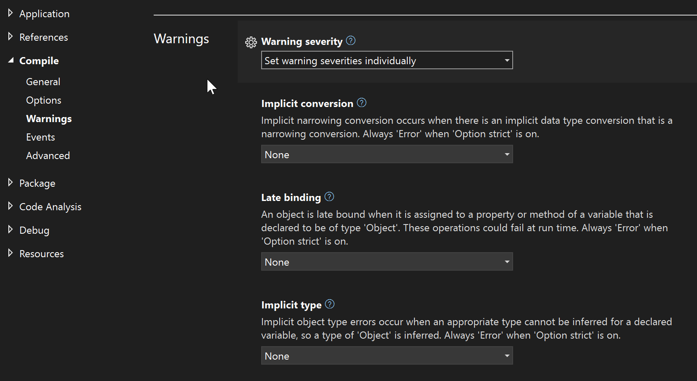
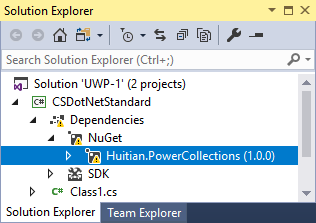
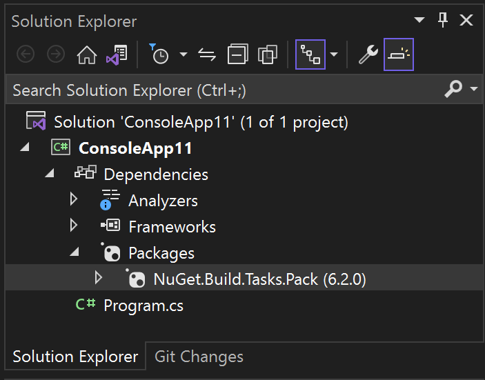
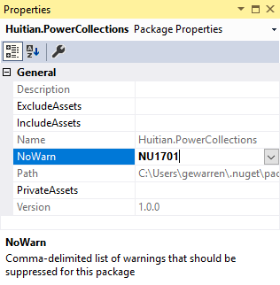
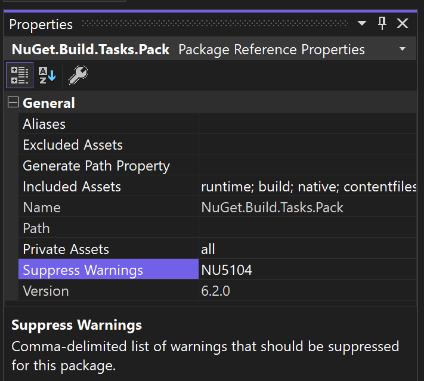

# Suppress compiler warnings

With Visual Studio, you can specify which warnings you want to suppress by specifying the warning codes in the Project Designer (project property pages). You can also suppress warnings by setting certain properties directly in the project file, via the command line, or in code when you want to suppress a warning in one location only.

Some compilers and build tools also have options to specify the warning level. This lets you control categories of warnings with one setting. For those options, see the documentation for the specific language and compiler you're using:

- [Warning levels in C#](/dotnet/csharp/language-reference/compiler-options/errors-warnings#warninglevel)
- [Warning levels in C++](/cpp/build/reference/compiler-option-warning-level)

If your goal is to see more concise and focused output in your build log, you might want to change the build log verbosity. The available settings are **Normal**, **Detailed**, or **Diagnostic**. For more information about verbosity, see [How to: View, save, and configure build log files](../ide/how-to-view-save-and-configure-build-log-files.md).

> [!CAUTION]
> Note that warnings are intended to be an indication of a potential problem with your code, so you should understand the risks of disabling any particular warning. Visual Studio settings disable warnings at the project level. You might want to use a more targeted approach to disabling warnings than Visual Studio provides. Most compilers provide ways to disable warnings just for certain lines of code, so that you can still review the warnings if they occur elsewhere in the same project.

## Suppress specific warnings for Visual C# or F\#

Use the **Build** properties to suppress specific warnings for an entire C# and F# project. If you want to suppress a warning only in a specific part of the code in C#, use [#pragma warning](/dotnet/csharp/language-reference/preprocessor-directives#pragma-warning). For F#, use [#nowarn](/dotnet/fsharp/language-reference/compiler-directives#preprocessor-directives) preprocessor directive to disable a warning for an entire source file.

:::moniker range=">=vs-2022"

1. In **Solution Explorer**, choose the project in which you want to suppress warnings.

1. Right-click on the project node, and choose **Properties** on the context menu. Or, select the project node and press **Alt**+**Enter**.

1. Choose **Build**, and go to the **Errors and warnings** subsection.

1. In the **Suppress warnings** or **Suppress specific warnings** box, specify the error codes of the warnings that you want to suppress, separated by semicolons. For a list and descriptions of warning codes, see [C# Compiler Messages](/dotnet/csharp/language-reference/compiler-messages/).

1. Rebuild the solution.
:::moniker-end
:::moniker range="<=vs-2019"
1. In **Solution Explorer**, choose the project in which you want to suppress warnings.

1. Right-click on the project node, and choose **Properties** on the context menu. Or, select the project node and press **Alt**+**Enter**.

1. Choose the **Build** page or section, and if you're in the current  UI, open the **Errors and warnings** subsection.

1. In the **Suppress warnings** or **Suppress specific warnings** box, specify the error codes of the warnings that you want to suppress, separated by semicolons. For a list and descriptions of warning codes, see [C# Compiler Messages](/dotnet/csharp/language-reference/compiler-messages/).

1. Rebuild the solution.
:::moniker-end

> [!NOTE]
> Some warnings can't be suppressed. For a list of those, see [NoWarn compiler option](/dotnet/csharp/language-reference/compiler-options/errors-warnings#nowarn).

## Suppress specific warnings for C++

You can suppress warnings in a C++ project by using the project properties; you use the **Configuration Properties** property page to suppress specific warnings for an entire C++ project. You can also suppress warnings in specific files by using `#pragma warning`. This article covers the project-level control, but if your intent is to disable a warning in a particular file or just around a few lines of code, but you want to continue to see other occurrences of the same warning, you should consider using `#pragma warning`. See [#pragma warning](/cpp/preprocessor/warning).

1. In **Solution Explorer**, choose the project or source file in which you want to suppress warnings.

1. On the menu bar, choose **View** > **Property Pages**.

1. Choose the **Configuration Properties** category, choose the **C/C++** category, and then choose the **Advanced** page.

1. Perform one of the following steps:

    - In the **Disable Specific Warnings** box, specify the error codes of the warnings that you want to suppress, separated by a semicolon.

    - In the **Disable Specific Warnings** box, choose **Edit** to display more options.

1. Choose the **OK** button, and then rebuild the solution.

If the warning is from another tool, refer to the documentation for the specific tool to find out how you can suppress warnings for that tool. For example, the C++ linker has some warnings you can disable using the `/IGNORE` linker option. See [/IGNORE (Ignore specific warnings)](/cpp/build/reference/ignore-ignore-specific-warnings) and to set this option, see [/link (Pass options to linker)](/cpp/build/reference/link-pass-options-to-linker).

## Suppress warnings for Visual Basic

:::moniker range="<=vs-2019"
You can hide specific compiler warnings for Visual Basic by editing the `.vbproj` file for the project. To suppress warnings by *category*, you can use the [Compile property page](../ide/reference/compile-page-project-designer-visual-basic.md). If you want to disable a warning in a specific part of a code file, use [#Disable and #Enable directives](/dotnet/visual-basic/language-reference/directives/disable-enable). For more information, see [Configure warnings in Visual Basic](../ide/configuring-warnings-in-visual-basic.md).

### To suppress specific warnings for an entire Visual Basic project

This example shows you how to edit the `.vbproj` file to suppress specific compiler warnings.

1. In **Solution Explorer**, choose the project in which you want to suppress warnings.

1. On the menu bar, choose **Project** > **Unload Project**.

1. In **Solution Explorer**, open the right-click or shortcut menu for the project, and then choose **Edit \<ProjectName>.vbproj**.

    The XML project file opens in the code editor.

1. Locate the `<NoWarn>` element for the build configuration you're building with, and add one or more warning numbers as the value of the `<NoWarn>` element. If you specify multiple warning numbers, separate them with a comma.

     The following example shows the `<NoWarn>` element for the *Debug* build configuration on an x86 platform, with two compiler warnings suppressed:

    ```xml
    <PropertyGroup Condition=" '$(Configuration)|$(Platform)' == 'Debug|x86' ">
        <PlatformTarget>x86</PlatformTarget>
        <DebugSymbols>true</DebugSymbols>
        <DebugType>full</DebugType>
        <Optimize>false</Optimize>
        <OutputPath>bin\Debug\</OutputPath>
        <DefineDebug>true</DefineDebug>
        <DefineTrace>true</DefineTrace>
        <ErrorReport>prompt</ErrorReport>
        <NoWarn>40059,42024</NoWarn>
        <WarningLevel>1</WarningLevel>
      </PropertyGroup>
    ```

   > [!NOTE]
   > .NET Core projects do not contain build configuration property groups by default. To suppress warnings in a .NET Core project, add the build configuration section to the file manually. For example:
   >
   > ```xml
   > <Project Sdk="Microsoft.NET.Sdk">
   >   <PropertyGroup>
   >     <OutputType>Exe</OutputType>
   >     <TargetFramework>netcoreapp2.0</TargetFramework>
   >     <RootNamespace>VBDotNetCore_1</RootNamespace>
   >   </PropertyGroup>
   >   <PropertyGroup Condition=" '$(Configuration)|$(Platform)' == 'Debug|AnyCPU' ">
   >     <NoWarn>42016,41999,42017</NoWarn>
   >   </PropertyGroup>
   > </Project>
   > ```

1. Save the changes to the `.vbproj` file.

1. On the menu bar, choose **Project** > **Reload Project**.

1. On the menu bar, choose **Build** > **Rebuild Solution**.

    The **Output** window no longer shows the warnings that you specified.

For more information, see the [/nowarn compiler option](/dotnet/visual-basic/reference/command-line-compiler/nowarn) for the Visual Basic command-line compiler.

:::moniker-end

:::moniker range=">=vs-2022"

You can suppress warnings for individual warnings, or by category. The experience differs depending on whether you are working with a .NET Framework project or a .NET Core (or .NET 5 and later) project.

If you want to disable a warning in a specific part of a code file, use [#Disable and #Enable directives](/dotnet/visual-basic/language-reference/directives/disable-enable).  For more information, see [Configure warnings in Visual Basic](../ide/configuring-warnings-in-visual-basic.md).

### .NET 5 or later projects

You can edit the project file to suppress specific compiler warnings by the diagnostic codes, or you can suppress warnings by category by using the Project Designer. To open the project designer, select the project node, right-click, and choose **Properties**, or press **Alt**+**Enter**.

In the **Compile** section, choose **Warnings**. Under **Warning severity**, you can choose **Set warning severities individually**. The categories are shown, and you have the option to set each category to **None** to disable the category of warning, or set it to **Warning** or **Error** to enable it either as a warning or error.



### .NET Framework projects

You can hide specific compiler warnings for Visual Basic by editing the `.vbproj` file for the project. To suppress warnings by *category*, you can use the [Compile property page](../ide/reference/compile-page-project-designer-visual-basic.md). 

### To suppress specific warnings for an entire Visual Basic project

This example shows you how to edit the `.vbproj` file to suppress specific compiler warnings.

1. In **Solution Explorer**, choose the project in which you want to suppress warnings.

1. (.NET) Double-click on the project node to open the project file.

   (.NET Framework) On the menu bar, choose **Project** > **Unload Project**. Then, in **Solution Explorer**, open the right-click or shortcut menu for the project, and then choose **Edit \<ProjectName>.vbproj**.

    The MSBuild project file opens in the code editor. This is an XML file.

1. Locate the `<NoWarn>` element for the build configuration you're building with, and add one or more warning numbers as the value of the `<NoWarn>` element. If you specify multiple warning numbers, separate them with a comma.

     The following example shows the `<NoWarn>` element for the *Debug* build configuration on an x86 platform, with two compiler warnings suppressed:

    ```xml
    <PropertyGroup Condition=" '$(Configuration)|$(Platform)' == 'Debug|x86' ">
        <PlatformTarget>x86</PlatformTarget>
        <DebugSymbols>true</DebugSymbols>
        <DebugType>full</DebugType>
        <Optimize>false</Optimize>
        <OutputPath>bin\Debug\</OutputPath>
        <DefineDebug>true</DefineDebug>
        <DefineTrace>true</DefineTrace>
        <ErrorReport>prompt</ErrorReport>
        <NoWarn>40059,42024</NoWarn>
        <WarningLevel>1</WarningLevel>
      </PropertyGroup>
    ```

   > [!NOTE]
   > .NET Core and .NET 5 and later projects do not contain build configuration property groups by default. To suppress warnings in a .NET Core project, add the build configuration section to the file manually. For example:
   >
   > ```xml
   > <Project Sdk="Microsoft.NET.Sdk">
   >   <PropertyGroup>
   >     <OutputType>Exe</OutputType>
   >     <TargetFramework>netcoreapp2.0</TargetFramework>
   >     <RootNamespace>VBDotNetCore_1</RootNamespace>
   >   </PropertyGroup>
   >   <PropertyGroup Condition=" '$(Configuration)|$(Platform)' == 'Debug|AnyCPU' ">
   >     <NoWarn>42016,41999,42017</NoWarn>
   >   </PropertyGroup>
   > </Project>
   > ```

1. Save the changes to the `.vbproj` file.

1. On the menu bar, choose **Project** > **Reload Project**.

1. On the menu bar, choose **Build** > **Rebuild Solution**.

    The **Output** window no longer shows the warnings that you specified.

For more information, see the [/nowarn compiler option](/dotnet/visual-basic/reference/command-line-compiler/nowarn) for the Visual Basic command-line compiler.

:::moniker-end

## Suppress a warning by editing the project file

Using the Visual Studio property designer to suppress warnings results in a change to the project file. At times, it can be more convenient to hand-edit the project file to accomplish the task of disabling a warning. The project file is processed by MSBuild, Microsoft's build engine. See [MSBuild](../msbuild/msbuild.md).

Also, in Visual Studio 2019 version 16.7 and earlier, some warnings from tools other than the compiler can't be suppressed in any other way.

1. To open the project file in the Visual Studio editor, right-click on the project node, and choose **Edit project file**. Some project types require you to unload the project before you can edit the project file. If you need to unload the project, right-click on the project node and choose **Unload project**.
1. In a new `PropertyGroup` section, use the `NoWarn` property. List the errors you want to suppress, separated by commas or semicolons. For compiler warnings, you can omit the language code and enter only the number, but for clarity, we recommend using the full code. For warnings from other tools in the build, specify the full code, including the prefix (such as `MSB` for warnings issued by MSBuild itself).

   The following code adds warnings CS0028 and CS0618 to the list of the suppressed warnings:

   ```xml
   <PropertyGroup>
      // Other properties
      <NoWarn>$(NoWarn);CS0028;CS0618</NoWarn>
   </PropertyGroup>
   ```

   Referencing the previous value of `$(NoWarn)` as shown in the previous example adds those numbers to any previously set value for `NoWarn`, rather than overwriting it.

See [NoWarn](/dotnet/csharp/language-reference/compiler-options/errors-warnings#nowarn).

## Suppress a warning from the build command line

If you're building a project from the command line, you can also suppress warnings by using `-warnAsMessage` at the MSBuild command line. Use quotes around lists of multiple warning codes.

`MSBuild.exe -warnAsMessage="CS0028;CS0618" MyProject.csproj`

See [MSBuild command line reference](../msbuild/msbuild-command-line-reference.md).

## Suppress warnings for all projects and solutions in a directory structure

You can suppress warnings for many projects at once if they are all under a common directory in the filesystem by using the MSBuild file *Directory.Build.props*. See [Customize builds by directory](../msbuild/customize-by-directory.md). For example, if you place the following *Directory.Build.props* file at the root of a folder with many solutions and projects, you can suppress a specified list of warnings for all the projects in that folder and recursively to folders within it.

```xml
<Project>
   <PropertyGroup>
      <NoWarn>$(NoWarn);CS0028;CS0618</NoWarn>
   </PropertyGroup>
</Project>
```

## Suppress tool warnings

How you suppress warnings from tools other than the compiler, such as MSBuild, depends on what type of project you have and what version of MSBuild you're using.

With MSBuild 16.8 and later, in projects that use an SDK or the standard imports, you can suppress tool warnings using the same methods described previously. You must specify the full error code (including the prefix such as `MSB` for MSBuild), not just a number as you can with a compiler warning. Also, the message is not eliminated; it still shows as an informational message, but it's been demoted from a warning.

With MSBuild 16.7 and earlier, and in any project that doesn't use an SDK or the standard imports, those warnings aren't suppressed using `NoWarn`. In such cases, the property you can use to suppress tool warnings is `MSBuildWarningsAsMessages`. You can suppress build warnings by editing the project file or specifying the `MSBuildWarningsAsMessages` option at the MSBuild command line. When you use `MSBuildWarningsAsMessages`, use the full MSBuild error code, including the `MSB` prefix.

```xml
<PropertyGroup>
    <MSBuildWarningsAsMessages>$(MSBuildWarningsAsMessages);MSB3270</MSBuildWarningsAsMessages>
</PropertyGroup>
```

Note that some MSBuild warnings can't be suppressed by setting  `MSBuildWarningsAsMessages`. To disable them, use the command-line option `warnAsMessage`.

Also, some warnings have specific properties you can set to disable the warning. For example, `MSB3253` is disabled by setting the property:

```xml
 <PropertyGroup>
    <ResolveAssemblyWarnOrErrorOnTargetArchitectureMismatch>
        None
    </ResolveAssemblyWarnOrErrorOnTargetArchitectureMismatch>
  </PropertyGroup>
```

When possible, use the more explicit property, because an error code by itself is not as readily understood. The error reference page for the code usually contains the property that is used to disable it.

## Suppress warnings for NuGet packages

In some cases, you might want to suppress NuGet compiler warnings for a single NuGet package, instead of for an entire project. The warning serves a purpose, so you don't want to suppress it at the project level. For example, one of the NuGet warnings tells you that the package may not be fully compatible with your project. If you suppress it at the project level and later add an additional NuGet package, you would never know if it was producing the compatibility warning.

### To suppress a specific warning for a single NuGet package

1. In **Solution Explorer**, select the NuGet package you want to suppress compiler warnings for.

   :::moniker range="vs-2019"
   
   :::moniker-end
   :::moniker range=">=vs-2022"
   
   :::moniker-end

1. From the right-click or context menu, select **Properties**.

1. In the **Suppress warnings** box of the package's properties, enter the warning number you want to suppress for this package. If you want to suppress more than one warning, use a comma to separate the warning numbers.

   :::moniker range="vs-2019"
   
   :::moniker-end
   :::moniker range=">=vs-2022"
   
   :::moniker-end

   The warning disappears from **Solution Explorer** and the **Error List**. In the project file, the NoWarn property is set.

   ```xml
    <PackageReference Include="NuGet.Build.Tasks.Pack" Version="6.2.0">
      <PrivateAssets>all</PrivateAssets>
      <IncludeAssets>runtime; build; native; contentfiles; analyzers; buildtransitive</IncludeAssets>
      <NoWarn>NU5104</NoWarn>
    </PackageReference>
   ```

## Suppress Code Analysis warnings

Diagnostic messages with codes beginning with `CA` are Code Analysis violations and warnings, which are distinct from the compiler warnings discussed in this article. You can suppress Code Analysis warnings in various ways, including using site-specific markup and project-wide or globally, by using rules configuration files. See [Suppress Code Analysis warnings](/dotnet/fundamentals/code-analysis/suppress-warnings) and [Suppress Code Analysis violations](../code-quality/in-source-suppression-overview.md).

## Related content

- [Walkthrough: Build an application](../ide/walkthrough-building-an-application.md)
- [How to: View, save, and configure build log files](../ide/how-to-view-save-and-configure-build-log-files.md)
- [Compile and build](../ide/compiling-and-building-in-visual-studio.md)
- [Code Analysis](../code-quality/roslyn-analyzers-overview.md)
- [C# Compiler options to report errors and warnings](/dotnet/csharp/language-reference/compiler-options/errors-warnings)
- [Configuring warnings in Visual Basic](configuring-warnings-in-visual-basic.md)
- [C++ compiler errors and warnings](/cpp/error-messages/compiler-errors-1/c-cpp-build-errors)