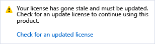

# Extend a trial version or update a license

You can evaluate a free trial of [Visual Studio Professional or Visual Studio Enterprise](https://visualstudio.microsoft.com/vs/compare/) for 30 days. And if you sign in, you can extend the trial period to 90 days. (Visual Studio Community is free without a trial period. However, you must [sign in](signing-in-to-visual-studio.md) periodically to keep your [license up to date](#update-a-stale-license).)

To continue using Visual Studio after a trial period ends, unlock it with an [online subscription](#use-an-online-subscription) or a [product key](#enter-a-product-key).

## Use an online subscription

1. Choose the **Sign in** button in the upper-right corner of the IDE (or go to **File** > **Account Settings** to open the **Account Settings** dialog, and then choose the **Sign in** button).

1. Enter the credentials for either a Microsoft account or a work or school account. Visual Studio finds a Visual Studio subscription or an Azure DevOps organization associated with your account.

> [!IMPORTANT]
> Visual Studio automatically looks for associated online subscriptions when you connect to an Azure DevOps organization from the **Team Explorer** tool window. When you connect to an Azure DevOps organization, you can sign in using both Microsoft and work or school accounts. If an online subscription exists for that user account, Visual Studio will automatically unlock the IDE for you.

For more information about Visual Studio subscriptions and how they work, see the [Subscriptions Support FAQ](https://visualstudio.microsoft.com/subscriptions/support/) page.

## Enter a product key

1. Select **File** > **Account Settings** to open the **Account Settings** dialog, and then choose the **License with a Product Key** link.

1. Enter the product key in the space provided.

> [!TIP]
> Pre-release versions of Visual Studio do not have product keys. You must sign in to the IDE to use pre-release versions.

For more information about Visual Studio product keys for Visual Studio and how to get them, see the [Using product keys in Visual Studio subscriptions](/visualstudio/subscriptions/product-keys) page.

## Update a stale license

You might see a message in Visual Studio that says, "Your license has gone stale and must be updated."

This message indicates that while your subscription might still be valid, the license token that Visual Studio uses to keep your subscription up to date hasn't been refreshed. Visual Studio reports that the license is stale because of one of the following reasons:

* You haven't used Visual Studio or you haven't connected to the internet for an extended period of time.
* You signed out of Visual Studio.

Before the license token goes stale, Visual Studio first shows a warning message that asks you to reenter your credentials.

If you do not reenter your credentials, the token starts to go stale and the **Account Settings** dialog tells you how many days you have left before your token expires. After your token expires, you must reenter your credentials for the account before you can continue using Visual Studio.

> [!Important]
> If you are using Visual Studio for extended periods in environments with limited or no internet access, you should use a product key to unlock Visual Studio to avoid interruption.

## Update an expired license

If your subscription has expired and you no longer have access rights to Visual Studio, you must renew your subscription or add another account that has a subscription. To see more information about the license you are using, go to **File** > **Account Settings** and look at the license information on the right side of the dialog. If you have another subscription associated with a different account, add that account to the **All Accounts** list on the left side of the dialog box by selecting the **Add an account** link.

## Get support

Sometimes, things go wrong. If you experience a problem, here are some support options:

* Report product issues by using the [Report a Problem](how-to-report-a-problem-with-visual-studio.md) tool.
* Find answers to questions about subscriptions, accounts, and billing in the [Subscriptions Support FAQ](https://visualstudio.microsoft.com/subscriptions/support/).

## See also

* [Sign in to Visual Studio](../ide/signing-in-to-visual-studio.md)
* [Compare Visual Studio editions](https://visualstudio.microsoft.com/vs/compare/)
* [Learn more about Visual Studio subscriptions](/visualstudio/subscriptions/)
