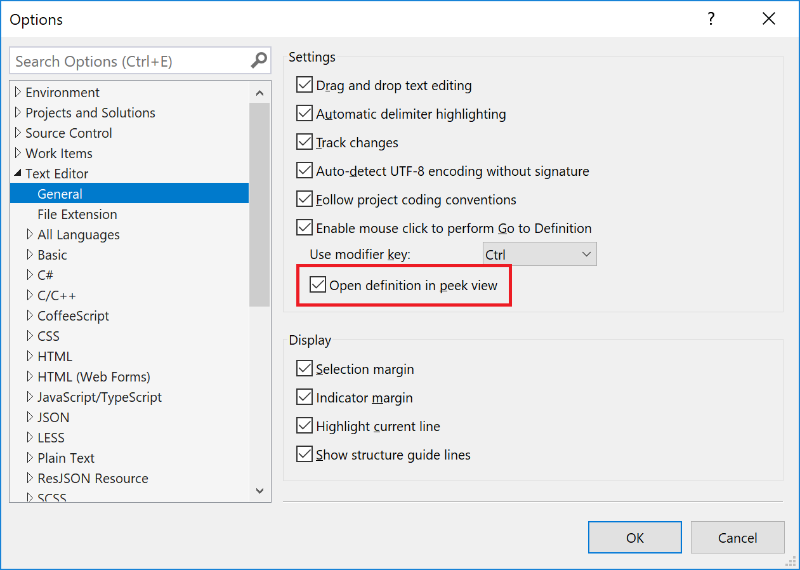

# View and edit code by using Peek Definition (Alt+F12)

You can use the **Peek Definition** command to view and edit code without switching away from the code that you're writing. **Peek Definition** and **Go To Definition** show the same information, but **Peek Definition** shows it in a pop-up window, and **Go To Definition** shows the code in a separate code window. **Go To Definition** causes your context (that is, the active code window, current line, and cursor position) to switch to the definition code window. By using **Peek Definition**, you can view and edit the definition and move around inside the definition file while keeping your place in the original code file.

You can use **Peek Definition** with C#, Visual Basic, and C++ code. In Visual Basic, **Peek Definition** shows a link to the **Object Browser** for symbols that don't have definition metadata (for example, .NET types that are built in). Some languages and file types might not support **Peek Definition**; for example, CSS files.

## Use Peek Definition

### Open a Peek Definition window

1. You can peek a definition by choosing **Peek Definition** from the right-click menu for a type or member that you want to explore. If the option is enabled, you can also peek a definition using the mouse, by pressing **Ctrl** (or another modifier) and clicking the member name. Or, from the keyboard, press **Alt**+**F12**.

     This illustration shows the **Peek Definition** window for a method that's named `Print()`:

     

     The definition window appears below the `printer.Print("Hello World!")` line in the original file. The window doesn't hide any of the code in your original file. The lines that follow `printer.Print("Hello World!")` appear under the definition window.

1. You can move the cursor to different locations in the peek definition window. You can also still move around in the original code window.

1. You can copy a string from the definition window and paste it in the original code. You can also drag and drop the string from the definition window to the original code without deleting it from the definition window.

1. You can close the definition window by choosing the **Esc** key or the **Close** button on the definition window tab.

### Open a Peek Definition window from within a Peek Definition window

If you already have a **Peek Definition** window open, you can call **Peek Definition** again on the code in that window. Another definition window opens. A set of breadcrumb dots appears next to the definition window tab, which you can use to navigate between definition windows. The tooltip on each dot shows the file name and path of the definition file that the dot represents.

   

### Peek Definition with multiple results

If you use **Peek Definition** on code that has more than one definition (for example, a partial class), a result list appears to the right of the code definition view. You can choose any result in the list to display its definition.

   

### Edit inside the Peek Definition window

When you start to edit inside a **Peek Definition** window, the file that you're modifying automatically opens as a separate tab in the code editor and reflects the changes that you've made. You can continue to make, undo, and save changes in the **Peek Definition** window, and the tab will continue to reflect those changes. Even if you close the **Peek Definition** window without saving your changes, you can make, undo, and save more changes in the tab, picking up exactly where you left off in the **Peek Definition** window.

   

### To change options for Peek Definition

:::moniker range="visualstudio"

1. Open the **Tools** > **Options** pane, and expand the **All Settings** > **Text Editor** > **General** section.

1. Select the **Enable mouse click to perform Go To Definition** checkbox.

1. Select the **Open definition in peek view** checkbox.

   :::image type="content" source="../ide/media/visualstudio/editor-options-peek-view.png" border="false" alt-text="Screenshot that shows how to set the mouse-click peek definition option in Visual Studio.":::

:::moniker-end
:::moniker range="<=vs-2022"

1. Go to **Tools** > **Options** dialog, and expand the **Text Editor** > **General** section.

1. Select the **Enable mouse click to perform Go To Definition** checkbox.

1. Select the **Open definition in peek view** checkbox, and then select **OK**.

   

:::moniker-end

### Keyboard shortcuts for Peek Definition

You can use these keyboard shortcuts with the **Peek Definition** window:

|Functionality|Keyboard shortcut|
|-------------------|:-----------------------:|
|Open the definition window|**Alt**+**F12**|
|Close the definition window|**Esc**|
|Promote the definition window to a regular document tab|**Ctrl**+**Alt**+**Home**|
|Navigate between definition windows|**Ctrl**+**Alt**+**-** and **Ctrl**+**Alt**+**=**|
|Navigate between multiple results|**F8** and **Shift**+**F8**|
|Toggle between the code editor window and the definition window|**Shift**+**Esc**|

> [!NOTE]
> You can also use the same keyboard shortcuts to edit code in a **Peek Definition** window as you use elsewhere in Visual Studio.

## Related content

- [Navigate code](../ide/navigating-code.md)
- [Go To Definition and Peek Definition](../ide/go-to-and-peek-definition.md)
- [Productivity features in Visual Studio](../ide/productivity-features.md)
