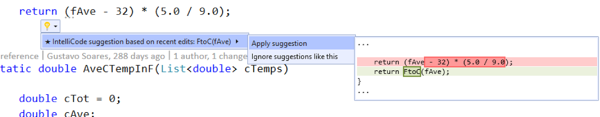
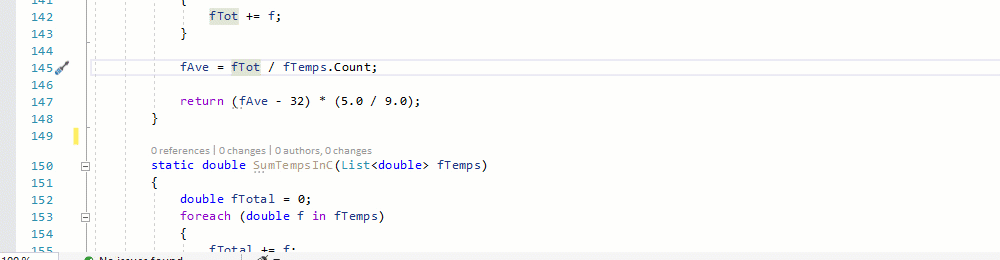
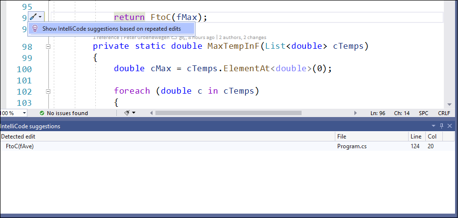

# AI assistance while you edit code

IntelliCode suggestions assists you when making similar edits in multiple places in your code. It tracks your edits locally, and detects repetition. It then offers to apply those same edits in other places where they might apply. For example, if you have missed locations where a refactoring could be applied, IntelliCode suggestions helps you find those locations and fix them.

IntelliCode is aware of the semantic structure of your code. That structure is used to detect situations where changes can be applied, even if variable names are different.

Suppose you're replacing a repeated temperature conversion using hardcoded local values with a helper function that abstracts those values away. IntelliCode detects the repeated change you're making, and suggest you make that change in other places.

Suggestions appear as [Quick Actions](/visualstudio/ide/quick-actions) in Visual Studio editor. IntelliCode suggestions have the Quick Action menu options **Apply suggestion** and **Ignore suggestions like this**. If you want to use the suggested change, select **Apply suggestion**. 

In Visual Studio 2019 16.9 and later releases, you also see suggestions as you type, in the completions list:

Because it learns from your repeated edits in a session, IntelliCode suggestions sometimes makes suggestions that don't fit your intent. If you don’t want to use the suggested change, just select the **Ignore suggestions like this** action. IntelliCode won't suggest that pattern again unless you recreate it in subsequent edits. 
 
 > [!NOTE]
 > IntelliCode suggestions are session-scoped - they don't show up after you close and re-open Visual Studio
 
If you want to see the list of all suggested changes, go to **View** > **Other windows** > **IntelliCode suggestions**. 

## More suggestions available light bulb

When you accept a completions-list suggestion, if there are other locations you could apply the same change, you see a light bulb with an action that shows you a list of the suggestions found. This opens the IntelliCode suggestions window, so you can locate and act on the suggestions. 

:::moniker range="<=vs-2019"

## Disable IntelliCode suggestions

Suggestions is turned on by default for Visual Studio version 16.7 and later. 

If you wish to turn it off, choose **Tools** > **Options**, **IntelliCode General** tab, and then switch **C# suggestions** to **Disabled**.
:::moniker-end
