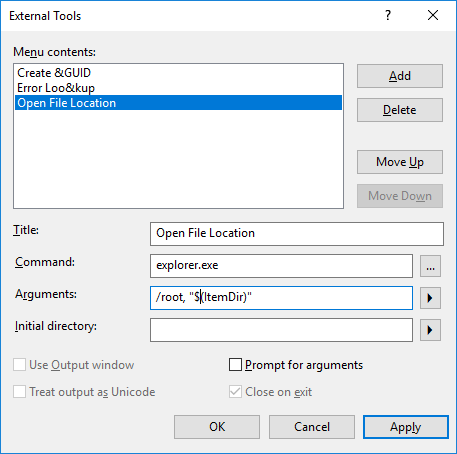

# Manage external tools

You can call external tools from inside Visual Studio by using the **Tools** menu. A few default tools are available from the **Tools** menu, and you can customize the menu by adding other executables of your own.

## Tools available on the Tools menu

The **Tools** menu contains several built-in commands, including:

* **Code Snippets Manager** to [Organize Code Snippets](code-snippets.md)
* **Customize** to [Customize menus and toolbars](how-to-customize-menus-and-toolbars-in-visual-studio.md)
* **Options** to [Set a variety of different options for the Visual Studio IDE and other tools](reference/options-dialog-box-visual-studio.md)

## Add new tools to the Tools menu

You can add an external tool to appear on the **Tools** menu.

1. Open the **External Tools** dialog box by choosing **Tools** > **External Tools**.

1. Click **Add**, and then fill in the information. For example, the following entry causes **Windows Explorer** to open at the directory of the file you currently have open in Visual Studio:

   * Title: `Open File Location`

   * Command: `explorer.exe`

   * Arguments: `/root, "$(ItemDir)"`

   

The following is a full list of arguments that can be used when defining an external tool:

|Name|Argument|Description|
|----------|--------------|-----------------|
|Item Path|$(ItemPath)|The complete file name of the current file (drive + path + file name).|
|Item Directory|$(ItemDir)|The directory of the current file (drive + path).|
|Item File Name|$(ItemFilename)|The file name of the current file.|
|Item Extension|$(ItemExt)|The file name extension of the current file.|
|Current Line|$(CurLine)|The current line position of the cursor in the code window.|
|Current Column|$(CurCol)|The current column position of the cursor in the code window.|
|Current Text|$(CurText)|The selected text.|
|Target Path|$(TargetPath)|The complete file name of the item to be built (drive + path + file name).|
|Target Directory|$(TargetDir)|The directory of the item to be built.|
|Target Name|$(TargetName)|The file name of the item to be built.|
|Target Extension|$(TargetExt)|The file name extension of the item to be built.|
|Binary Directory|$(BinDir)|The final location of the binary that is being built (defined as drive + path).|
|Project Directory|$(ProjectDir)|The directory of the current project (drive + path).|
|Project File Name|$(ProjectFileName)|The file name of the current project.|
|Solution Directory|$(SolutionDir)|The directory of the current solution (drive + path).|
|Solution File Name|$(SolutionFileName)|The file name of the current solution.|

> [!NOTE]
> The IDE status bar displays the **Current Line** and **Current Column** variables to indicate where the insertion point is located in the active **Code Editor**. The **Current Text** variable returns the text or code selected at that location.

## Related content

- [C/C++ build tools](/cpp/build/reference/c-cpp-build-tools)
