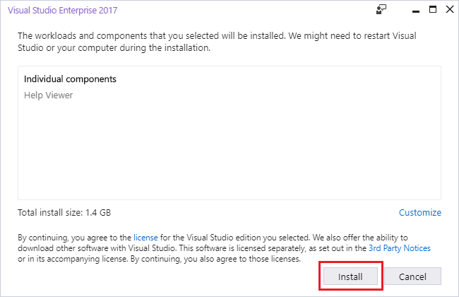

# Microsoft Help Viewer installation
Several products can display Help content in Microsoft Help Viewer, including Visual Studio and SQL Server.

Help Viewer is an optional installation component of Visual Studio. To install it through Visual Studio Installer, follow these steps:

1. Open **Visual Studio Installer** from the Start menu or, if you have Visual Studio open, you can choose **Tools**, **Get Tools and Features...** to open Visual Studio Installer.

2. Choose the **Individual Components** tab, then select **Help Viewer** under the **Code tools** section.

   

3. Choose the **Modify** button to start the installation of Microsoft Help Viewer.

Another way to easily install Microsoft Help Viewer is via the **Quick Launch** box:

1. Type or enter **help viewer** in the **Quick Launch** box on the Visual Studio title bar.

   

2. Choose the Install result called **Help Viewer (Indiviual Component)**.

3. In the dialog box that opens, choose the **Install** button.

   

|         |         |
|---------|---------|
|    |  [Watch a video](https://mva.microsoft.com/en-us/training-courses/getting-started-with-visual-studio-2017-17798?l=ZMfaVID6D_7411787171) on how to install the Microsoft Help Viewer by using Visual Studio Installer. |

## See also
[Microsoft Help Viewer](../ide/microsoft-help-viewer.md)  
[Help viewer and offline content for SQL Server](/sql/sql-server/sql-server-help-installation)
