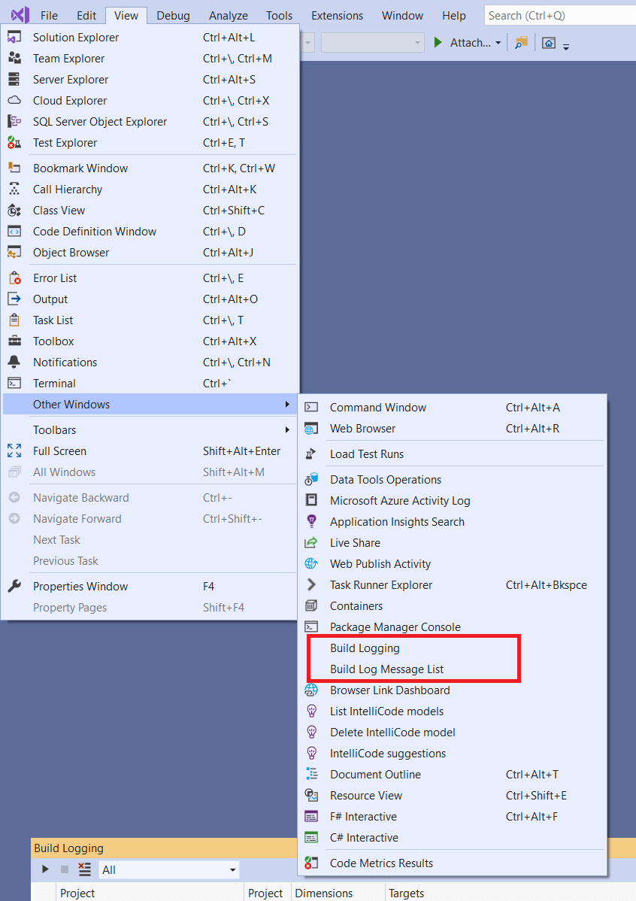
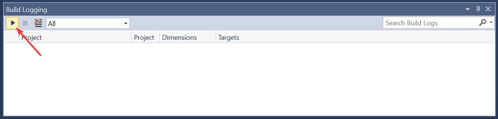
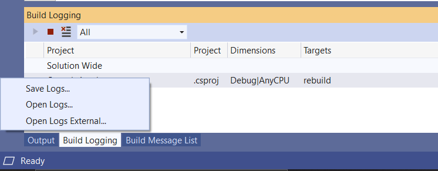

# Troubleshoot and create logs for MSBuild problems

The following procedures can help you diagnose build problems in your Visual Studio project, and, if necessary, create a log to send to Microsoft for investigation.

## A property value is ignored

If a project property appears set to a particular value, but the property has no effect on the build, follow these steps:

1. Open the Visual Studio Developer Command Prompt that corresponds to your version of Visual Studio.
1. Run the following command, after substituting the values for your solution path, configuration, and project name:

    ```cmd
    MSBuild /p:SolutionDir="c:\MySolutionDir\";Configuration="MyConfiguration";Platform="Win32" /pp:out.xml MyProject.vcxproj
    ```

    This command produces a "preprocessed" MSBuild project file (out.xml). You can search that file for a specific property to see where it's defined.

The last definition of a property is what the build consumes. If property is set twice, the second value overwrites the first. Also, MSBuild evaluates the project in several passes:

- PropertyGroups and Imports
- ItemDefinitionGroups
- ItemGroups
- Targets

Therefore, given the following order:

```xml
<PropertyGroup>
   <MyProperty>A</MyProperty>
</PropertyGroup>
<ItemGroup>
   <MyItems Include="MyFile.txt"/>
</ItemGroup>
<ItemDefinitionGroup>
  <MyItems>
      <MyMetadata>$(MyProperty)</MyMetadata>
  </MyItems>
</ItemDefinitionGroup>
<PropertyGroup>
   <MyProperty>B</MyProperty>
</PropertyGroup>
```

The value of `MyMetadata` for the `MyFile.txt` item is evaluated to `B` during build (not `A` and not empty).

## Incremental build is building more than it should

If MSBuild is unnecessarily rebuilding a project or project item, create a detailed or binary build log. You can search the log for the file that was built or compiled unnecessarily. The output looks something like this:

```output
  Task "CL"

  Using cached input dependency table built from:

  F:\test\Project1\Project1\Debug\Project1.tlog\CL.read.1.tlog

  Outputs for F:\TEST\PROJECT1\PROJECT1\PROJECT1.CPP:
  F:\TEST\PROJECT1\PROJECT1\DEBUG\PROJECT1.OBJ
  Project1.cpp will be compiled because F:\TEST\PROJECT1\PROJECT1\PROJECT1.H was modified at 6/5/2019 12:37:09 PM.

  Outputs for F:\TEST\PROJECT1\PROJECT1\PROJECT1.CPP:
  F:\TEST\PROJECT1\PROJECT1\DEBUG\PROJECT1.OBJ

  Write Tracking Logs:
  Debug\Project1.tlog\CL.write.1.tlog
```

If you're building in the Visual Studio IDE (with detailed output window verbosity), the **Output Window** displays the reason why each project isn't up-to-date:

```output
1>------ Up-To-Date check: Project: Project1, Configuration: Debug Win32 ------

1>Project is not up-to-date: build input 'f:\test\project1\project1\project1.h' was modified after the last build finished.
```

## Create a detailed log

:::moniker range="visualstudio"

1. Open the **Tools** > **Options** pane and expand the **All Settings** > **Projects and Solutions** > **Build and Run** section.

:::moniker-end
:::moniker range="<=vs-2022"
      
1. Open the **Tools** > **Options** dialog and expand the **Projects and Solutions** > **Build and Run** section.

:::moniker-end

2. Use the dropdown lists and set both the **MSBuild project build output verbosity** and **MSBuild project build log file verbosity** options to **Detailed**.

   The top one controls build verbosity in the **Output Window** and the second one controls build verbosity in the `{projectname}.log` file that is created in each project's intermediate directory during build.

3. From a Visual Studio developer command prompt, enter one of these commands, substituting your actual path and configuration values:

    ```cmd
    MSBuild /p:Configuration="MyConfiguration";Platform="x86" /fl MySolution.sln
    ```

    or

    ```cmd
    MSBuild /p:/p:SolutionDir="c:\MySolutionDir\";Configuration="MyConfiguration";Platform="Win32" /fl MyProject.vcxproj
    ```

    An `MSBuild.log` file is created in the directory that you ran MSBuild from.

## Provide MSBuild binary logs for investigation

MSBuild has the ability to capture a detailed binary log file. If you're having a build issue and are able to provide a binary log, the log can be helpful for investigating the issue.

However, you should be aware what type of information is captured in the binary log to make sure you aren't inadvertently sharing more than you intend.  The binary log captures almost everything your build does, including the contents of your project files and any files (such as `.props` and `.targets`) that they import, all tasks that are run during the build as well as the input and output, as well as environment variables that have been accessed in that MSBuild session. It generally doesn't include the contents of the source files that are compiled, but it does capture their full names and paths.

> [!NOTE]
> Some build environments make secrets available using environment variables. Before sharing a binary log, make sure it doesn't expose API tokens or other important secrets.

### Capture binary logs for command-line builds

You can create a binary log by passing the `-bl` parameter to MSBuild (`MSBuild.exe` or `dotnet build`). You can explore the contents of the generated `.binlog` file using [MSBuild Structured Log Viewer](http://msbuildlog.com/) or in your browser using [Live Structured Log Viewer](https://live.msbuildlog.com). MSBuild doesn't capture any data from binary logs viewed on your browser.

#### Examples

```sh
dotnet build -bl
dotnet build -bl:SpecificStep.binlog
MSBuild.exe -bl:ServiceRelease.binlog -p:Configuration=Release
```

See also [More details about binary logs](https://github.com/dotnet/msbuild/blob/main/documentation/wiki/Binary-Log.md).

### Capture binary logs through Visual Studio

To capture logs for all MSBuild invocations:

Set `MSBUILDDEBUGENGINE` environment variable to `'1'` and (optionally) set `MSBUILDDEBUGPATH` to an existing destination folder to store the captured logs. Then start Visual Studio from the same shell to inherit the environment:

   ```batch
   SET MSBUILDDEBUGENGINE=1
   SET MSBUILDDEBUGPATH=C:\MSBuildReproLogs
   devenv.exe MySolution.sln
   ```

   ```powershell
   $env:MSBUILDDEBUGENGINE = 1
   $env:MSBUILDDEBUGPATH="C:\MSBuildReproLogs"
   & "devenv.exe" MySolution.sln
   ```

MSBuild binary logs are then captured to a location specified via `MSBUILDDEBUGPATH` environment variable (or defaults to `MSBuild_Logs` subfolder of a current folder or `%temp%`, based on access rights).

> [!NOTE]
> Logs are recorded for each MSBuild invocation (including design time builds) and kept in the folder without removing older ones - so the number of log files can grow quickly. It's recommended to set the opt-in environment variable only for the short duration of reproducing the issue to be investigated (though it's understandable that some nondeterministic issues might need multiple reproduction attempts).

### Create a binary MSBuild log by using the Project System Tools extension

See [this guide](https://github.com/dotnet/project-system-tools) in the Project System Tools repo for capturing binlogs through Visual Studio.

1. Download and install the [Project System Tools extension](https://marketplace.visualstudio.com/items?itemName=VisualStudioProductTeam.ProjectSystemTools).

1. Once the extension is installed, some new items appear in the **View** > **Other Windows** menu.

   

1. Select **View** > **Other Windows** > **Build Logging** to show the **Build Logging** window in Visual Studio. Choose the first toolbar icon to start recording both regular and design-time builds in the project system.

   

1. Once a build is recorded, it appears in the Build Logging window. Right-click the item and select **Save Logs** on the context menu to save your `.binlog` file.

   

You can view and search your *.binlog* files by using the [MSBuild Structured Log Viewer](http://www.msbuildlog.com/).

## Related content

- [Visual Studio troubleshooting](/troubleshoot/visualstudio/welcome-visual-studio/)
