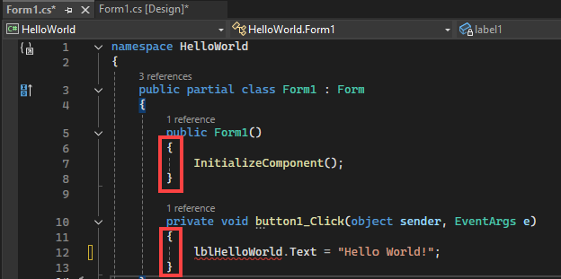

# Navigate code

Visual Studio provides numerous ways to navigate code in the editor. This topic summarizes the different ways you can navigate your code, and provides links to topics that go into more detail.

## Navigate Backward and Navigate Forward commands

You can use the **Navigate Backward** (**Ctrl**+**-**) and **Navigate Forward** (**Ctrl**+**Shift**+**-**) buttons on the toolbar to move the insertion point to previous locations, or to return to a more recent location from a previous location. These buttons retain the last 20 locations of the insertion point. These commands are also available on the **View** menu, under **Navigate Backward** and **Navigate Forward**.

## Navigation bar

You can use the **navigation bar** (the drop-down boxes at the top of the code window) to navigate to code in a codebase. You can choose a type or member to go directly to it. The navigation bar appears when you edit code in a Visual Basic, C#, or C++ code base. In a partial class, members defined outside the current code file may be disabled (they appear in gray).

You can navigate around the drop-down boxes as follows:

- To navigate to another project that the current file belongs to, choose it in the left drop-down.

- To navigate to a class or type, choose it in the middle drop-down.

- To navigate directly to a procedure or other member of a class, choose it in the right drop-down.

- To shift focus from the code window to the navigation bar, press the shortcut key combination **Ctrl**+**F2**.

- To shift focus from box to box on the navigation bar, press the **Tab** key.

- To select the navigation bar item that has focus and return to the code window, press the **Enter** key.

- To return focus from the navigation bar to the code  without selecting anything, press the **Esc** key.

To hide the navigation bar, change the **Navigation bar** option in the **Text Editor All Languages** settings (**Tools** > **Options** > **Text Editor** > **All Languages**), or you can change the settings for individual languages.

## Find all references

Finds all the references to the selected element in the solution. You can use this to check possible side-effects of a large refactoring, or to verify "dead" code. Press **F8** to jump between results. For more information, see [Find references in your code](finding-references.md).

Input | Function
------------ | ---
**Keyboard** | Place your text cursor somewhere inside the type name, and press **Shift**+**F12**
**Mouse** | Select **Find All References** from the right-click menu

## Reference highlighting

When you click a symbol in the source code, all instances of that symbol are highlighted in the document. The highlighted symbols may include declarations and references, and many other symbols that **Find All References** would return. These include the names of classes, objects, variables, methods, and properties. In Visual Basic code, keywords for many control structures are also highlighted. To move to the next or the previous highlighted symbol, press **Ctrl**+**Shift**+**Down Arrow** or **Ctrl**+**Shift**+**Up Arrow**. You can change the highlighting color in **Tools** > **Options** > **Environment** > **Fonts and Colors** > **Highlighted Reference**.

## Go To commands

Go To has the following commands, which are available in the **Edit** menu under **Go To**:

:::moniker range="<=vs-2019"
- **Go To Line** (**Ctrl**+**G**): Move to the specified line number in the active document.

- **Go To All** (**Ctrl**+**T** or **Ctrl**+**,**): Move to the specified line, type, file, member, or symbol. This brings you to the search experience. See [Visual Studio search](./visual-studio-search.md).

- **Go To File** (**Ctrl**+**Shift**, **T**): Move to the specified file in the solution.

- **Go To Recent File** (**Ctrl**+**1**, **Ctrl**+**R**): Move to the specified, recently visited file in the solution.

- **Go To Type** (**Ctrl**+**1**, **Ctrl**+**T**): Move to the specified type in the solution.

- **Go To Member** (**Alt**+**\\**): Move to the specified member in the solution.

- **Go To Symbol** (**Ctrl**+**1**, **Ctrl**+**S**): Move to the specified symbol in the solution.

- **Go To Next Issue in File** (**Alt**+**PgDn**) and **Go To Previous Issue in File** (**Alt**+**PgUp**)

- **Go To Last Edit Location** (**Ctrl**+**Shift**+**Backspace**)

See more about these commands in the [Find code using Go To commands](../ide/go-to.md) topic.

:::moniker-end

:::moniker range=">=vs-2022"

- **Go To Line** (**Ctrl**+**G**): Move to the specified line number in the active document.

- **Go To File** (**Ctrl**+**Shift**, **T**): Move to the specified file in the solution.

- **Go To Next Issue in File** (**Alt**+**PgDn**) and **Go To Previous Issue in File** (**Alt**+**PgUp**)

- **Go To Last Edit Location** (**Ctrl**+**Shift**+**Backspace**)

The following commands work differently in Visual Studio 2022 version 17.10 and later (or in earlier versions with the optional feature **All in One Search** enabled). See [All in One Search experience](visual-studio-search.md#about-the-all-in-one-search-experience). With **All in One Search**, the search dialog box opens, and you can search for any code element. With earlier versions of Visual Studio, a UI widget appears where you can enter the search text.

- **Go To All** (**Ctrl**+**T** or **Ctrl**+**,**): Move to the specified line, type, file, member, or symbol. This brings you to the search experience. See [Visual Studio search](./visual-studio-search.md).

- **Go To Type** (**Ctrl**+**1**, **Ctrl**+**T**): Move to the specified type in the solution.

- **Go To Member** (**Alt**+**\\**): Move to the specified member in the solution.

See more about these commands in the [Find code using Go To commands](../ide/go-to.md) topic.

:::moniker-end

## Go To Definition

Go To Definition takes you to the definition of the selected element. For more information, see [Go To Definition and Peek Definition](../ide/go-to-and-peek-definition.md).

Input | Function
------------ | ---
**Keyboard** | Place your text cursor somewhere inside the type name, and press **F12**
**Mouse** | Right-click on the type name and select **Go To Definition**  OR  press **Ctrl** and click on the type name

## Peek Definition

Peek Definition displays the definition of the selected element in a window without navigating away from your current location in the code editor. For more information, see [How to: View and edit code by using Peek Definition](../ide/how-to-view-and-edit-code-by-using-peek-definition-alt-plus-f12.md) and [Go To Definition and Peek Definition](../ide/go-to-and-peek-definition.md).

Input | Function
------------ | ---
**Keyboard** | Place your text cursor somewhere inside the type name, and press **Alt**+**F12**
**Mouse** | Right-click on the type name and select **Peek Definition** OR press **Ctrl** and click on the type name (if you have the **Open definition in peek view** option checked)

## Go To Implementation

Using Go To Implementation, you can navigate from a base class or type to its implementations. If there are multiple implementations, you will see them listed in the **Find Symbol Results** window:

Input | Function
------------ | ---
**Keyboard** | Place your text cursor somewhere inside the type name, and press **Ctrl**+**F12**
**Mouse** | Right-click on the type name and select **Go To Implementation**

## Go To Base

Using Go To Base, you can navigate up the inheritance chain of the selected element. If there are multiple results, you will see them listed in the **Go To Base** window:

Input | Function
------------ | ---
**Keyboard** | Place your text cursor somewhere inside the type name, and press **Alt**+**Home**
**Mouse** | Right-click on the type name and select **Go To Base**

## Call Hierarchy

You can view calls to and from a method in the [Call Hierarchy window](../ide/reference/call-hierarchy.md):

Input | Function
------------ | ---
**Keyboard** | Place your text cursor somewhere inside the type name, and press **Ctrl**+**K**, **Ctrl**+**T**
**Mouse** | Right-click on the member name and select **View Call Hierarchy**

## Next Method and Previous Method commands (Visual Basic)

In Visual Basic code files, use these commands to move the insertion point to different methods. Choose **Edit** > **Next Method** or **Edit** > **Previous Method**.

## Structure Visualizer

The Structure Visualizer feature in the code editor shows *structure guide lines* - vertical dashed lines that indicate matching curly braces in your codebase. This makes it easier to see where logical blocks begin and end.

To disable structure guide lines, go to **Tools** > **Options** > **Text Editor** > **General** and clear the **Show structure guide lines** box.

## Enhanced scroll bar

You can use the enhanced scroll bar in a code window to get a bird's-eye view of your code. In map mode, you can see previews of the code when you move the cursor up and down the scroll bar. For more information, see [How to: Track your code by customizing the scroll bar](../ide/how-to-track-your-code-by-customizing-the-scrollbar.md).

## CodeLens information

You can find info about specific code, like changes and who made those changes, references, bugs, work items, code reviews, and unit test status when you use CodeLens in the code editor. CodeLens works like a heads-up display when you use Visual Studio Enterprise with a version control provider. See [Find code changes and other history](../ide/find-code-changes-and-other-history-with-codelens.md).

## Related content

- [Features of the code editor](../ide/writing-code-in-the-code-and-text-editor.md)
- [View call hierarchy](../ide/reference/call-hierarchy.md)
