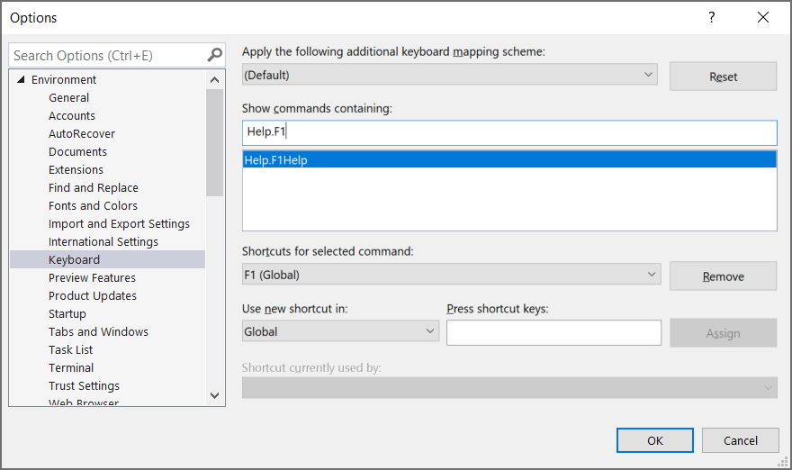

# Change the F1 help key in Visual Studio

If you want to use the F1 key for a different function than the F1 help service, or you just want to disable the help using F1, you can remove or modify the key mapping.

> [!IMPORTANT]
> If you want to disable F1 help due to performance issues, we recommend you modify the key mapping temporarily so you can test improvements to the F1 help service in updates to Visual Studio. In most scenarios, F1 is an easy way to open reference pages for language keywords and APIs from the code editor, or to open help pages associated with windows or UI elements in the IDE. If you disable it, you disable it for all uses from within Visual Studio.

**To disable the F1 help:**

1. In Visual Studio, select **Tools** > **Options**, then under **Environment**, select **Keyboard**.

1. In the **Show commands containing** text box, type **Help.f1** to filter the view of commands.

   

1. Select **Remove** to remove the key mapping.

1. Select the **Press shortcut key** text box.

1. On your keyboard, press a new key or key combination for the F1 help such as **Alt + F1**, select **Assign**, and then select **OK**.

For more information on setting keyboard shortcuts, see [Identify and customize keyboard shortcuts](../../ide/identifying-and-customizing-keyboard-shortcuts-in-visual-studio.md).
