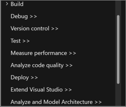
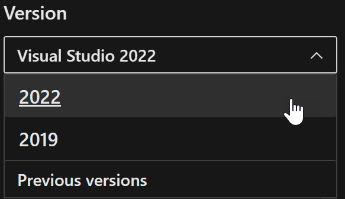

# Welcome to the Visual Studio docs

You likely arrived here by clicking **View Help** in the Visual Studio IDE. Let's get you where you need to go.

Documentation for Visual Studio covers the functionality of the IDE. 

## Get started with docs

You can start with a [Visual Studio feature tour](~/ide/quickstart-ide-orientation.md) and [overview of Visual Studio](~/get-started/visual-studio-ide.md). 

You can also access major areas of the documentation from the main [Visual Studio hub page](~/windows/index.yml), or by using landing pages for various subareas, including:
+ [General IDE docs](~/ide/index.yml) 
+ [Projects and solutions](~/ide/solutions-and-projects-in-visual-studio.md)
+ [Debugger docs](~/debugger/index.yml) 
+ [Performance analysis](~/profiling/beginners-guide-to-performance-profiling.md) tools
+ [Test & validation docs](~/test/index.yml) 
+ [Containers docs](~/containers/index.yml) 
+ [Azure development docs](~/azure/index.yml) 
+ [Settings in the IDE](~/ide/personalizing-the-visual-studio-ide.md)

If you're looking to get started with Visual Studio by writing some kind of app, such as a console app or web app, try these pages to select an appropriate tutorial:

| Tutorial by language | Description |
| - | - |
| [C# Tutorials](~/get-started/csharp/index.yml) | Create C# console, Windows, and web apps. |
| [Visual Basic tutorials](~/get-started/visual-basic/index.yml) | Create Visual Basic console, Windows, and web apps. |
| [F# tutorial](~/get-started/tutorial-fsharp-web-app.md) | Get started with F#, a functional programming language for .NET. |
| [C++ tutorials](/cpp/build/vscpp-step-1-create) | Create "Hello, world" in C++ in Visual Studio. |

## Navigate the documentation

Use the table of contents (TOC) on the left to explore the contents. This tree view of links to articles encompasses the Visual Studio IDE content for the Windows platform. Many subareas of the Visual Studio documentation, such as the debugger, are in separate TOCs. Links to those separate TOCs are indicated in the main TOC with a ">>" symbol.

### Find using docs search 

You can always use Internet search engines to find content for all Microsoft technologies. Try adding `site:learn.microsoft.com` to your search queries in your favorite search engine if you know you're looking for Microsoft content.

In addition, you can use the search box at the top of the screen to search text just in articles on the Learn platform or scoped to certain Microsoft products and services. After you enter a query, you can narrow the search scope to Visual Studio or other documentation. See [Microsoft Search](/search/).

The TOC also has a search box just above it. It only searches the TOC, not the pages themselves.

### Find with contextual help (F1)

Anytime you're using the IDE, press your F1 key to get relevant documentation based on your current context, as determined by the window focus and cursor position. For example, when you're writing code, you can press F1 when your cursor is on the name of a type, method, or language keyword in the code editor to get right to the reference page for that program entity. You can click on most error codes in the [Task List](~/ide/using-the-task-list.md) or [Output Window](~/ide/reference/output-window.md) to get to pages with suggestions for how to deal with the errors. You can click on the ? icon or press F1 on most dialog boxes or options pages to jump right to the documentation for that tool or settings page.

In some cases, when there isn't enough context to provide meaningful help, nothing happens when you press F1. Try moving the window focus or cursor position to get more specific help. 

### Find versioned documentation

The documentation applies to the most recently generally-available releases of Visual Studio. You can use the version selector at the top left, above the table of contents to switch between versions.  Articles or sections that apply to current previews are marked as preview content.

You can also access [archived documentation for previous versions](/previous-versions/visualstudio).

## Get local, offline documentation

You can install a local copy of the documentation, also called offline documentation. This is helpful for those who don't have a fast, high-bandwidth connection to the Internet on their development machines, or work in isolated networks for security or other reasons.   For more information about offline documentation, see [Microsoft Help Viewer](~/help-viewer/overview.md).

First, you need to [install the Help Viewer](~/help-viewer/install-manage-local-content.md), which is available in the Visual Studio Installer. Choose **Modify** > **Individual Components** and search for **Help Viewer**.

Not all documentation on the Learn platform is available locally. Available documentation includes Visual Studio, .NET, Windows APIs, SQL Server, and more. To see the full list of what you can install, choose the **Help > Add and Remove Help Content** menu item from the main Visual Studio menu, or in the Help Viewer, use the toolbar button  with the tooltip **Manage Help Content** (it looks like books on a shelf), or press **Ctrl**+**Shift**+**M**.

## More help & feedback

If you're not finding what you wanted, let us know! If your feedback is about the product, use [Visual Studio Developer Community](https://developercommunity.visualstudio.com/VisualStudio) to report your concern or see what others have suggested. 

If your feedback is about the documentation, use the feedback link at the bottom of this page. The best feedback includes information about your situation, what you expected or wanted, and if possible, specific suggestions for us to consider improving or changing. See also [Report a problem](~/ide/how-to-report-a-problem-with-visual-studio.md).

## Next steps

+ [Main documentation home page](~/windows/index.yml)
+ [Select a color theme for Visual Studio](~/ide/how-to-change-fonts-and-colors-in-visual-studio.md)
