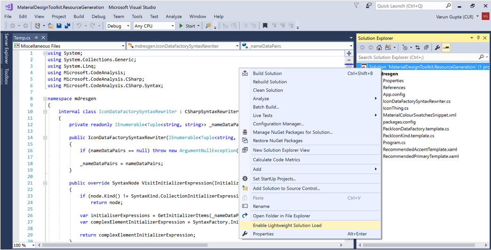

# Optimize Solution Loading in Visual Studio
Many solutions contain a large number of projects, which affects the time taken to load those solutions. However, in team environments, developers typically work on a different subset of those projects and don’t need to load all of the individual projects.

Visual Studio 2017 supports **lightweight solution load**. When lightweight solution load (LSL) mode is enabled, Visual Studio 2017 loads a small subset of projects instead of loading all the projects in a large solution. Most of the commonly used IDE features work under LSL mode, and it provides the ability for you to build, search, and debug on the entire solution. (The main unsupported feature in LSL mode is edit and continue).

> [!NOTE]
> This content applies to Visual Studio 2017 Update 3

For large solutions with more than 30 projects, LSL typically loads solutions twice as fast (on average). While most of the IDE features work in LSL mode, some IDE features might require all the projects to be loaded. In these cases, Visual Studio automatically loads the entire solution so that you can use the feature. In the worst-case scenario, you end up loading all the projects in the lightweight mode. 

If you use an IDE feature on a project that is not currently loaded, Visual Studio loads the appropriate project(s) for you. For example, if you are trying to create or open a class diagram for an unopened project, Visual Studio automatically loads the appropriate projects. The detailed feature list is referenced in the sections following.

The following sections show how to enable lightweight solution load and also help you decide whether or not to enable the feature.

## Enable or disable lightweight solution load

You can right-click the solution name in Solution Explorer, and select **Enable Lightweight Solution Load**. After selecting the option, you need to close and reopen the solution to activate lightweight solution load.

> [!NOTE]
> Similar steps apply for disabling LSL. To disable lightweight solution load, select **Disable Lightweight Solution Load**, then close and reopen the solution. 

## Configure global settings for  lightweight solution load

You can globally disable or configure LSL for all the solutions by choosing **Tools > Options > Projects and Solutions**.

## How does lightweight solution load work behind the scenes?

When you load your solution, Visual Studio remembers which projects you previously opened and loads only those projects. All other projects are visible in Solution Explorer but not loaded. As soon as you expand a project or right click on a project, Visual Studio auto-loads that project. Auto-loading of projects usually takes less than a second but can take longer for some projects.
However, Visual Studio enables IDE features like search, debug, build, and source control that operate across the entire solution. For example, you can search across an entire solution even though only a few projects are loaded in the lightweight mode. 

As you expand more projects, Visual Studio remembers the list of expanded projects. When a solution is reopened, Visual Studio auto-loads projects that you previously expanded.

## Visual Studio prompts developers likely to see significant performance gains

From Visual Studio telemetry, large solutions with over 30 projects significantly benefit from LSL mode. Consequently, we prompt developers with large solutions to try out LSL mode. The majority of developers who try LSL for the first time end up using it on regular basis. 

We are constantly reviewing Visual Studio usage telemetry to improve heuristics for offering LSL mode to developers who would benefit the most. 

## Visual Studio makes recommendations to turn on lightweight solution load based on heuristics

By default, Visual Studio turns on LSL for users who are most likely to benefit. If you have multiple solutions, Visual Studio offers LSL mode for solutions that are most likely to see significant performance gains. If you select the lightweight mode option **Let Visual Studio decide** (default option), Visual Studio may open the solution in lightweight mode based on heuristics. A message bar indicates whether the solution is in lightweight mode. When the message bar shows, you have the option to learn more, or update settings.

## IDE Features fully supported in Lightweight mode

|Feature|Supported in Lightweight Mode?|
|-|-|-|
|IntelliSense|Yes|
|Search|Yes|
|Debugging|Yes|
|Build|Yes|
|Code Navigation (Go To Definition & Find All References)|Yes|
|Code Lens|Yes|
|Static Code analysis|Yes|
|Deploy and Publish|Yes|
|Adding & removing references|Yes|
|Multi-targeting|Yes|
|IntelliTrace|Yes|
|Live Unit Testing|Yes|
|IntelliTest|Yes|
|Microsoft Fakes|Yes|
|Edit and Continue|Not supported|
|Unit Testing|Requires loading of test projects  followed by a solution build|

## Scenarios in which Lightweight solution loads the appropriate project(s) to complete the operation

If you are not working on a project in the solution, the project is not loaded in lightweight mode. For some features, additional projects are automatically loaded to support the feature scenario. (We intend to minimize this list of scenarios. ) For these scenarios, Visual Studio either loads the project(s) itself, or prompts you to load the project(s) as needed.

|Category|Issue|
|-|-|-|
|Unit test|Projects that are not currently loaded do not show up in the list of test projects for both the “Create IntelliTest” and “Create Unit Test” wizards.  You need to load the projects for which you want to create tests (you can expand the project node to load the project).|
|Class Diagrams|If you create or open a Class Diagram of a project, Visual Studio automatically loads the projects that are direct dependencies of that project.  If the entire solution is not loaded, we turn off the validation of obsolete artifacts referenced by a dependency validation diagram.|

## Scenarios in which lightweight solution loads the entire solution 

For some features, Visual Studio automatically loads the entire solution to support the scenario. This action ensures that you always get full functionality. For example, some TFS operations may require the entire solution to be loaded. To provide full functionality, Visual Studio loads the entire solution.

|Category|Scenario|
|-|-|-|
|TFS SCC command on solution node|If an SCC command is triggered on the solution node (within Solution Explorer), Visual Studio automatically loads the entire solution before completing the command.|
|Project load|If your solution contains .NET Core projects and Shared projects, Visual Studio always automatically loads these projects during initial solution load itself. These projects do not currently support lightweight mode.|
|Solution configuration manager|If you use solution configuration manager or batch build, Visual Studio automatically loads the entire solution to provide a full experience.|
|NuGet package manager|If you open NuGet package manager’s user interface, or the NuGet package manager console, Visual Studio automatically loads the entire solution to provide a full experience.|

## Known issues

There are some scenarios that may not work in LSL mode, and require the loading of additional projects or the entire solution. We are actively working on addressing these cases. 

|Category|Issue|Workaround|
|-|-|-|-|
|IntelliSense|IntelliSense may not get updated after a configuration change (for example, changing a release build to debug and vice versa). The impact depends on code differences due to configuration change.|Reload solution after changing the configuration.|
|Refactoring limitations for C#/VB projects|Code fixes that change project files may fail silently the first time.|Load projects if you need to make code fixes to files of these projects. Lightweight mode does not make fixes to projects that are not loaded.|
|Unit Test Discovery|Tests discovered on deferred projects do not run when a project is loaded manually.|Rebuild the project to rediscover tests and run selected tests again.|
|Live unit testing (LUT)|In LSL mode, you may see that LUT is not activated. It is not activated because LUT needs one of the test projects to get loaded.|Load any test project to activate live unit testing for the solution.|
|Solution Explorer Search|1.	Solution Explorer search in LSL mode does not search within the files and there are no progression results (that is, only files are shown under the search tree, but not classes, methods, etc.). 2.	All files belonging to a project are shown as a flat list instead of a tree view. When files belong to a folder of a project, we show the relative path of the file, instead of just the file name on the search view. There are no context menus for the file items in the search view.|Load the entire solution in non-LSL mode to get traditional Solution Explorer search. You can also use Visual Studio IDE search.|
|Object Browser for C++ Projects|Object Browser shows assembly/WinMD references for only loaded projects.|Load projects for which you want to see information in the Object browser.|

> [!Note]
> Thanks to our partners, popular extensions including Resharper also work well with lightweight solution  load.

We are excited about innovations to optimize solution load time performance for developers. Since this is a new feature, we are actively looking at customer feedback, and addressing known issues. We look forward to hearing your feedback. You can email Visual Studio solution load optimization team at lslsupport@microsoft.com

## See Also
[Visual Studio Performance Tips and Tricks](../ide/visual-studio-performance-tips-and-tricks.md)
