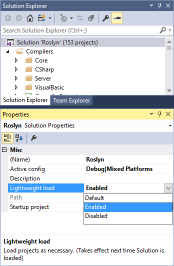
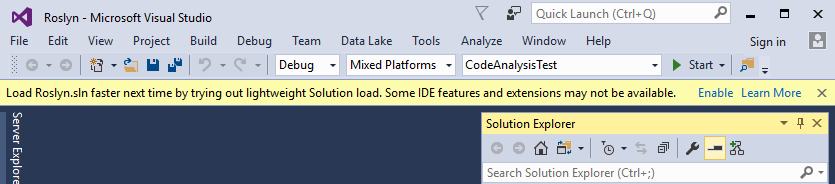

# Optimize Visual Studio Startup Time
Ideally, Visual Studio should always start up as quickly as possible. However, Visual Studio extensions and open tool windows can adversely affect startup time because they load automatically at startup. The **Manage Visual Studio Performance** window enables you to not only see which extensions and features affect Visual Studio startup time, but also lets you determine their loading behavior so you have more control over how quickly Visual Studio starts up.

## Control startup behavior

To avoid extending startup time, Visual Studio 2017 avoids loading extensions during startup, using an on-demand-load approach. This means that extensions don't open immediately after Visual Studio starts, but rather open asynchronously on an as-needed basis after startup. Also, because tool windows left open in a prior Visual Studio session can slow startup time, Visual Studio opens tool windows in a more intelligent way to avoid impacting startup time.

If Visual Studio detects slow startup, a pop-up message appears, alerting you to the extension or tool window that's causing the slowdown. The message also provides a link to the **Manage Visual Studio Performance** dialog box, which lists the extensions and tools windows that are affecting startup performance. This dialog box enables you to change extension and tool window settings to improve startup performance.

The **Manage Visual Studio Performance** dialog box has two categories: **Extensions** and **Tool Windows**.

### Control extensions
If an extension is slowing down Visual Studio startup, the extension appears in the **Manage Visual Studio Performance dialog** box when you choose one of the extension types. If the impact on startup time (which is listed under the **Impact** section) is unacceptably  high, you can choose to always disable the extension at startup by choosing the **Disable** button. You can re-enable the extension for future sessions by using the Extension Manager or the Manage Visual Studio Performance dialog box.

In addition to startup extensions, you can also disable extensions that load when solutions load, or when a user types. Just choose the scenario to see a list of the associated extensions.

### Control tool windows
If a tool window is slowing down Visual Studio startup, you can choose to leave it at its default behavior (giving you no benefit in startup speed), or you can override its behavior by choosing one of two behaviors:

- **Do not show window at startup:** If you choose this option, the specified tool window will always be closed when you open Visual Studio, even if left open in a previous session. You can open the tool window from the menu.
- **Auto hide window at startup:** If a tool window was left open in a previous session, choosing this option will collapse the tool window's group at startup to avoid initializing the tool window. This is a good choice if you use a tool window often, because the tool window is still available, but no longer negatively affects Visual Studio startup time.

If you later change your mind, you can revert any of these options in the **Manage Visual Studio Performance** dialog box. To open the **Manage Visual Studio Performance** dialog box, on the menu bar, choose **Help**, **Manage Visual Studio Performance**.

## Speed up solution load

Visual Studio 2017 introduces a new feature called **lightweight solution load** that reduces the amount of time and memory required to load large solutions in the IDE. If you have a large solution containing many C#, VB, or C++ projects, you are likely to see a substantial performance benefit if you enable lightweight solution load.

Because some IDE features are not fully available when lightweight solution load is enabled, the feature is turned off by default. The following sections will help you decide whether or not to enable this feature.

### Enable lightweight solution load

You can enable lightweight solution load for the IDE as a whole or for individual solutions. To enable lightweight solution load for the entire IDE, go to **Tools**, **Options** and then go to the **Projects and Solutions** section.

To enable lightweight solution load for an individual solution, choose the top level solution node in Solution Explorer.  In the Properties window, choose one of the following values for the property **Lightweight load**.

- **Enabled:** Lightweight solution load will be enabled for this solution regardless of the IDE-wide setting.
- **Disabled:** Lightweight solution load will be disabled for this solution regardless of the IDE-wide setting.
- **Default:** Lightweight solution load behavior will defer to the IDE-wide setting.

When you change the lightweight solution load setting, the change takes effect the next time the solution is loaded. You don't need to restart the IDE.

### Automatically enable lightweight solution load

When you open a large solution in Visual Studio 2017, you may see a pop-up message offering to enable lightweight solution load. The message only appears for solutions that contain many C#, VB, or C++ projects. Choosing the **enable** command will enable lightweight solution load for that solution only. The IDE-wide setting will not be changed.

You can disable lightweight solution load later in the solution's Properties window.

### Lightweight solution load limitations
Most features of the IDE are fully available when lightweight solution load is enabled. However, some IDE features and third party extensions may not be fully compatible.  The following features are known to not work when lightweight solution load is enabled:

#### Third Party Extensions
Some extensions may not behave as expected when lightweight solution load is enabled.

#### Edit and Continue
Edit and Continue doesn't work in projects that are not loaded when you start debugging. The files contained in such a project will be read-only and an error will be reported that the project has not been loaded if an edit is attempted.

#### F# Support
When lightweight solution load is enabled, F# projects may not properly build and symbols may not be fully available in GoTo.
