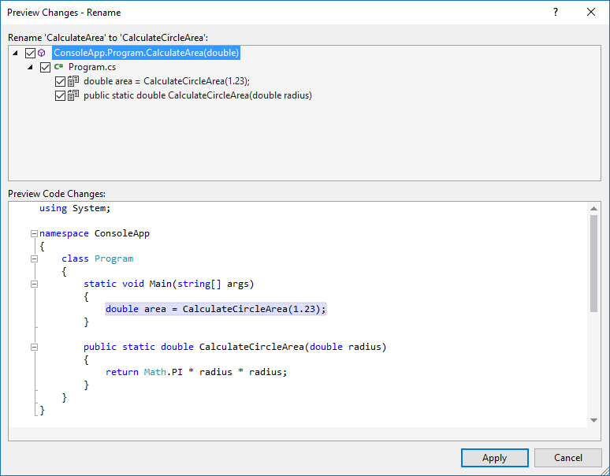

# Preview Changes window

When using various [Quick Actions](../ide/quick-actions.md) or [Refactoring](../ide/refactoring-in-visual-studio.md) tools in Visual Studio, it is often possible to preview changes that are going to be made to your project prior to accepting them. The **Preview Changes** window is where this is done.  

The top half of the window shows the specific lines that will be changed, each with a checkbox. You can check or uncheck each checkbox if you want to selectively apply the refactoring to only specific lines.

The bottom half of the window shows the formatted code from the project that will be changed, with the affected areas highlighted. Selecting the specific line in the top half of the window will highlight the corresponding line in the bottom half. This allows you to quickly skip to the appropriate line and see the surrounding code.

After reviewing the changes, click the **Apply** button to commit those changes, or click the **Cancel** button to leave things as they were.

For example, the following screenshot shows the **Preview Changes** window showing what will be changed during a Rename refactor in a C# project:

