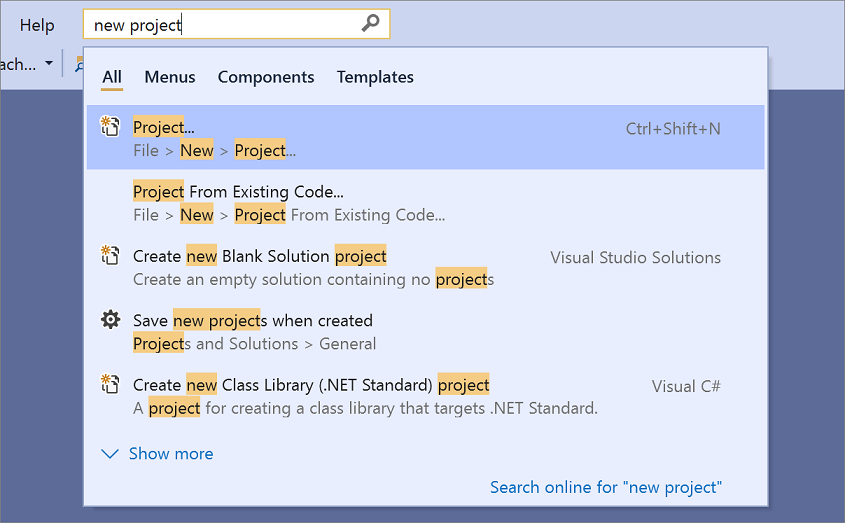

# Productivity guide for Visual Studio

If you want to save time while you're writing code, you're in the right place. This productivity guide includes tips that can help you get started with Visual Studio, write code, debug code, handle errors, and use keyboard shortcuts&mdash;all on one page.

For information about helpful keyboard shortcuts, see [Productivity shortcuts](../ide/productivity-shortcuts.md). For a complete list of command shortcuts, see [Default keyboard shortcuts](../ide/default-keyboard-shortcuts-in-visual-studio.md).

::: zone pivot="programming-language-csharp,programming-language-cpp,programming-language-vb,programming-language-all"
## Get started

Save time digging through menus by quickly searching for anything you need, including commands, settings, documentation, and install options. See keyboard shortcuts for commands within your search results in Visual Studio so you can memorize them more easily.

- **Mock code using task list**. If you don't have enough requirements to complete a piece of code, use Task List to track code comments that use tokens such as `TODO` and `HACK`, or custom tokens, and to manage shortcuts that take you directly to a predefined location in code. For more information, see [Use the Task List](../ide/using-the-task-list.md).

- **Use Solution Explorer shortcuts**. If you're new to Visual Studio, these shortcuts come in handy and save you time while you're coming up to speed on a new codebase. For the full list of shortcuts, see [Default keyboard shortcuts in Visual Studio](../ide/default-keyboard-shortcuts-in-visual-studio.md#bkmk_solutionexplorerGLOBAL).
::: zone-end 

::: zone pivot="programming-language-csharp"
- **Use keyboard shortcuts from a different editor**. If you're coming from another IDE or coding environment, you can change your keyboard scheme to *Visual Studio Code* or *ReSharper (Visual Studio)* using **Tools > Options** settings for **Environment > Keyboard**. Some extensions also offer keyboard schemes: [HotKeys for Visual Studio (ReSharper/IntelliJ)](https://marketplace.visualstudio.com/items?itemName=JustinClareburtMSFT.HotKeys) and [VSVim](https://marketplace.visualstudio.com/items?itemName=JaredParMSFT.VsVim).
::: zone-end

::: zone pivot="programming-language-csharp,programming-language-cpp,programming-language-vb,programming-language-all"
- **[Identify and customize keyboard shortcuts in Visual Studio](../ide/identifying-and-customizing-keyboard-shortcuts-in-visual-studio.md)**. You can identify keyboard shortcuts for Visual Studio commands, customize those shortcuts, and export them for others to use. You can always find and change a keyboard shortcut in the Options dialog box.

- **Make Visual Studio more accessible**. Visual Studio has built-in accessibility features that are compatible with screen readers and other assistive technologies. See [Accessibility tips and tricks for Visual Studio](../ide/reference/accessibility-tips-and-tricks.md) for the full list of available features.

- **Customize the appearance of the IDE**. To change themes and other visual aspects of the IDE, see [Change fonts, colors, and themes](../ide/how-to-change-fonts-and-colors-in-visual-studio.md).

::: moniker range=">=vs-2022"
- **Version Control** In Visual Studio 2022, you can use Git directly from the IDE to create, review, check out, and run pull requests. To learn more, see [How Visual Studio makes version control easy with Git](../version-control/git-with-visual-studio.md?view=vs-2022&preserve-view=true).
::: moniker-end
::: zone-end

## Write code

Write code more quickly by using the following features.

- **Use convenience commands**. Visual Studio contains various commands to help you accomplish common editing tasks faster. For example, you can choose a command to easily duplicate a line of code without having to copy it, reposition the cursor, and then paste it. Choose **Edit** > **Duplicate** or press **Ctrl**+**E**,**V**. You can also quickly expand or contract a selection of text by choosing **Edit** > **Advanced** > **Expand Selection** or **Edit** > **Advanced** > **Contract Selection**, or by pressing **Shift**+**Alt**+**=** or **Shift**+**Alt**+**-**.

- **Use IntelliSense**. As you enter code in the editor, IntelliSense information, such as List Members, Parameter Info, Quick Info, Signature Help, and Complete Word, appears. These features support fuzzy matching of text; for example, the results lists for List Members include not only entries that start with the characters that you have entered but also entries that contain the character combination anywhere in their names. For more information, see [Use IntelliSense](../ide/using-intellisense.md).

::: moniker range=">=vs-2022"
- **AI assistance**. If you're using [Copilot](../ide/visual-studio-github-copilot-install-and-states.md), get AI assistance to [help you write code](../ide/ai-assisted-development-visual-studio.md#ai-capabilities-side-by-side).
::: moniker-end

- **Change auto-insertion of IntelliSense options as you enter code**. By switching IntelliSense to suggestion mode, you can specify that IntelliSense options are inserted only if you explicitly choose them.

     To enable suggestion mode, choose the **Ctrl**+**Alt**+**Spacebar** keys, or, on the menu bar, choose **Edit** > **IntelliSense** > **Toggle Completion Mode**.

- **Use code snippets**. You can use built-in snippets, or create your own snippets.

     To insert a snippet, on the menu bar, choose **Edit** > **IntelliSense** > **Insert Snippet** or **Surround With**, or open the shortcut menu in a file and choose **Snippet** > **Insert Snippet** or **Surround With**. For more information, see [Code Snippets](../ide/code-snippets.md).

- **[Paste JSON or XML as classes](../ide/paste-json-xml.md)**. Copy any JSON or XML text fragment to the clipboard and then paste it as strongly typed .NET classes into any C# or Visual Basic code file. To do so, use **Edit** > **Paste Special** > **Paste JSON As Classes** (or **Paste XML As Classes**).

- **Fix code errors inline**. Quick Actions let you easily refactor, generate, or otherwise modify code with a single action. These actions can be applied using the light bulb  or screwdriver  icons, or by pressing **Alt**+**Enter** or **Ctrl**+**.** when your cursor is on the appropriate line of code. See [Quick Actions](quick-actions.md) for more information.

- **Show and edit the definition of a code element**. You can quickly show and edit the module in which a code element, such as a member, a variable, or a local, is defined.

    To open a definition in a pop-up window, highlight the element and then choose the **Alt**+**F12** keys, or open the shortcut menu for the element and then choose **Peek Definition**. To open a definition in a separate code window, open the shortcut menu for the element, and then choose **Go to Definition**.

- **Use sample applications**. You can speed up application development by downloading and installing sample applications from [Microsoft Developer Network](https://code.msdn.microsoft.com/). You can also learn a particular technology or programming concept by downloading and exploring a Sample Pack for that area.

- **Change brace formatting with Formatting/New Lines**. Use the **Formatting**  options page to set options  for formatting code in the code editor, including new lines. For more information on how to use this setting in C#, see [Options dialog box: Text Editor > C# > Code Style > Formatting](../ide/reference/options-text-editor-csharp-formatting.md). For C++, see [Set your C++ coding preferences in Visual Studio](/cpp/ide/how-to-set-preferences). For Python, see [Format Python code](../python/formatting-python-code.md).

- **Change your indentation with Tabs**. Use custom editor settings, tailored to each codebase, to enforce consistent coding styles for multiple developers working on the same project across different editors and IDEs. Ensure your whole team follows the same language conventions, naming conventions, and formatting rules. Since these custom settings are portable and travel with your code, you can enforce coding styles even outside of Visual Studio. For more information, see [Options, Text Editor, All Languages, Tabs](../ide/reference/options-text-editor-all-languages-tabs.md#tabs).

::: moniker range=">=vs-2022" 
- [**Try automatic copy and trim indentation**](writing-code-in-the-code-and-text-editor.md#copy-and-paste-code). Copy code from Visual Studio to another program (Outlook, Teams, etc.), without having to manually fix indentation after you paste your code. Available in Visual Studio 2022 [version 17.7](/visualstudio/releases/2022/release-notes) and later.
::: moniker-end 

::: zone pivot="programming-language-csharp"
::: moniker range=">=vs-2022" 
- **Enforce code style rules** You can use an EditorConfig file to codify coding conventions and have them travel with your source. Add a default or .NET-style EditorConfig file to your project by choosing **Add** > **New Item** from the [Add context menu fly-out](use-solution-explorer.md#the-add-menu) in Solution Explorer. Then, in the **Add New Item** dialog box, search for "editorconfig". Select either of the **editorconfig File** item templates and then choose **Add**.
::: moniker-end
::: zone-end

::: zone pivot="programming-language-csharp"
- **Apply code styles with code cleanup** Visual Studio provides on-demand formatting of your code file, including code style preferences, through the Code Cleanup feature. To run Code Cleanup, select the broom icon at the bottom of the editor or press **Ctrl+K, Ctrl+E**. For detailed instructions, see [Code style preferences](../ide/code-styles-and-code-cleanup.md).
::: zone-end

::: zone pivot="programming-language-csharp,programming-language-cpp,programming-language-vb"
::: moniker range=">=vs-2022" 
- **Write or generate unit tests** Test Explorer automatically discovers unit tests written using supported test frameworks. You can use Copilot or built-in features to generate unit tests. For more information, see [Unit test basics](../test/unit-test-basics.md) and [Create unit test method stubs from code](../test/create-unit-tests-menu.md). 
::: moniker-end
::: zone-end

::: zone pivot="programming-language-csharp,programming-language-vb"
- **Install and manage NuGet packages in Visual Studio**. NuGet is a mechanism through which developers can create, share, and consume useful code. The NuGet Package Manager UI in Visual Studio on Windows allows you to easily install, uninstall, and update NuGet packages in projects and solutions. For more information, see [Install and manage packages in Visual Studio using the NuGet Package Manager](/nuget/consume-packages/install-use-packages-visual-studio).
::: zone-end

## Navigate within your code and the IDE

You can use various techniques to find and move to specific locations in your code more quickly. You can also change the layout of your Visual Studio windows based on your preferences.

- **Bookmark lines of code**. You can use bookmarks to navigate quickly to specific lines of code in a file.

    To set a bookmark, on the menu bar, choose **Edit** > **Bookmarks** > **Toggle Bookmark**. You can view all of the bookmarks for a solution in the **Bookmarks** window. For more information, see [Set bookmarks in code](../ide/setting-bookmarks-in-code.md).

- **Search for symbol definitions in a file**. You can search within a solution to locate symbol definitions and file names, but search results don't include namespaces or local variables.

   To access this feature, on the menu bar, choose **Edit** > **Navigate To**.

- **Browse the overall structure of your code**. In **Solution Explorer**, you can search and browse classes and their types and members in your projects. You can also search for symbols, view a method's Call Hierarchy, find symbol references, and perform other tasks. If you choose a code element in **Solution Explorer**, the associated file opens in a **Preview** tab, and the cursor moves to the element in the file. For more information, see [View the structure of code](../ide/viewing-the-structure-of-code.md).

- **Jump to a location in a file with map mode**. Map mode displays lines of code, in miniature, on the scroll bar. For more information about this display mode, see [How to: Customize the scroll bar](../ide/how-to-track-your-code-by-customizing-the-scrollbar.md#map-mode).

- **Understand your code structure with code map**. Code maps can help you  visualize dependencies across your code, and see how it fits together without reading through files and lines of code. For more information, see [Map dependencies with code maps](../modeling/map-dependencies-across-your-solutions.md).

- **See frequently used files with Edit/Go to Recent File**. Use the Go To commands in Visual Studio to perform a focused search of your code to help you quickly find specified items. For  detailed instructions, see [Find code using Go To commands](../ide/go-to.md).

- **Jump to any file, type, member, or symbol declaration.** Visual Studio has a feature called **Go To All** that you can use to quickly find the code you want. For  detailed instructions, see [Find code using Go To commands](../ide/go-to.md).

- **Synchronize Solution Explorer** For large solutions, use the **Sync with Active Document** button in Solution Explorer to find the active document within the project hierarchy. 

- **Move the [Properties window](../ide/reference/properties-window.md) to the right-hand side**. If you're looking for a more familiar window layout, you can move the Properties window in Visual Studio by pressing **F4**.

## Find commands, files, and options faster

You can search across the IDE for commands, files, and options, in addition to filtering the contents of tool windows to show only relevant information for your current task.

- **Filter the contents of tool windows**. You can search within the contents of many tool windows, such as the **Toolbox**, the **Properties** window, and **Solution Explorer**, but display only items whose names contain the characters that you specify.

- **Display only the errors you want to address**. If you choose the **Filter** button on the **Error List** toolbar, you can reduce the number of errors that appear in the **Error List** window. You can display only the errors in the files that are open in the editor, only the errors in the current file, or only the errors in the current project. You can also search within the **Error List** window to find specific errors.

- **Find dialog boxes, menu commands, options, and more**. In the search box, enter keywords or phrases for the items that you're trying to find. For example, the following options appear if you enter **new project**:

   

   Press **Ctrl**+**Q** to jump straight to the search box.

## Debug code

Debugging can take time, but the following tips can help you speed up the process.

- **Use the Visual Studio debugger tools**. In the Visual Studio context, when you *debug your app*, it usually means that you're running the application in debugger mode. The debugger provides many ways to see what your code is doing while it runs. See [First look at the Visual Studio Debugger](../debugger/debugger-feature-tour.md) for a guide to getting started.

::: moniker range=">=vs-2022"
- **AI assistance**. If you're using [Copilot](../ide/visual-studio-github-copilot-install-and-states.md), get AI assistance to [help you debug code](../debugger/debug-with-copilot.md).
::: moniker-end

- **Set different types of breakpoints**. You can create a temporary breakpoint in the current line of code and start the debugger simultaneously. When you hit that line of code, the debugger enters break mode. For more information, see [Use the right type of breakpoint](../debugger/using-breakpoints.md).

    To use this feature, choose the **Ctrl**+**F10** keys, or open the shortcut menu for the line of code on which you want to break, and then choose **Run To Cursor**.

- **Capture value information for variables**. You can add a DataTip to a variable in your code and pin it so that you can access the last known value for the variable after debugging has finished. For more information, see [View data values in Data Tips](../debugger/view-data-values-in-data-tips-in-the-code-editor.md).

     To add a DataTip, the debugger must be in break mode. Place the cursor on the variable, and then choose the pin button on the DataTip that appears. When debugging is stopped, a blue pin icon appears in the source file next to the line of code that contains the variable. If you point to the blue pin, the value of the variable from the most recent debugging session appears.

- **Clear the Immediate window**. You can erase the contents of the [Immediate window](../ide/immediate-window.md) at design time by entering `>cls` or `>Edit.ClearAll`

     For more information about other commands, see [Visual Studio command aliases](../ide/reference/visual-studio-command-aliases.md).

- **[Find code changes and other history with CodeLens](../ide/find-code-changes-and-other-history-with-codelens.md)**. CodeLens lets you stay focused on your work while you find out what happened to your code&mdash;without leaving the editor. You can find references to a piece of code, changes to your code, linked bugs, work items, code reviews, and unit tests.

- **Use Live Share to debug in real time with others**. Live Share enables you to collaboratively edit and debug with others in real time, regardless of the programming languages you're using or app types you're building. For more information, see [What is Visual Studio Live Share?](/visualstudio/liveshare/)

- **Use Interactive Window to write and test small code**. Visual Studio provides an interactive read-evaluate-print-loop (REPL) window that lets you enter arbitrary code and see immediate results. This way of coding helps you to learn and experiment with APIs and libraries, and to interactively develop working code to include in your projects. For Python, see [Work with the Python Interactive window](../python/python-interactive-repl-in-visual-studio.md). The Interactive Window feature is also available for C#.

## Access Visual Studio tools

You can quickly access the Developer Command Prompt, or another Visual Studio tool, if you pin it to the Start menu or the taskbar.

1. In Windows Explorer, browse to *%ProgramData%\Microsoft\Windows\Start Menu\Programs\Visual Studio 2019\Visual Studio Tools*.

2. Right-click or open the context menu for **Developer Command Prompt**, and then choose **Pin to Start** or **Pin to taskbar**.

## Manage files, toolbars, and windows

At any one time, you may be working in multiple code files and moving among several tool windows as you develop an application. You can keep organized by using the following tips:

- **Keep files that you frequently use visible in the editor**. You can pin files to the left side of the tab so that they remain visible regardless of how many files are open in the editor.

   To pin a file, choose the file's tab, and then choose the **Toggle Pin Status** button.

- **Move documents and windows to other monitors**. If you use more than one monitor when you develop applications, you can work on portions of your application more easily by moving files that are open in the editor to another monitor. You can also move tool windows, such as debugger windows, to another monitor and tab dock document and tool windows together to create "rafts." For more information, see [Customize window layouts and personalize tabs in Visual Studio](../ide/customizing-window-layouts-in-visual-studio.md).

   You can also manage files more easily by creating another instance of **Solution Explorer** and moving it to another monitor. To create another instance of **Solution Explorer**, open a shortcut menu in **Solution Explorer**, and then choose **New Solution Explorer View**.

- **Customize the fonts that appear in Visual Studio**. You can change the font face, size, and color that's used for text in the IDE. For example, you can customize the color of specific code elements in the editor and the font face in tool windows or throughout the IDE. For more information, see [How to: Change fonts and colors](../ide/how-to-change-fonts-and-colors-in-visual-studio.md) and [How to: Change fonts and colors in the editor](/visualstudio/ide/how-to-change-fonts-and-colors-in-visual-studio).

## Related content

- [Visual Studio tips and tricks blog post](https://devblogs.microsoft.com/visualstudio/visual-studio-tips-and-tricks/)
- [Default keyboard shortcuts for frequently used commands](default-keyboard-shortcuts-in-visual-studio.md)
- [How to: Customize menus and toolbars](../ide/how-to-customize-menus-and-toolbars-in-visual-studio.md)
- [Walkthrough: Create an application](../get-started/csharp/tutorial-wpf.md)
- [Accessibility tips and tricks](../ide/reference/accessibility-tips-and-tricks.md)
