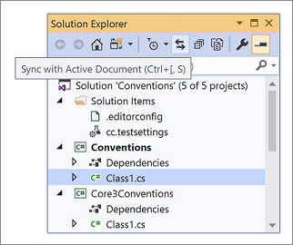

# Customize Visual Studio for working with projects and solutions

This article shows you how to configure Visual Studio's behavior for projects and solutions by using the **Projects and Solutions** > **General** options page. These settings help you customize how Visual Studio handles solution loading, file management, error display, and other project-related behaviors.

## Access the Projects and Solutions options

:::moniker range="visualstudio"

To configure these options in Visual Studio, select **Tools** > **Options**, and expand the **All Settings** > **Projects and Solutions** > **General** section.

### Default Solution File Format

In Visual Studio 2026, you can specify the default file format to use when creating new solutions:

- **Visual Studio 2010 - 2022 Solution File Format** (_.sln_)
- **XML Solution File Format** (_.slnx_) 

:::moniker-end
:::moniker range="<=vs-2022"

To configure these options in Visual Studio, select **Tools** > **Options**, and expand the **Projects and Solutions** > **General** section.

:::moniker-end

## Configure error and output display

Use these options to control how Visual Studio displays build errors and output.

### Always show Error List if build finishes with errors

Opens the **Error List** window on build completion, only if a project failed to build. Errors that occur during the build process are displayed. When this option is cleared, the errors still occur but the window doesn't open when the build is complete. This option is enabled by default.

### Show Output window when build starts

Automatically displays the [Output window](reference/output-window.md) in the IDE at the outset of solution builds.

## Configure Solution Explorer behavior

Use these options to control how Solution Explorer tracks and displays items.

### Track active item in Solution Explorer

When selected, **Solution Explorer** automatically opens and the active item is selected. The selected item changes as you work with different files in a project or solution, or different components in a designer. When this option is cleared, the selection in **Solution Explorer** doesn't change automatically. This option is enabled by default.

> [!TIP]
> If you disable this option, an easy way to navigate to the active document in Solution Explorer is by selecting **Sync with Active Document** on the **Solution Explorer** toolbar.
>
> 

### Restore Solution Explorer project hierarchy state on solution load

When selected, restores the state of nodes in Solution Explorer with respect to whether they were expanded or collapsed the last time the solution was open. Deselect this option to decrease solution load time for large solutions.

:::moniker range="visualstudio"

### Show symbols under Solution Explorer files

When selected, Solution Explorer displays the symbols under files.

:::moniker-end

## Configure solution loading behavior

Use these options to control how Visual Studio loads solutions and related documents.

:::moniker range="<=vs-2022"

### Allow parallel project initialization

When selected, Visual Studio loads large .NET solutions faster when you reload the same solution. For more information, see the "*Parallel project load*" section of the [Load solutions faster](https://devblogs.microsoft.com/visualstudio/load-solutions-faster-with-visual-studio-2017-version-15-6/) blog post.

:::moniker-end

### Reopen documents on solution load

When selected, documents that were left open the previous time the solution was closed are automatically opened when the solution is opened.

Reopening certain types of files or designers can delay solution load. Uncheck this option to [improve solution load performance](visual-studio-performance-tips-and-tricks.md#disable-automatic-file-restore) if you don't want to restore the solution's previous context.

## Configure file and project management

Use these options to control how Visual Studio handles file operations and project interactions.

### Prompt before moving files to a new location

When selected, Visual Studio displays a confirmation message box before the locations of files are changed by actions in **Solution Explorer**.

### Open project files with double-click or the Enter key when supported

When this option is selected and you double-click a project node in Solution Explorer or select it and then press **Enter**, the project file (for example, _*.csproj_ file) opens in the editor. When deselected, double-clicking a project node in Solution Explorer or selecting it and pressing **Enter** expands or collapses the node only.

If you don't have this option selected and you want to edit a project file, right-click the project node in Solution Explorer and select **Edit Project File**. 

## Configure symbolic renaming

Use these options to control how Visual Studio handles renaming files and their associated references.

### Enable symbolic renaming when renaming files

When selected, you can rename all the references in a project to that of the code element. 

### Prompt for symbolic renaming when renaming files

When selected, Visual Studio displays a message box asking whether or not it should also rename all references in the project to that of the code element.

::: moniker range=">=vs-2022"

## Configure namespace updates

Use these options to control how Visual Studio handles namespace updates when moving files.

### Enable namespace update when moving files

When selected, Visual Studio automatically adjusts the namespace of a file when the file is moved to a new location.

### Prompt to update namespace when moving files

When selected, Visual Studio prompts you to specify whether to automatically adjust the namespace of a file when the file is moved to a new location.

::: moniker-end

## Related content

- [Configure Projects and Solutions Locations options](reference/projects-solutions-locations-options.md)
- [Configure Projects and Solutions Build and Run options](reference/options-dialog-box-projects-and-solutions-build-and-run.md)
- [Configure Projects and Solutions Web Projects options](/previous-versions/visualstudio/visual-studio-2017/ide/reference/options-dialog-box-projects-and-solutions-web-projects)
