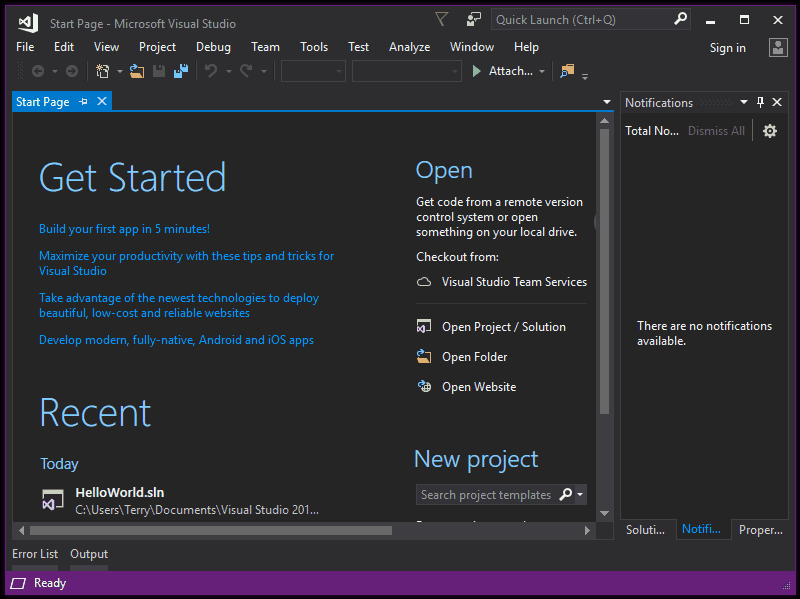

# Quickstart: Use Visual Studio to create your first ASP.NET Core web app

In this 5-10 minute introduction to how to use Visual Studio, you'll create a simple "Hello World" web app by using an ASP.NET project template and the C# programming language.

If you haven't already installed Visual Studio, go to the [Visual Studio downloads](https://visualstudio.microsoft.com/downloads/?utm_medium=microsoft&utm_source=docs.microsoft.com&utm_campaign=button+cta&utm_content=download+vs2017) page to install it for free.

## Create a project

First, you'll create an ASP.NET Core web application project. Here's how.

   

csharp-aspnet-animated-create-project

   > [!NOTE]
   > If you don't see the **.NET Core** project template category, choose the **Open Visual Studio Installer** link in the left pane.
   >
   > 
   >
   > The Visual Studio Installer launches. Choose the **ASP.NET and web development** workload, and then choose **Modify**.
   >
   > 
   >
   > (You might have to close Visual Studio before you can continue installing the new workload.)

## Create and run the app

Next, you'll create and run your "Hello World" web app. Here's how.

   

Congratulations on completing this Quickstart! We hope you learned a little bit about C#, ASP.NET Core, and the Visual Studio IDE (integrated development environment).

## Next steps

To learn more, continue with the following tutorials:

> [!div class="nextstepaction"]
> [Get started with C# and ASP.NET in Visual Studio](tutorial-csharp-aspnet-core.md)
>
> [!div class="nextstepaction"]
> [Get started with ASP.NET Core MVC and Visual Studio](/aspnet/core/tutorials/first-mvc-app/start-mvc?tabs=aspnetcore2x)

## See also

[Publish your web app to Azure App Service by using Visual Studio](..//deployment/quickstart-deploy-to-azure.md)
