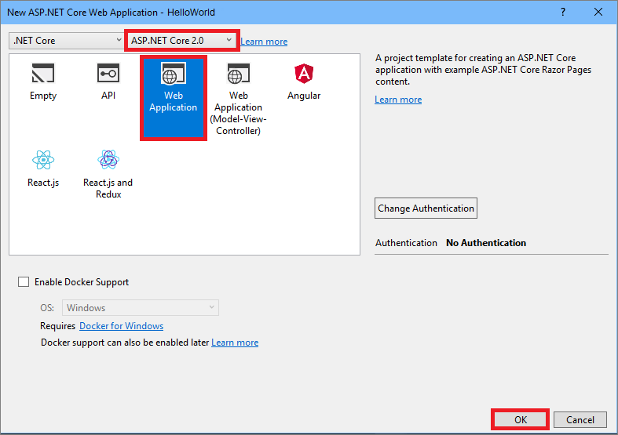
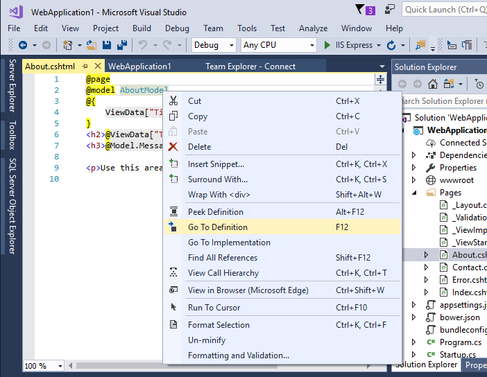
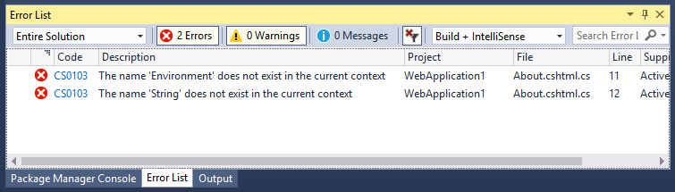

# Quickstart: Use Visual Studio to create your first ASP.NET Core web app

In this 5-10 minute introduction to the Visual Studio integrated development environment (IDE), you'll create a simple C# ASP.NET Core web application.

If you haven't already installed Visual Studio, go to the [Visual Studio downloads](https://aka.ms/vsdownload?utm_source=mscom&utm_campaign=msdocs) page to install it for free.

## Create a project

First, you'll create an ASP.NET Core web application project. The project type comes with template files that constitute a functional web application, before you've even added anything!

1. Open Visual Studio 2017.

1. From the top menu bar, choose **File** > **New** > **Project**.

1. In the **New Project** dialog box, in the left pane, expand **Visual C#**, then choose **.NET Core**. In the middle pane, choose **ASP.NET Core Web Application**, then choose **OK**.

     If you don't see the **.NET Core** project template category, choose the **Open Visual Studio Installer** link in the left pane. The Visual Studio Installer launches. Choose the **ASP.NET and web development** workload, then choose **Modify**.

     

1. In the **New ASP.NET Core Web Application** dialog box, select **ASP.NET Core 2.0** from the top drop-down menu. (If you don't see **ASP.NET Core 2.0** in the list, install it by following the **Download** link that should appear in a yellow bar near the top of the dialog box.) Choose **OK**.

   

## Explore the IDE

1. In the **Solution Explorer** toolbar, expand the **Pages** folder, then choose **About.cshtml** to open it in the editor. This file corresponds to a page called **About** in the web application.

1. In the editor, choose `AboutModel` and then press **F12** or choose **Go To Definition** from the context (right-click) menu. This command takes you to the definition of the `AboutModel` C# class.

   

1. Next we'll clean up the `using` directives at the top of the file using a simple shortcut. Choose any of the greyed-out using directives and a [Quick Actions](../ide/quick-actions.md) light bulb will appear just below the caret or in the left margin. Choose the light bulb, and then choose **Remove Unnecessary Usings**.

     The unnecessary usings are deleted from the file.

1. In the `OnGet()` method, change the body to the following code:

 ```csharp
 public void OnGet()
 {
     string directory = Environment.CurrentDirectory;
     Message = String.Format("Your directory is {0}.", directory);
 }
 ```

1. You'll see two wavy underlines appear under **Environment** and **String**, because these types are not in scope. Open the **Error List** toolbar to see the same errors listed there. (If you don't see the **Error List** toolbar, choose **View** > **Error List** from the top menu bar.)

   

1. In the editor window, place your cursor on either line that contains the error, then choose the **Quick Actions light bulb** in the left margin. From the drop-down menu, choose **using System;** to add this directive to the top of your file and resolve the errors.

## Run the application

1. Press **Ctrl**+**F5** to run the application and open it in a web browser.

1. At the top of the web site, choose **About** to see the directory message you added in the `OnGet()` method for the **About** page.

1. Close the web browser.

> [!NOTE]
> If you get an error message that says **Unable to connect to web server 'IIS Express'**, close Visual Studio and then open it using the **Run as administrator** option from the right-click or context menu. Then, run the application again.

Congratulations on completing this Quickstart! We hope you learned a little bit about the Visual Studio IDE. If you'd like to delve deeper into its capabilities, please continue with a tutorial in the **Tutorials** section of the table of contents.

## Next steps
Congratulations on completing this Quickstart! We hope you learned a little bit about C#, ASP.NET Core, and the Visual Studio IDE. To learn more, continue with the following tutorial.

> [!div class="nextstepaction"]
> [Get started with C# and ASP.NET in Visual Studio](tutorial-csharp-aspnet-core.md)
