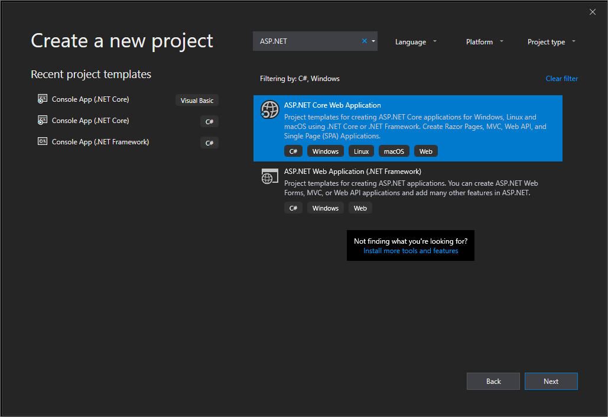
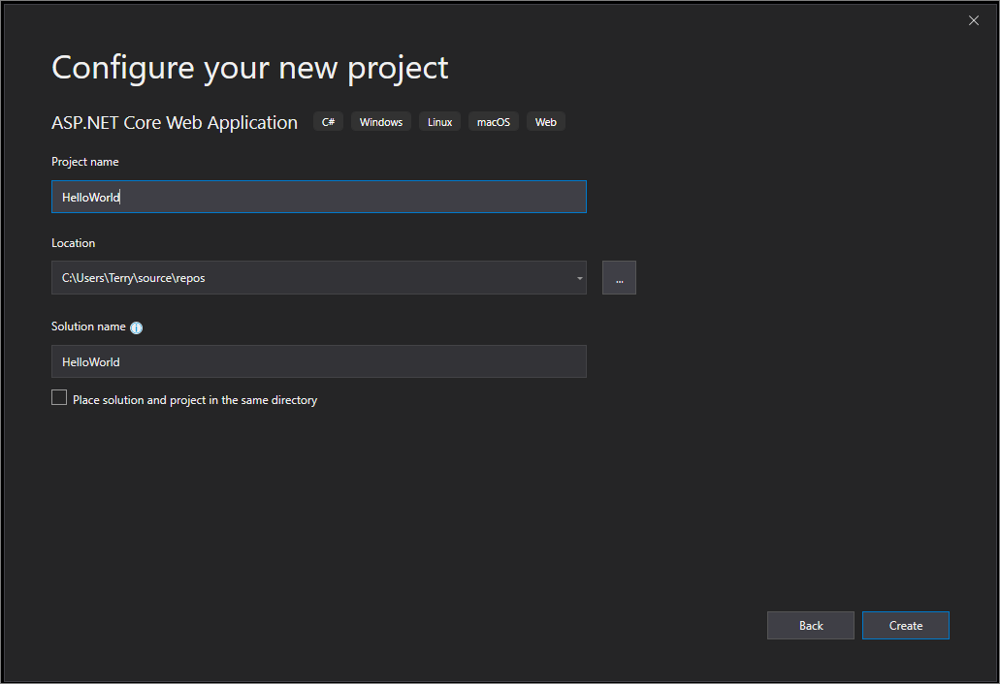
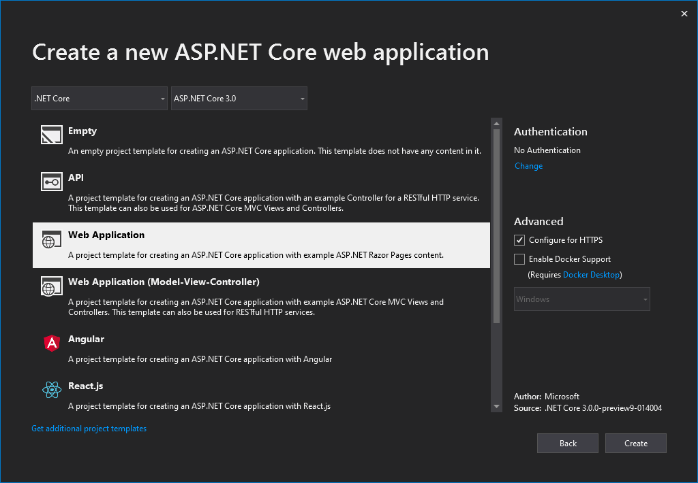
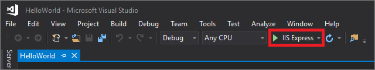

# Quickstart: Use Visual Studio to create your first ASP.NET Core web app

In this 5-10 minute introduction to how to use Visual Studio, you'll create a simple "Hello World" web app by using an ASP.NET project template and the C# programming language.

## Before you begin

### Install Visual Studio

::: moniker range="vs-2017"

If you haven't already installed Visual Studio, go to the [Visual Studio downloads](https://visualstudio.microsoft.com/vs/older-downloads/?utm_medium=microsoft&utm_source=docs.microsoft.com&utm_campaign=vs+2017+download) page to install it for free.

::: moniker-end

::: moniker range="vs-2019"

If you haven't already installed Visual Studio, go to the [Visual Studio downloads](https://visualstudio.microsoft.com/downloads) page to install it for free.

::: moniker-end

### Choose your theme (optional)

This quickstart tutorial includes screenshots that use the dark theme. If you aren't using the dark theme but would like to, see the [Personalize the Visual Studio IDE and Editor](quickstart-personalize-the-ide.md) page to learn how.

## Create a project

To start, you'll create an ASP.NET Core web application project. The project type comes with all template files to create a web app, before you've even added anything!

::: moniker range="vs-2017"

1. Open Visual Studio 2017.

1. From the top menu bar, choose **File** > **New** > **Project**.

1. In the left pane of the **New Project** dialog box, expand **Visual C#**, and then choose **.NET Core**. In the middle pane, choose **ASP.NET Core Web Application**.   Then, name your file `HelloWorld` and choose **OK**.

   

   > [!NOTE]
   > If you don't see the **.NET Core** project template category, choose the **Open Visual Studio Installer** link in the left pane. (Depending on your display settings, you might have to scroll to see it.)
   >
   > 
   >
   > The Visual Studio Installer launches. Choose the **ASP.NET and web development** workload, and then choose **Modify**.
   >
   > 
   >
   > (You might have to close Visual Studio before you can continue installing the new workload.)

1. In the **New ASP.NET Core Web Application** dialog box, select **ASP.NET Core 2.1** from the top drop-down menu. Next, choose **Web Application**, and then choose **OK**.

   

   > [!NOTE]
   > If you don't see **ASP.NET Core 2.1**, make sure that you are running the most recent release of Visual Studio. For more information about how to update your installation, see the [Update Visual Studio  to the most recent release](../install/update-visual-studio.md) page.

Soon after, Visual Studio opens your project file.

::: moniker-end

::: moniker range="vs-2019"

1. Open Visual Studio.

1. On the start window, choose **Create a new project**.

   

1. On the **Create a new project** window, enter or type *ASP.NET* in the search box. Next, choose **C#** from the Language list, and then choose **Windows** from the Platform list.

   After you apply the language and platform filters, choose the **ASP.NET Core Web Application** template, and then choose **Next**.

   

   > [!NOTE]
   > If you do not see the **ASP.NET Core Web Application** template, you can install it from the **Create a new project** window. In the **Not finding what you're looking for?** message, choose the **Install more tools and features** link.
   >
   > 
   >
   > Then, in the Visual Studio Installer, choose the **ASP.NET and web development** workload.
   >
   > 
   >
   > After that, choose the **Modify** button in the Visual Studio Installer. You might be prompted to save your work; if so, do so. Next, choose **Continue** to install the workload. Then, return to step 2 in this "[Create a project](#create-a-project)" procedure.

1. In the **Configure your new project** window, type or enter *HelloWorld* in the **Project name** box. Then, choose **Create**.

   

1. In the **Create a new ASP.NET Core Web Application** window, verify that **ASP.NET Core 3.0** appears in the top drop-down menu. Then, choose **Web Application**, which includes example Razor Pages. Next, choose  **Create**.

   

   Visual Studio opens your new project.

::: moniker-end

## Create and run the app

::: moniker range="vs-2017"

1. In the **Solution Explorer**, expand the **Pages** folder, and then choose **About.cshtml**.

   

   This file corresponds to a page that's named **About** in the web app, which runs in a web browser.

   

   In the editor, you'll see HTML code for the "additional information" area of the **About** page.

   

1. Change the "additional information" text to read "**Hello World!**".

   

1. In the **Solution Explorer**, expand **About.cshtml**, and then choose **About.cshtml.cs**. (This file also corresponds with the **About** page in a web browser.)

   

   In the editor, you'll see C# code that includes text for the "application description" area of the **About** page.

   

1. Change the "application description" message text to read "**What's my message?**".

   

1. Choose **IIS Express** or press **Ctrl**+**F5** to run the app and open it in a web browser.

   

   > [!NOTE]
   > If you get an error message that says, **Unable to connect to web server 'IIS Express'**, or an error message that mentions an SSL certificate, close Visual Studio. Next, open Visual Studio by using the **Run as administrator** option from the right-click context menu. Then, run the application again.

1. In the web browser, verify that the **About** page includes your updated text.

   

1. Close the web browser.

### Review your work

View the following animation to check the work that you completed in the previous section.

  

Congratulations on completing this Quickstart! We hope you learned a little bit about C#, ASP.NET Core, and the Visual Studio IDE (integrated development environment).

::: moniker-end

::: moniker range="vs-2019"

1. In the **Solution Explorer**, expand the **Pages** folder, and then choose **Index.cshtml**.

   

   This file corresponds to a page that's named **Home** in the web app, which runs in a web browser.

   

   In the editor, you'll see HTML code for the text that appears on the **Home** page.

   

1. Change the "Welcome" text to read "**Hello World!**".

   

1. Choose **IIS Express** or press **Ctrl**+**F5** to run the app and open it in a web browser.

   

   > [!NOTE]
   > If you get an error message that says, **Unable to connect to web server 'IIS Express'**, or an error message that mentions an SSL certificate, close Visual Studio. Next, open Visual Studio by using the **Run as administrator** option from the right-click context menu. Then, run the application again.

1. In the web browser, verify that the **Home** page includes your updated text.

   

1. Close the web browser.

::: moniker-end

## Next steps

To learn more, continue with the following tutorial:

> [!div class="nextstepaction"]
> [Get started with C# and ASP.NET in Visual Studio](../get-started/csharp/tutorial-aspnet-core.md)

## See also

[Publish your web app to Azure App Service by using Visual Studio](../deployment/quickstart-deploy-to-azure.md)
