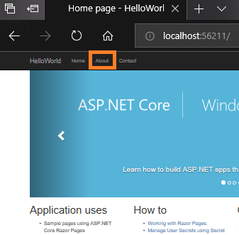

# Quickstart: Use Visual Studio to create your first ASP.NET Core web app

In this 5-10 minute introduction to how to use Visual Studio, you'll create a simple "Hello World" web app by using an ASP.NET project template and the C# programming language.

## Before you begin

### Install Visual Studio

If you haven't already installed Visual Studio, go to the [Visual Studio downloads](https://visualstudio.microsoft.com/downloads/?utm_medium=microsoft&utm_source=docs.microsoft.com&utm_campaign=button+cta&utm_content=download+vs2017) page to install it for free.

### Update Visual Studio

If you've already installed Visual Studio, make sure that you are running the most recent release. For more information about how to update your installation, see the [Update Visual Studio 2017 to the most recent release](../install/update-visual-studio.md) page.

### Choose your theme (optional)

This quickstart tutorial includes screenshots that use the dark theme. If you aren't using the dark theme but would like to, see the [Personalize the Visual Studio IDE and Editor](quickstart-personalize-the-ide.md) page to learn how.

## Create a project

To start, you'll create an ASP.NET Core web application project. The project type comes with all template files to create a web app, before you've even added anything!

1. Open Visual Studio 2017.

1. From the top menu bar, choose **File** > **New** > **Project**.

1. In the left pane of the **New Project** dialog box, expand **Visual C#**, and then choose **.NET Core**. In the middle pane, choose **ASP.NET Core Web Application**. Then, name your file `HelloWorld` and choose **OK**.

   

   > [!NOTE]
   > If you don't see the **.NET Core** project template category, choose the **Open Visual Studio Installer** link in the left pane. (Depending on your display settings, you might have to scroll to see it.)
   >
   > 
   >
   > The Visual Studio Installer launches. Choose the **ASP.NET and web development** workload, and then choose **Modify**.
   >
   > 
   >
   > (You might have to close Visual Studio before you can continue installing the new workload.)

1. In the **New ASP.NET Core Web Application** dialog box, select **ASP.NET Core 2.0** or later from the top drop-down menu.

   > [!NOTE]
   > If you don't see **ASP.NET Core 2.0** or later, make sure that you are running the most recent release of Visual Studio. For more information about how to update your installation, see the [Update Visual Studio 2017 to the most recent release](../install/update-visual-studio.md) page.

1. Next, choose **Web Application**, and then choose **OK**.

   

Soon after, Visual Studio opens your project file.

## Create the app

1. In the **Solution Explorer**, expand the **Pages** folder, and then choose **About.cshtml**.

   

   This file corresponds to a page that's named **About** in the web app.

   

   In the editor, you'll see HTML code for the "additional information" area of the **About** page.

   

1. Change the "additional information" text to read "**Hello World!**".

   

1. In the **Solution Explorer**, expand **About.cshtml**, and then choose **About.cshtml.cs**. (This file also corresponds with the **About** page in your web app.)

   

   In the editor, you'll see C# code that includes text for the "application description" area of the **About** page.

   

1. Change the "application description" message text to read "**What's my message?**".

   

## Run the app

1. Press **Ctrl**+**F5** to run the app and open it in a web browser.

   > [!NOTE]
   > If you get an error message that says, **Unable to connect to web server 'IIS Express'**, or an error message that mentions an SSL certificate, close Visual Studio. Next, open Visual Studio by using the **Run as administrator** option from the right-click or context menu. Then, run the application again.

1. At the top of the web page, choose **About**.

   

1. View the updated text that you added to the **About** page.

   

1. Close the web browser.

Congratulations on completing this Quickstart! We hope you learned a little bit about C#, ASP.NET Core, and the Visual Studio IDE (integrated development environment).

## Next steps

To learn more, continue with the following tutorial:

> [!div class="nextstepaction"]
> [Get started with C# and ASP.NET in Visual Studio](../get-started/csharp/tutorial-aspnet-core.md)

## See also

[Publish your web app to Azure App Service by using Visual Studio](../deployment/quickstart-deploy-to-azure.md)
