# Quickstart: Use Visual Studio to create your first ASP.NET Core web app

In this 5-10 minute introduction to how to use Visual Studio, you'll create a simple "Hello World" web app by using an ASP.NET project template and the C# programming language.

## Before you begin

### Install Visual Studio

::: moniker range="vs-2017"

If you haven't already installed Visual Studio, go to the [Visual Studio downloads](https://visualstudio.microsoft.com/vs/older-downloads/?utm_medium=microsoft&utm_source=docs.microsoft.com&utm_campaign=vs+2017+download) page to install it for free.

::: moniker-end

::: moniker range=">=vs-2019"

If you haven't already installed Visual Studio, go to the [Visual Studio downloads](https://visualstudio.microsoft.com/downloads) page to install it for free.

::: moniker-end

::: moniker range="<=vs-2019"
### Choose your theme (optional)

This quickstart tutorial includes screenshots that use the dark theme. If you aren't using the dark theme but would like to learn how, see [How to: Personalize the Visual Studio IDE and the editor](quickstart-personalize-the-ide.md).

::: moniker-end

## Create a project

To start, you'll create an ASP.NET Core web application project. The project type comes with all template files to create a web app, before you've even added anything!

::: moniker range="vs-2017"

1. Open Visual Studio 2017.

1. From the top menu bar, choose **File** > **New** > **Project**.

1. In the left pane of the **New Project** dialog box, expand **Visual C#**, and then choose **.NET Core**. In the middle pane, choose **ASP.NET Core Web Application**.   Then, name your file `HelloWorld` and choose **OK**.

   

   > [!NOTE]
   > If you don't see the **.NET Core** project template category, choose the **Open Visual Studio Installer** link in the left pane. (Depending on your display settings, you might have to scroll to see it.)
   >
   > 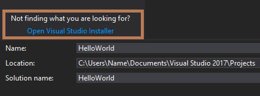
   >
   > The Visual Studio Installer launches. Choose the **ASP.NET and web development** workload, and then choose **Modify**.
   >
   > 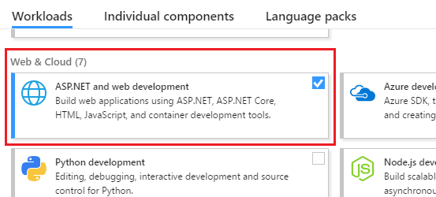
   >
   > (You might have to close Visual Studio before you can continue installing the new workload.)

1. In the **New ASP.NET Core Web Application** dialog box, select **ASP.NET Core 2.1** from the top drop-down menu. Next, choose **Web Application**, and then choose **OK**.

   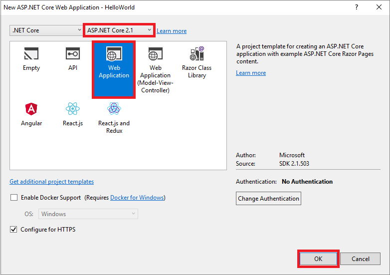

   > [!NOTE]
   > If you don't see **ASP.NET Core 2.1**, make sure that you are running the most recent release of Visual Studio. For more information about how to update your installation, see the [Update Visual Studio  to the most recent release](../install/update-visual-studio.md) page.

Soon after, Visual Studio opens your project file.

::: moniker-end

::: moniker range="vs-2019"

1. In the start window, choose **Create a new project**.

   :::image type="content" source="../get-started/media/vs-2019/create-new-project-dark-theme.png" alt-text="Screenshot showing the start window in Visual Studio with the 'Create a new project' option highlighted.":::

1. In the **Create a new project** window, choose **C#** from the Language list. Next, choose **Windows** from the Platform list, and **Web** from the project types list.

   After you apply the language, platform, and project type filters, choose the **ASP.NET Core Web App** template, and then choose **Next**.

   :::image type="content" source="../get-started/csharp/media/vs-2019/csharp-create-new-project-aspnet-core.png" alt-text="Screenshot showing the 'Create a new project' window filtered on 'C#', 'Windows', and 'Web'. The 'ASP.NET Core Web App' project template highlighted.":::

   > [!NOTE]
   > If you don't see the **ASP.NET Core Web App** template, you can install it from the **Create a new project** window. In the **Not finding what you're looking for?** message, choose the **Install more tools and features** link.
   >
   > 
   >
   > Then, in the Visual Studio Installer, choose the **ASP.NET and web development** workload.
   >
   > 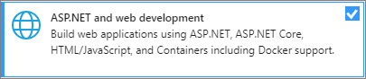
   >
   > After that, choose the **Modify** button in the Visual Studio Installer. If you're prompted to save your work, do so. Next, choose **Continue** to install the workload. Then, return to step 2 in this "[Create a project](#create-a-project)" procedure.

1. In the **Configure your new project** window, type or enter *HelloWorld* in the **Project name** box. Then, choose **Next**.

    :::image type="content" source="../get-started/csharp/media/vs-2019/csharp-name-your-aspnet-hello-world-project.png" alt-text="Screenshot showing the 'Configure your new project' window with 'HelloWorld' entered in the Project name field.":::

1. In the **Additional information** window, verify that **.NET Core 3.1** appears in the top drop-down menu. Note that you can choose to enable Docker support by checking the box. You can also add authentication support by clicking the change Authentication button. From there you can choose from:
    - None: no authentication.
    - Individual accounts: these are stored in a local or Azure-based database.
    - Microsoft identity platform: this option uses Active Directory, Azure AD, or Microsoft 365 for authentication.
    - Windows: suitable for intranet applications.
    
    Leave the **Enable Docker** box unchecked, and select **None** for Authentication Type. Then, select **Create**.

   :::image type="content" source="../get-started/csharp/media/vs-2019/aspnet-core-additional-information.png" alt-text="Screenshot showing the Additional information window with '.NET Core 3.1' selected in the Framework field.":::

   Visual Studio will open up your new project.

::: moniker-end

::: moniker range=">=vs-2022"

1. In the start window, choose **Create a new project**.

   :::image type="content" source="media/vs-2022/create-new-project-dark-theme.png" alt-text="Screenshot showing the start window in Visual Studio with the 'Create a new project' option highlighted.":::

1. In the **Create a new project** window, choose **C#** from the Language list. Next, choose **Windows** from the Platform list, and **Web** from the project types list.

   After you apply the language, platform, and project type filters, choose the **ASP.NET Core Web App** template, and then choose **Next**.

   :::image type="content" source="media/vs-2022/csharp-create-new-project-aspnet-core.png" alt-text="Screenshot showing the 'Create a new project' window filtered on 'C#', 'Windows', and 'Web'. The 'ASP.NET Core Web App' project template highlighted.":::

   > [!NOTE]
   > If you don't see the **ASP.NET Core Web App** template, you can install it from the **Create a new project** window. In the **Not finding what you're looking for?** message, choose the **Install more tools and features** link.
   >
   > :::image type="content" source="media/vs-2022/not-finding-what-looking-for.png" alt-text="Screenshot showing the 'Install more tools and features' link highlighted in the 'Not finding what you're looking for' message.":::
   >
   > Then, in the Visual Studio Installer, choose the **ASP.NET and web development** workload.
   >
   > :::image type="content" source="media/vs-2022/aspnet-core-web-dev-workload.png" alt-text="Screenshot showing the .NET Core cross-platform development workload in the Visual Studio Installer.":::
   >
   > After that, choose the **Modify** button in the Visual Studio Installer. If you're prompted to save your work, do so. Next, choose **Continue** to install the workload. Then, return to step 2 in this "[Create a project](#create-a-project)" procedure.

1. In the **Configure your new project** window, type or enter *HelloWorld* in the **Project name** box. Then, choose **Next**.

    :::image type="content" source="media/vs-2022/csharp-name-your-aspnet-hello-world-project.png" alt-text="Screenshot showing the 'Configure your new project' window with 'HelloWorld' entered in the Project name field.":::

1. In the **Additional information** window, verify that **.NET 6.0** appears in the **Framework** field. Note that you can choose to enable Docker support by checking the box. You can also add authentication support by selecting a value from the **Authentication type** drop-down list. From there you can choose from:

    - None: no authentication.
    - Individual accounts: these authentications are stored in a local or Azure-based database.
    - Microsoft identity platform: this option uses Active Directory, Azure AD, or Microsoft 365 for authentication.
    - Windows: suitable for intranet applications.
    
    Leave the **Enable Docker** box unchecked, and select **None** for Authentication type. Then, select **Create**.

   :::image type="content" source="media/vs-2022/aspnet-core-additional-information.png" alt-text="Screenshot showing the Additional information window with '.NET 6.0' selected in the Framework field.":::

   Visual Studio will open up your new project.

::: moniker-end

## Create and run the app

::: moniker range="vs-2017"

1. In the **Solution Explorer**, expand the **Pages** folder, and then choose **About.cshtml**.

   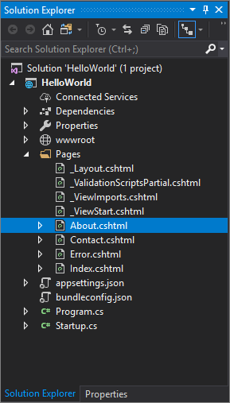

   This file corresponds to a page that's named **About** in the web app, which runs in a web browser.

   

   In the editor, you'll see HTML code for the "additional information" area of the **About** page.

   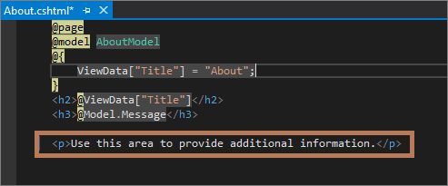

1. Change the "additional information" text to read "**Hello World!**".

   

1. In the **Solution Explorer**, expand **About.cshtml**, and then choose **About.cshtml.cs**. (This file also corresponds with the **About** page in a web browser.)

   

   In the editor, you'll see C# code that includes text for the "application description" area of the **About** page.

   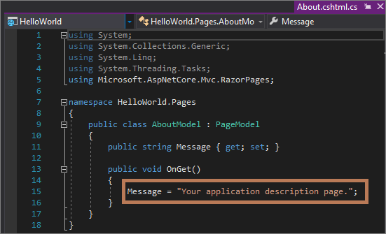

1. Change the "application description" message text to read "**What's my message?**".

   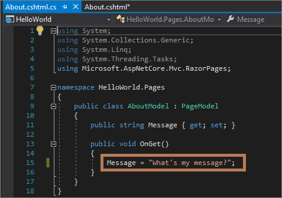

1. Choose **IIS Express** or press **Ctrl**+**F5** to run the app and open it in a web browser.

   

   > [!NOTE]
   > If you get an error message that says, **Unable to connect to web server 'IIS Express'**, or an error message that mentions an SSL certificate, close Visual Studio. Next, open Visual Studio by using the **Run as administrator** option from the right-click context menu. Then, run the application again.

1. In the web browser, verify that the **About** page includes your updated text.

   

1. Close the web browser.

### Review your work

View the following animation to check the work that you completed in the previous section.

  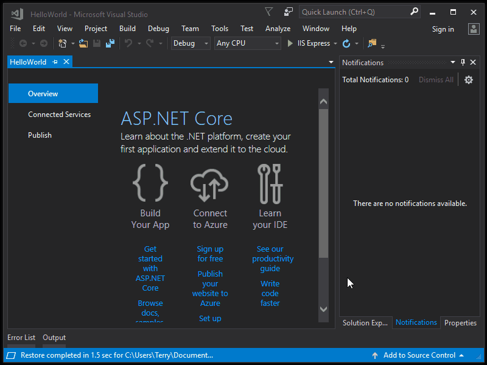

Congratulations on completing this Quickstart! We hope you learned slightly about C#, ASP.NET Core, and the Visual Studio IDE (integrated development environment).

::: moniker-end

::: moniker range="vs-2019"

1. In the **Solution Explorer**, expand the **Pages** folder, and then choose **Index.cshtml**.

   

   This file corresponds to a page that's named **Home** in the web app, which runs in a web browser.

   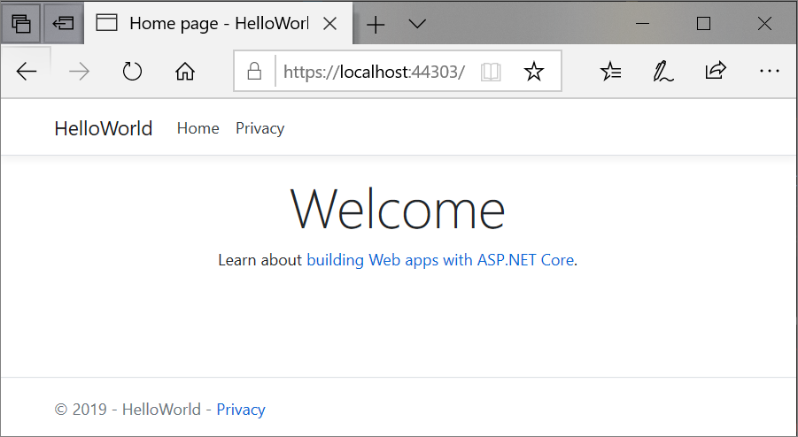

   In the editor, you'll see HTML code for the text that appears on the **Home** page.

   

1. Change the "Welcome" text to read "**Hello World!**".

   

1. Choose **IIS Express** or press **Ctrl**+**F5** to run the app and open it in a web browser.

   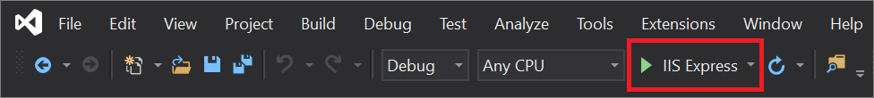

   > [!NOTE]
   > If you get an error message that says, **Unable to connect to web server 'IIS Express'**, or an error message that mentions an SSL certificate, close Visual Studio. Next, open Visual Studio by using the **Run as administrator** option from the right-click context menu. Then, run the application again.

1. In the web browser, verify that the **Home** page includes your updated text.

   

1. Close the web browser.

::: moniker-end

::: moniker range=">=vs-2022"

1. In the **Solution Explorer**, expand the **Pages** folder, and then choose **Index.cshtml**.

   :::image type="content" source="media/vs-2022/csharp-aspnet-index-page-cshtml-file.png" alt-text="Screenshot showing 'Index.cshtml' selected within the expanded Pages folder in the Solution Explorer.":::

   This file corresponds to a page that's named **Home** in the web app, which runs in a web browser.

   :::image type="content" source="media/vs-2022/csharp-aspnet-index-page.png" alt-text="Screenshot showing the Home page for the web app in the browser window.":::

   In the editor, you'll see HTML code for the text that appears on the **Home** page.

   :::image type="content" source="media/vs-2022/csharp-aspnet-index-cshtml.png" alt-text="Screenshot showing the Index.cshtml file for the Home page in the Visual Studio code editor.":::

1. Change the "Welcome" text to read "**Hello World!**".

   :::image type="content" source="media/vs-2022/csharp-aspnet-index-cshtml-page-hello-world.png" alt-text="Screenshot showing the 'Index.cshtml' file in the Visual Studio code editor with the 'Welcome' text changed to 'Hello World!'.":::

1. Select **IIS Express** or press **Ctrl**+**F5** to run the app and open it in a web browser.

   :::image type="content" source="media/vs-2022/csharp-aspnet-generic-iis-button.png" alt-text="Screenshot showing the IIS Express button highlighted in Visual Studio.":::

   > [!NOTE]
   > If you get an error message that says, **Unable to connect to web server 'IIS Express'**, or an error message that mentions an SSL certificate, close Visual Studio. Next, open Visual Studio by using the **Run as administrator** option from the right-click context menu. Then, run the application again.

1. In the web browser, verify that the **Home** page includes your updated text.

   :::image type="content" source="media/vs-2022/csharp-aspnet-index-page-hello-world.png" alt-text="Screenshot showing the Home page for the web app in the browser window with the updated message 'Hello World!'.":::

1. Close the web browser.

::: moniker-end

## Next steps

To learn more about creating ASP.NET web apps, continue with the following tutorial:

> [!div class="nextstepaction"]
> [Get started with C# and ASP.NET in Visual Studio](../get-started/csharp/tutorial-aspnet-core.md)

Or, learn how to containerize your web app with Docker:

> [!div class="nextstepaction"]
> [Container Tools in Visual Studio](../containers/overview.md)

## See also

[Publish your web app to Azure App Service by using Visual Studio](../deployment/quickstart-deploy-to-azure.md)
