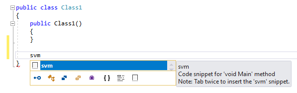
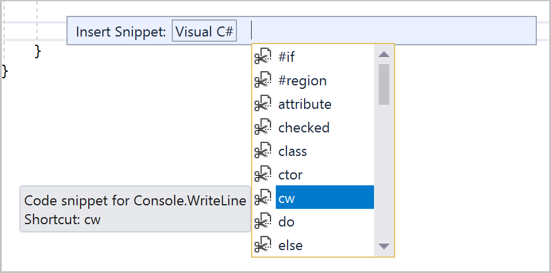
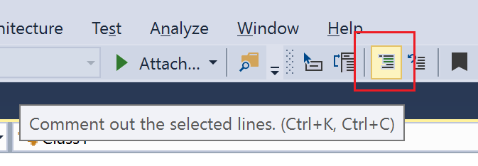
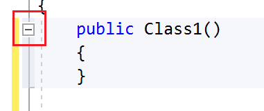
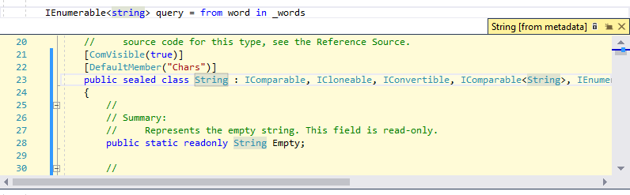
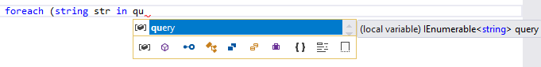
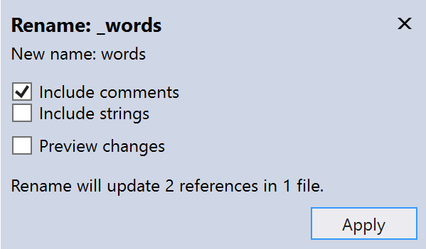

# Quickstart: Coding in the editor

In this 10-minute introduction to the editor, we'll add code to a file to look at some of the ways that Visual Studio makes writing, navigating, and understanding code easier.

## Create a new code file

Start by creating a new file and adding some code to it. Notice that we do not have to create a project to gain some of the benefits that the editor offers.

1. Open Visual Studio, and from the **File** menu on the menu bar, choose **New** > **File...**.

1. In the **New File** dialog box, under the **General** category, choose **Visual C# Class**, and then choose **Open**.

   A new file opens in the editor with the skeleton of a C# class.

## Using code snippets

Visual Studio provides useful code snippets that you can use to quickly and easily generate commonly used code blocks. [Code snippets](../ide/code-snippets.md) are available for different programming languages including C#, Visual Basic, and C++. Let's add the C# `void Main` snippet to our file.

1. Place your cursor below the closing brace of the `Class1` constructor and enter the characters `svm`.

   You see an IntelliSense dialog box appear with information about the `svm` snippet.

   

1. Press **Tab** twice to insert the code snippet.

   You see the `static void Main()` method signature get added to the file. The `Main()` method is the entry point for C# applications.

The available code snippets vary for different languages. You can look at the available code snippets for your programming language by choosing **Edit**, **IntelliSense**, **Insert Snippet...**, and then choosing your language's folder. For C#, the list looks like this:



The list includes snippets for creating a class, a constructor, `Console.WriteLine()`, `for` loops, `if` and `switch` statements, and more.

## Commenting out code

The toolbar provides a number of buttons to make you more productive as you code. For example, you can toggle IntelliSense completion mode, increase or decrease an indent, set a bookmark, or comment out code. In this section, we'll comment out some code that we don't want to compile.


1. Paste the following code into the `Main()` method body.

    ```csharp
    // _words is a string array that we'll sort alphabetically
    string[] _words = {
        "the",
        "quick",
        "brown",
        "fox",
        "jumps"
    }

    string[] morewords = {
        "over",
        "the",
        "lazy",
        "dog"
    };

    IEnumerable<string> query = from word in _words
                                orderby word.Length
                                select word;
    ```

1. We are not using the `morewords` variable, but we may use it later so we don't want to delete it. Instead, let's comment out those lines. Select the entire definition of `morewords` to the closing semi-colon, and then choose the **Comment out the selected lines** button on the toolbar, or press **Ctrl**+**K**, **Ctrl**+**C**.

   

   The C# comment characters `//` are added to the beginning of each selected line to comment out the code.

## Collapsing code blocks

We don't want to see the empty constructor for `Class1` that was generated, so to unclutter our view of the code, let's collapse it. Choose the small gray box with the minus sign inside it in the margin of the first line of the constructor. Or, if you are a keyboard user, place the cursor anywhere in the constructor code and press **Ctrl**+**M**, **Ctrl**+**M**.



The code block collapses to just the first line, followed by an ellipsis (`...`). To expand the code block again, click the same gray box that now has a plus sign in it, or press **Ctrl**+**M**, **Ctrl**+**M** again. This feature is called [outlining](../ide/outlining.md) and is especially useful when you're collapsing long methods or entire classes.

## Viewing symbol definitions

The Visual Studio editor makes it easy to inspect the definition of a type, method, etc. One way is to navigate to the file that contains the definition, for example by choosing **Go to Definition** anywhere the symbol is referenced. An even quicker way that doesn't move your focus away from the file you're working in is to use [Peek Definition](../ide/go-to-and-peek-definition.md#peek-definition). Let's peek at the definition of `string`.

1. Right-click on any occurrence of `string` and choose **Peek Definition** from the content menu&mdash;or, press **Alt**+**F12**.

   A pop-up window appears with the definition of the `String` class. You can scroll within the pop-up window, or even peek at the definition of another type from the peeked code.

   

1. Close the peeked definition window by choosing the small box with an "x" at the top right of the pop-up window.

## Using IntelliSense to complete words

[IntelliSense](../ide/using-intellisense.md) is an invaluable resource when you're coding. It can show you information about available members of a type, or parameter details for different overloads of a method. You can also use IntelliSense to complete a word after you type enough characters to disambiguate it. Let's add a line of code to print out the ordered strings to the console window.

1. Below the `query` variable, start typing the following code:

   ```csharp
   foreach (string str in qu
   ```

   You see IntelliSense show you **Quick Info** about the `query` symbol.

   

1. To insert the rest of the word `query` by using IntelliSense's "Complete Word" functionality, press **Tab**.

1. Finish off the code block to look like the following code. You can even practice using code snippets again by entering `cw` and then pressing **Tab** twice to generate the `Console.WriteLine` code.

   ```csharp
   foreach (string str in query)
   {
      Console.WriteLine(str);
   }
   ```

## Refactoring a name

Nobody gets code right the first time, and one of the things you might want to change is the name of a variable or method. Let's try out Visual Studio's [refactoring](../ide/refactoring-in-visual-studio.md) functionality to rename the `_words` variable to `words`.

1. Place your cursor over the definition of the `words` variable, and choose **Rename...** from the right-click or context menu, or press **Ctrl**+**R**, **Ctrl**+**R**.

   A pop-up **Rename** dialog box appears at the top right of the editor.

1. Enter the desired name `words`. Notice that the reference to `words` in the query is also automatically renamed. Before you press **Enter**, select the **Include comments** checkbox in the **Rename** pop-up box.

   

1. Press **Enter**.

   Both occurrences of `words` have been renamed, as well as the reference to `words` in the code comment.

## Next steps

You've completed this quickstart for the Visual Studio editor! Next you might try out some of the other quickstarts for the Visual Studio IDE, look at more ways of [navigating code](../ide/navigating-code.md), or check out the links to more information about the features we looked at. Otherwise, happy coding!

## See also

[Quickstart: First look at the Visual Studio IDE](../ide/quickstart-ide-orientation.md)  
[Quickstart: Personalize the Visual Studio IDE and editor](../ide/quickstart-personalize-the-ide.md)  
[Quickstart: Projects and solutions](../ide/quickstart-projects-solutions.md)  
[Code snippets](../ide/code-snippets.md)  
[Outlining](../ide/outlining.md)  
[Go To Definition and Peek Definition](../ide/go-to-and-peek-definition.md)  
[Refactoring](../ide/refactoring-in-visual-studio.md)  
[Using IntelliSense](../ide/using-intellisense.md)