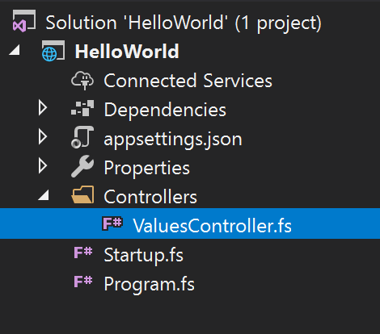
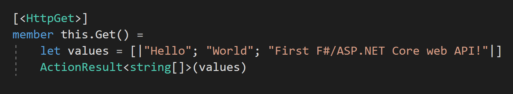

# Quickstart: Use Visual Studio to create your first ASP.NET Core web service in F\#

In this 5-10 minute introduction to F# in Visual Studio , you'll create an F# ASP.NET Core web application.

::: moniker range="vs-2017"

If you haven't already installed Visual Studio, go to the [Visual Studio downloads](https://visualstudio.microsoft.com/vs/older-downloads/?utm_medium=microsoft&utm_source=docs.microsoft.com&utm_campaign=vs+2017+download) page to install it for free.

::: moniker-end

::: moniker range="vs-2019"

If you haven't already installed Visual Studio, go to the [Visual Studio downloads](https://visualstudio.microsoft.com/downloads) page to install it for free.

::: moniker-end

## Create a project

First, you'll create an ASP.NET Core Web API project. The project type comes with template files that constitute a functional web service, before you've even added anything!

::: moniker range="vs-2017"

1. Open Visual Studio.

2. From the top menu bar, choose **File** > **New** > **Project**.

3. In the **New Project** dialog box, in the left pane, expand **Visual F#**, then choose **Web**. In the middle pane, choose **ASP.NET Core Web Application**, then choose **OK**.

     If you don't see the **.NET Core** project template category, choose the **Open Visual Studio Installer** link in the left pane. The Visual Studio Installer launches. Choose the **ASP.NET and web development** workload, then choose **Modify**.

     

4.In the **New ASP.NET Core Web Application** dialog box, select **ASP.NET Core 2.1** from the top drop-down menu. (If you don't see **ASP.NET Core 2.1** in the list, install it by following the **Download** link that should appear in a yellow bar near the top of the dialog box.) Choose **OK**.

::: moniker-end

::: moniker range=">=vs-2019"

1. Open Visual Studio.

2. On the start window, choose **Create a new project**.

3. On the **Create a new project** page, type **f# web** into the search box, and then choose the **ASP.NET Core Web Application** project template. Choose **Next**.

4. On the **Configure your new project** page, enter a name, and then choose **Create**.

5. On the **Create a new ASP.NET Core Web Application** page, select **ASP.NET Core 2.1** from the top drop-down menu, and then choose **Create**.

::: moniker-end

## Explore the IDE

1. In the **Solution Explorer** toolbar, expand the **Controllers** folder, then choose **ValuesController.fs** to open it in the editor.

   

2. Next, modify the `Get()` member to be the following:

   ```fsharp
   [<HttpGet>]
   member this.Get() =
       let values = [|"Hello"; "World"; "First F#/ASP.NET Core web API!"|]
       ActionResult<string[]>(values)
   ```

The code is straightforward. An F# array of values is bound to the `values` name, and then passed to the ASP.NET Core MVC framework as an `ActionResult`. ASP.NET Core takes care of the rest for you.

It should look like this in the editor:



## Run the application

1. Press **Ctrl**+**F5** to run the application and open it in a web browser.

2. The page should navigate to the `/api/values` route, but if it does not, enter `https://localhost:44396/api/values` into your browser.

The web browser will now display JSON matching what you typed earlier.

## Next steps

Congratulations on completing this Quickstart! We hope you learned a little bit about F#, ASP.NET Core, and the Visual Studio IDE. To see the app running on a public server, select the following button.

> [!div class="nextstepaction"]
> [Deploy the app to Azure App Service](../deployment/quickstart-deploy-to-azure.md)

To learn more about F#, check out the official [F# Guide](/dotnet/fsharp/index).