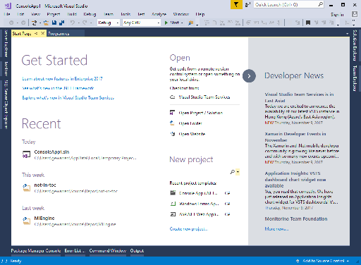
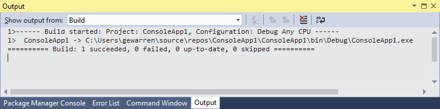

# Quickstart: First look at the Visual Studio IDE

In this 5-10 minute introduction to the Visual Studio integrated development environment (IDE), we'll take a tour of some of the windows, menus, and other UI features.

## Start Page

The first thing you'll see after you launch Visual Studio is most likely the Start Page. The Start Page is designed as a "hub" to help you find the commands and project files you need faster. The **Recent** section displays projects and folders you've worked on recently. Under **New project**, you can click a link to bring up the New Project dialog box, or under **Open**, you can open an existing project or code folder. On the right is a feed of the latest developer news.

If you close the Start Page and want to see it again, you can reopen it from the **File** menu.

To continue exploring the IDE, let's create a new project.

1. On the **Start Page**, in the search box under **New project**, enter `console` to filter the list of project types. Choose either a C# or VB **Console App (.NET Framework)**. (Alternatively, if you are a C++, Javascript, or other language developer, feel free to create a project in one of those languages. The UI we'll be looking at is similar for all languages.)

1. In the **New Project** dialog box, accept the default project name and choose **OK**.

   The project is created and a file named **Program.cs** or **Program.vb** opens in the **Editor** window. The Editor shows the contents of files, and is where you'll do most of your coding work in Visual Studio.

## Solution Explorer

Solution Explorer shows you a graphical representation of the hierarchy of files and folders in your project, solution, or code folder. You can browse the hierarchy and navigate to a file in Solution Explorer.

## Menus

The menu bar along the top of the IDE groups commands into categories. For example, the **Project** menu contains commands related to the project you're working in. On the **Tools** menu, you can customize the IDE by selecting **Options**, or add features to your installation by selecting **Get Tools and Features...**.

Let's open the Error List window by choosing the **View** menu, and then **Error List**.

## Error List

The Error List shows you errors, warning, and messages regarding the current state of your code. If there were any errors (such as a syntax typo) in your file, or anywhere in your project, they would be listed here.

## Output window

The Output window shows you output messages from Build and Source Control.

Let's build the project to see some output logging. From the **Build** menu, choose **Build Solution**. The Output window automatically obtains focus and display a successful build message.

## Quick Launch

The Quick Launch box is a quick and easy way to do pretty much anything in the IDE. You can enter some text related to what you want to do, and it'll show you a list of options that pertain to the text. For example, let's say we want to increase the build output's verbosity to display additional logging information about what exactly build is doing:

1. Enter `verbosity` into the **Quick Launch** box, and then choose **Projects and Solutions -> Build and Run** under the **Options** category.

   

   The **Options** dialog box opens to the **Build and Run** options page.

1. Under **MSBuild project build output verbosity**, choose **Normal**, and then click **OK**.

1. Now we'll build the project again by right-clicking on the **ConsoleApp1** project in **Solution Explorer**, and choosing **Rebuild** from the context menu.

   This time the Output window shows more verbose logging from the build process, including which files were copied where.

## Send Feedback menu

Should you encounter any problems while you're using Visual Studio, or if you have suggestions for how to improve the product, you can use the **Send Feedback** menu at the top of the IDE, next to the Quick Launch box.

## Next steps

We've looked at just a few of the features of the Visual Studio IDE to get acquainted with the user interface. To explore further:

- Browse the General User Interface Elements section of the VS documentation, which goes into more depth about windows such as the [Error List](../ide/reference/error-list-window.md), [Output window](../ide/reference/output-window.md), [Properties window](../ide/reference/properties-window.md), and [Options dialog box](../ide/reference/options-dialog-box-visual-studio.md)

- Take a more in-depth tour of the IDE, and even dabble in debugging, in [Overview of the Visual Studio IDE](../ide/visual-studio-ide.md)

## See also

[Quickstart: Personalizing the IDE](../ide/personalizing-the-visual-studio-ide.md)  
[Quickstart: Coding in the editor](../ide/quickstart-editor.md)  
[Quickstart: Projects and solutions](../ide/quickstart-projects-solutions.md)