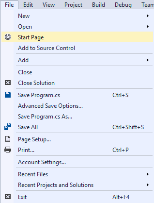
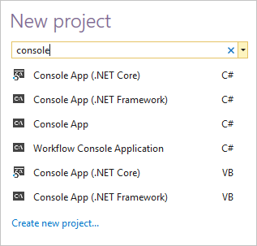
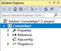
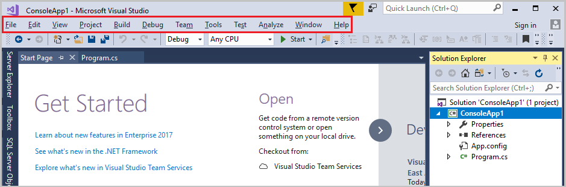
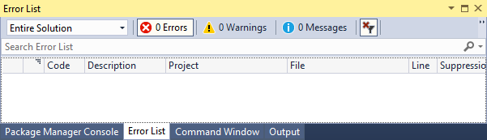
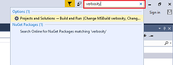
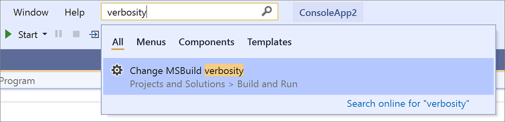
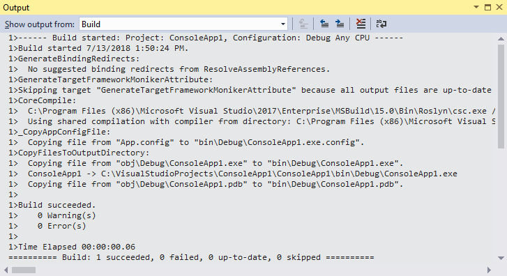
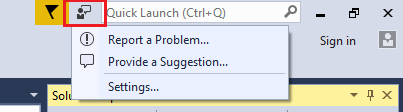

# Quickstart: First look at the Visual Studio IDE

In this 5-10 minute introduction to the Visual Studio integrated development environment (IDE), we'll take a tour of some of the windows, menus, and other UI features.

::: moniker range="vs-2017"

If you haven't already installed Visual Studio, go to the [Visual Studio downloads](https://visualstudio.microsoft.com/vs/older-downloads/?utm_medium=microsoft&utm_source=docs.microsoft.com&utm_campaign=vs+2017+download) page to install it for free.

::: moniker-end

::: moniker range=">=vs-2019"

If you haven't already installed Visual Studio, go to the [Visual Studio downloads](https://visualstudio.microsoft.com/downloads) page to install it for free.

::: moniker-end

::: moniker range="vs-2017"

## Start Page

The first thing you'll see after you open Visual Studio is most likely the **Start Page**. The **Start Page** is designed as a "hub" to help you find the commands and project files you need faster. The **Recent** section displays projects and folders you've worked on recently. Under **New project**, you can click a link to bring up the **New Project** dialog box, or under **Open**, you can open an existing code project or folder. On the right is a feed of the latest developer news.

If you close the **Start Page** and want to see it again, you can reopen it from the **File** menu.

::: moniker-end

::: moniker range=">=vs-2019"

## Start window

The first thing you'll see after you open Visual Studio is the start window. The start window is designed to help you "get to code" faster. It has options to clone or check out code, open an existing project or solution, create a new project, or simply open a folder that contains some code files.

If this is the first time you're using Visual Studio, your recent projects list will be empty.

If you work with non-MSBuild based codebases, you'll use the **Open a local folder** option to open your code in Visual Studio. For more information, see [Develop code in Visual Studio without projects or solutions](develop-code-in-visual-studio-without-projects-or-solutions.md). Otherwise, you can create a new project or clone a project from a source provider such as GitHub or Azure DevOps.

The **Continue without code** option simply opens the Visual Studio development environment without any specific project or code loaded. You might choose this option to join a [Live Share](/visualstudio/liveshare/) session or attach to a process for debugging. You can also press **Esc** to close the start window and open the IDE.

::: moniker-end

## Create a project

To continue exploring Visual Studio's features, let's create a new project.

::: moniker range="vs-2017"

1. On the **Start Page**, in the search box under **New project**, type in **console** to filter the list of project types to those that contain "console" in their name.

   

   Visual Studio provides various kinds of project templates that help you get started coding quickly. Choose a C# **Console App (.NET Core)** project template. (Alternatively, if you're a Visual Basic, C++, Javascript, or other language developer, feel free to create a project in one of those languages. The UI we'll be looking at is similar for all programming languages.)

1. In the **New Project** dialog box that appears, accept the default project name and choose **OK**.

::: moniker-end

::: moniker range=">=vs-2019"

1. On the start window, choose **Create a new project**.

   A dialog box opens that says **Create a new project**. Here, you can search, filter, and pick a project template. It also shows a list of your recently used project templates.

1. In the search box at the top, type in **console** to filter the list of project types to those that contain "console" in their name. Further refine the search results by picking **C#** (or another language of your choice) from the **Language** picker.

   

1. If you selected C#, Visual Basic, or F# as your language, select the **Console App (.NET Core)** template, and then choose **Next**. (If you selected a different language, just pick any template. The UI we'll be looking at is similar for all programming languages.)

1. On the **Configure your new project** page, accept the default project name and location, and then choose **Create**.

::: moniker-end

   The project is created and a file named *Program.cs* opens in the **Editor** window. The **Editor** shows the contents of files and is where you'll do most of your coding work in Visual Studio.

   

## Solution Explorer

**Solution Explorer**, which is typically on the right-hand side of Visual Studio, shows you a graphical representation of the hierarchy of files and folders in your project, solution, or code folder. You can browse the hierarchy and navigate to a file in **Solution Explorer**.

## Menus

The menu bar along the top of Visual Studio groups commands into categories. For example, the **Project** menu contains commands related to the project you're working in. On the **Tools** menu, you can customize how Visual Studio behaves by selecting **Options**, or add features to your installation by selecting **Get Tools and Features**.

::: moniker range="vs-2017"

::: moniker-end

::: moniker range=">=vs-2019"

::: moniker-end

## Error List

Open the **Error List** window by choosing the **View** menu, and then **Error List**.

The **Error List** shows you errors, warning, and messages regarding the current state of your code. If there are any errors (such as a missing brace or semicolon) in your file, or anywhere in your project, they're listed here.

## Output window

The **Output** window shows you output messages from building your project and from your source control provider.

Let's build the project to see some build output. From the **Build** menu, choose **Build Solution**. The **Output** window automatically obtains focus and display a successful build message.

## Search box

The search box is a quick and easy way to navigate to pretty much anything in Visual Studio. You can enter some text related to what you want to do, and it'll show you a list of options that pertain to the text. For example, imagine you want to increase the build output's verbosity to display additional details about what exactly build is doing. Here's how you might do that:

::: moniker range="vs-2017"

1. Locate the **Quick Launch** search box in the upper right of the IDE. (Alternatively, press **Ctrl**+**Q** to access it.)

2. Type **verbosity** into the search box. From the displayed results, choose **Projects and Solutions --> Build and Run** under the **Options** category.

   

   The **Options** dialog box opens to the **Build and Run** options page.

::: moniker-end

::: moniker range=">=vs-2019"

1. Press **Ctrl**+**Q** to activate the search box in the upper part of the IDE.

2. Type **verbosity** into the search box. From the displayed results, choose **Change MSBuild verbosity**.

   

   The **Options** dialog box opens to the **Build and Run** options page.

::: moniker-end

3. Under **MSBuild project build output verbosity**, choose **Normal**, and then click **OK**.

4. Build the project again by right-clicking on the **ConsoleApp1** project in **Solution Explorer** and choosing **Rebuild** from the context menu.

   This time the **Output** window shows more verbose logging from the build process, including which files were copied where.

   

## Send Feedback menu

Should you encounter any problems while you're using Visual Studio, or if you have suggestions for how to improve the product, you can use the **Send Feedback** menu near the top of the Visual Studio window.

::: moniker range="vs-2017"

::: moniker-end

::: moniker range=">=vs-2019"

::: moniker-end

## Next steps

We've looked at just a few of the features of Visual Studio to get acquainted with the user interface. To explore further:

> [!div class="nextstepaction"]
> [Learn about the code editor](../get-started/tutorial-editor.md)

> [!div class="nextstepaction"]
> [Learn about projects and solutions](../get-started/tutorial-projects-solutions.md)

## See also

- [Overview of the Visual Studio IDE](../get-started/visual-studio-ide.md)
- [More features of Visual Studio](../ide/advanced-feature-overview.md)
- [Change theme and font colors](../ide/quickstart-personalize-the-ide.md)
