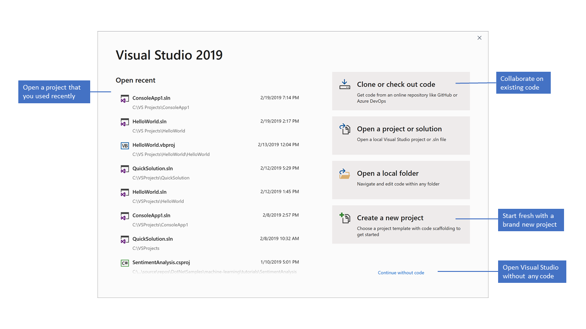
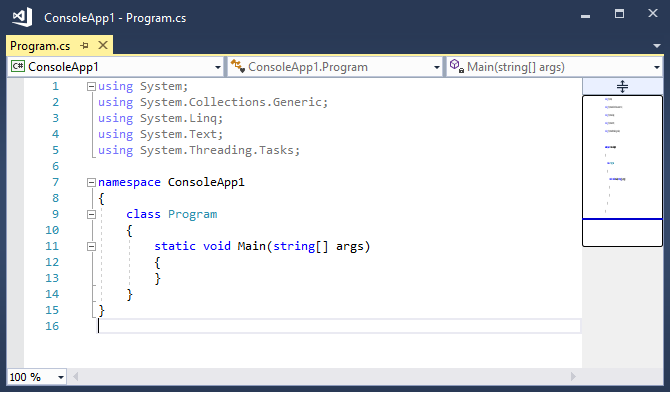
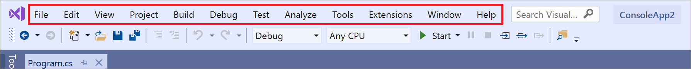
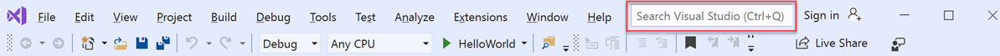
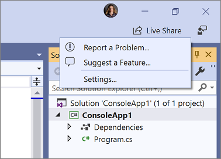
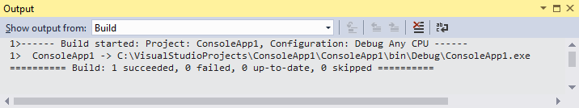

# Tour the Visual Studio IDE

In this introduction to the Visual Studio integrated development environment (IDE), you take a tour of some of the windows, menus, and other UI features.

To develop any type of app or learn a language, you work in the Visual Studio Integrated Development Environment (IDE). Beyond code editing, Visual Studio IDE brings together graphical designers, compilers, code completion tools, source control, extensions and many more features in one place. 

## Download and install

To get started, [download Visual Studio](https://visualstudio.microsoft.com/downloads/?cid=learn-onpage-download-cta) and install it on your system.

In the Visual Studio Installer, you choose and install *workloads*, which are groups of features you need for the programming languages or platforms you want. To follow along this article, be sure to select the **.NET desktop development** workload during installation. 

:::image type="content" source="media/vs-2022/dot-net-development-workload.png" alt-text="Screenshot of the .NET desktop development workload selected in the Visual Studio Installer.":::

If you already have Visual Studio, you can add the **.NET desktop development** workload as follows:
* Launch the Visual Studio Installer.
* If prompted, allow the installer to update itself.
* If an update for Visual Studio is available, an **Update** button is shown. Select it to update before modifying the installation.
* Find your Visual Studio installation and select the **Modify** button.
* If not selected already, select the **.NET desktop development** workload and select the **Modify** button. Otherwise, just close the dialog window.

::: moniker range="vs-2019"

## Start window

The first thing you'll see after you open Visual Studio is the start window. It has options to clone or check out code, open an existing project or solution, create a new project, or simply open a folder that contains some code files.

[](media/vs-2019/start-window-labeled.png#lightbox)

If this is the first time you're using Visual Studio, your recent projects list is empty.

Use the **Open a local folder** option to open your code in Visual Studio to [develop code without projects or solutions](develop-code-in-visual-studio-without-projects-or-solutions.md). Otherwise, you can **Create a new project** or **Clone a repository** from a source provider such as GitHub or Azure DevOps.

Use the **Continue without code** option to open the Visual Studio development environment without any specific project or code loaded. You might choose this option to join a [Live Share](/visualstudio/liveshare/) session or attach to a process for debugging. You can also press **Esc** to close the start window and open the IDE.

::: moniker-end

::: moniker range=">=vs-2022"

## Start window

The first thing you'll see after you open Visual Studio is the start window. It has options to clone or check out code, open an existing project or solution, create a new project, or simply open a folder that has some code files.

:::image type="content" source="media/vs-2022/quickstart-start-window-labeled.png" border="true" alt-text="An annotated screenshot that shows the start window in Visual Studio 2022." lightbox="media/vs-2022/quickstart-start-window-labeled.png":::

If this is the first time you're using Visual Studio, your recent projects list is empty.

Use the **Open a local folder** option to open your code in Visual Studio to [develop code without projects or solutions](develop-code-in-visual-studio-without-projects-or-solutions.md). Otherwise, you can **Create a new project** or **Clone a repository** from a source provider such as GitHub or Azure DevOps.

Use the **Continue without code** option to open the Visual Studio development environment without any specific project or code loaded. You might choose this option to join a [Live Share](/visualstudio/liveshare/) session or attach to a process for debugging. You can also press **Esc** to close the start window and open the IDE.

::: moniker-end

## Create your project

To explore Visual Studio's features, let's create a new project.

::: moniker range="vs-2019"

1. Start Visual Studio and select **Create a new project**.

    :::image type="content" source="../get-started/media/vs-2019/start-window-create-new-project.png" alt-text="Screenshot of the 'Create a new project' window in Visual Studio 2019.":::

   The **Create a new project** window opens and shows several project *templates*. A template contains the basic files and settings required for a given project type.

   Here, you can search, filter, and pick a project template. It also shows a list of your recently used project templates.

1. In the **Create a new project** window, type **console** in the search box to filter the list of project types. Further refine the search results by picking **C#** (or another language of your choice) from the **All languages** drop-down list.

    :::image type="content" source="media/vs-2019/create-new-project.png" alt-text="Screenshot of the 'Create a new project' window in Visual Studio 2019, where you select the template that you want.":::

1. If you selected C#, select the **Console Application** template, and then select **Next**. (If you selected a different language, just pick any template. The UI is similar for all programming languages.)

1. In the **Configure your new project** window, accept the default project name and location, and then select **Next**.

    :::image type="content" source="media/vs-2019/configure-new-project-console.png" alt-text="Screenshot of the 'Configure a new project' window in Visual Studio 2019, where you enter the name of the project.":::

1. In the **Additional information** window, verify that **.NET Core 3.1** appears in the **Target Framework** drop-down menu, and then select **Create**.

    :::image type="content" source="../get-started/media/vs-2019/create-project-additional-info.png" alt-text="Screenshot of the 'Additional information' window in Visual Studio 2019, where you select the version of the .NET Core Framework that you want.":::

1. Your project is created and loaded in Visual Studio. 

### Basic layout

* Take a look at the contents of your project using **Solution Explorer**, which shows you a graphical representation of the hierarchy of files and folders in your project, solution, or code folder. 

* You can browse the hierarchy and select a file to open it in the **Editor**. 
    A file named *Program.cs* opens in the **Editor** window. The **Editor** shows the contents of files and is where you do most of your coding work in Visual Studio.

    

* The menu bar along the top of Visual Studio groups commands into categories. For example, the **Project** menu contains commands related to the project you're working in. On the **Tools** menu, you can customize how Visual Studio behaves by selecting **Options**, or add features to your installation by selecting **Get Tools and Features**.
    
    

* Get contextual help by pressing **F1** while the mouse cursor is on a keyword or after selecting a keyword. For example, select *console* and press F1 to jump to documentation on the *Console Class*. 
* Visual Studio has excellent keyboard accessibility. It supports an array of built-in keyboard shortcuts to perform actions quickly. Use **Help > Keyboard Shortcut reference** to see the list of keyboard shortcuts.
* The **Error List** shows errors, warnings, and messages about the current state of your code. If there are errors (like a missing brace or semicolon) in your file or anywhere in your project, they're listed here. To open the **Error List** window, choose the **View** menu, and then select **Error List**.
    
    :::image type="content" source="media/quickstart-IDE-error-list.png" alt-text="Screenshot of the Error List in Visual Studio 2019.":::

* The **Search** box (**Ctrl + Q**) at the top is a quick and easy way to find just about anything in Visual Studio. You can enter some text related to what you want to do, and it shows you a list of options that are relevant to the text. For example, to open a **Terminal** window, just search for it and open from the search results. The built-in terminal is opened and is ready for commands.
    
    

* If you run into any problems while using Visual Studio, or if you have suggestions for how to improve the product, you can let us know by choosing the **Send Feedback** button near the upper-right corner of the IDE.

    

::: moniker-end

::: moniker range=">=vs-2022"

1. Start Visual Studio and select **Create a new project**.

    :::image type="content" source="media/vs-2022/start-window-create-new-project.png" alt-text="Screenshot of the 'Create a new project' window in Visual Studio 2022.":::

   The **Create a new project** window opens and shows several project *templates*. A template contains the basic files and settings required for a given project type.

   Here, you can search, filter, and pick a project template. The **Create a new project** window also shows a list of your recently used project templates.

1. In the **Create a new project** window, type **console** in the search box to filter the list of project types. Further refine the search results by picking **C#** (or another language of your choice) from the **All languages** drop-down list.

    :::image type="content" source="media/vs-2022/create-new-project.png" alt-text="Screenshot of the 'Create a new project' window in Visual Studio 2022, where you select the template that you want.":::

1. If you selected C#, select the **Console App** template, and then select **Next**. If you selected a different language, just pick any template.

1. In the **Configure your new project** window, accept the default project name and location, and then select **Next**.

    :::image type="content" source="media/vs-2022/quickstart-configure-new-project-console.png" alt-text="Screenshot of the Configure a new project window in Visual Studio 2022, where you enter the name of the project and the project location." lightbox="media/vs-2022/quickstart-configure-new-project-console.png":::

1. In the **Additional information** window, ensure that **.NET 8.0** appears in the **Framework** dropdown menu, and then select **Create**.

    :::image type="content" source="media/vs-2022/create-project-additional-info.png" alt-text="Screenshot of the Additional information window in Visual Studio 2022, where you select the version of the .NET that you want." lightbox="media/vs-2022/create-project-additional-info.png":::

1. The project is created and loaded in Visual Studio. 

### Basic layout

* Take a look at the contents of your project using **Solution Explorer**, which shows you a graphical representation of the hierarchy of files and folders in your project, solution, or code folder. 

* You can browse the hierarchy and select a file to open it in the **Editor**.
  The file *Program.cs* opens in the **Editor** window. The **Editor** shows the contents of files and is where you do most of your coding work in Visual Studio.
    
    :::image type="content" source="media/vs-2022/editor.png" alt-text="Screenshot of the Editor in Visual Studio 2022.":::

* The menu bar along the top of Visual Studio groups commands into categories. For example, the **Project** menu contains commands related to the project you're working in. On the **Tools** menu, you can customize how Visual Studio behaves by selecting **Options**, or add features to your installation by selecting **Get Tools and Features**. You can [customize Visual Studio IDE settings](personalizing-the-visual-studio-ide.md) in various ways to best support your own development style and requirements.
    
    :::image type="content" source="media/vs-2022/menu-bar.png" alt-text="Screenshot of the Menu bar in Visual Studio 2022.":::

* Get AI assistance with [GitHub Copilot](visual-studio-github-copilot-extension.md) directly in the editor with context-aware code completions, suggestions, code explanations, and more. For example, you can receive code suggestions by writing a natural language comment describing what you want the code to do, or ask coding-related questions in chat.

    :::image type="content" source="media/vs-2022/quickstart-ide-orientation/github-copilot-extension-example.gif" alt-text="Screenshot of the GitHub Copilot extension in Visual Studio 2022." lightbox="media/vs-2022/quickstart-ide-orientation/github-copilot-extension-example.gif":::

    > [!div class="button"]
    > [Get started with GitHub Copilot in Visual Studio](visual-studio-github-copilot-get-started.md)

    Learn more about [AI-assisted development in Visual Studio](ai-assisted-development-visual-studio.md). 

* Get contextual help by pressing F1 while the mouse cursor is on a keyword or after selecting a keyword. For example, select *console* and press F1 to jump to documentation on the *Console Class*. 

* Visual Studio has excellent keyboard accessibility. It supports an array of built-in keyboard shortcuts to perform actions quickly. Use **Help > Keyboard Shortcut reference** to see the list of keyboard shortcuts.

* The **Error List** shows errors, warnings, and messages about the current state of your code. If there are errors (like a missing brace or semicolon) in your file or anywhere in your project, they're listed here. To open the **Error List** window, choose the **View** menu, and then select **Error List**.
    
    :::image type="content" source="media/vs-2022/quickstart-ide-error-list.png" alt-text="Screenshot of the Error List in Visual Studio 2022.":::

* The **Search** box at the top is a quick and easy way to find just about anything in Visual Studio. You can search for features using **Feature Search** (`Ctrl + Q`) or search your code elements, such as files and symbols, using **Code Search**(`Ctrl+T`). For example, to open a **Terminal** window, just search for it and open from the search results. The built-in terminal is opened and is ready for commands.

    :::image type="content" source="media/vs-2022/ide-tour-toolbar-search-box.png" alt-text="Screenshot of the Search box in Visual Studio 2022.":::

* If you run into any problems while using Visual Studio, or if you have suggestions for how to improve the product, you can let us know by choosing the **Send Feedback** button near the upper-right corner of the IDE.
    
    :::image type="content" source="media/vs-2022/quickstart-ide-send-feedback.png" alt-text="Screenshot of the Send Feedback button and menu in Visual Studio 2022.":::

::: moniker-end

## Build your app

Let's build the project to see some build output. The **Output** window shows output messages from building your project and from your source control provider.

From the **Build** menu, choose **Build Solution**. 
The **Output** window automatically obtains focus and shows a successful build message. 

::: moniker range="<=vs-2019"



::: moniker-end

::: moniker range=">=vs-2022"

:::image type="content" source="media/vs-2022/quickstart-build-output-minimal.png" alt-text="Screenshot of the Output window in Visual Studio 2022 showing output messages from building your project and from your source control provider." lightbox="media/vs-2022/quickstart-build-output-minimal.png":::

::: moniker-end

## Run your app

::: moniker range="vs-2019"

1. Select the **Start Debugging** button (green arrow) in the toolbar or press **F5** to run your app.

    :::image type="content" source="media/vs-2019/ide-tour-menu-run-app-button.png" alt-text="Screenshot of the Start Debugging button in the debug toolbar.":::

   Visual Studio builds the app, and a console window opens with the message **Hello, World!**. You now have a running app!

1. To close the console window, press any key.

::: moniker-end

::: moniker range=">=vs-2022"

1. Select the **Start Debugging** button (green arrow) in the toolbar or press **F5** to run your app.

    :::image type="content" source="media/vs-2022/ide-tour-menu-run-app-button.png" alt-text="Screenshot of the Start Debugging button in the debug toolbar.":::

   Visual Studio builds the app, and a console window opens with the message **Hello, World!**. You now have a running app!

1. To close the console window, press any key.

::: moniker-end

## Debug your app

Visual Studio has many built-in debugging capabilities. Set a break point at any point of interest in the code to pause the execution of code or to debug step-by-step. Check out the **Locals**,  **Autos**, and **Watch** window for troubleshooting the code by inspecting the values at each stage.

::: moniker range="vs-2019"

1. Let's add some more code to the app. Add the following C# code before the line that says `Console.WriteLine("Hello World!");`:

   ```csharp
   Console.WriteLine("\nWhat is your name?");
   var name = Console.ReadLine();
   ```

1. Select the **Start Debugging** button (green arrow) in the debug toolbar in Visual Studio to run your app.

    :::image type="content" source="media/vs-2019/ide-tour-menu-run-app-button.png" alt-text="Screenshot of the Start Debugging button in the debug toolbar.":::

1. You can stop the app at any time by clicking on the **Stop** button in the toolbar.

::: moniker-end

::: moniker range=">=vs-2022"

1. Let's add some more code to the app. Add the following C# code before the line that says `Console.WriteLine("Hello World!");`:

   ```csharp
   Console.WriteLine("\nWhat is your name?");
   var name = Console.ReadLine();
   ``` 

    As you type, you can also press `Tab` to accept the code suggestions.

1. Select the **Start Debugging** button (green arrow) in the debug toolbar in Visual Studio to run your app.

    :::image type="content" source="media/vs-2022/ide-tour-menu-run-app-button.png" alt-text="Screenshot of the Start Debugging button in the debug toolbar.":::

1. Use **Hot Reload** to fix issues or make changes to the code on the fly and see the results without restarting the app.

    :::image type="content" source="media/vs-2022/ide-tour-menu-hot-reload.png" alt-text="Screenshot of the Hot Reload button in the debug toolbar.":::

1. You can stop the app at any time by selecting the **Stop** button in the toolbar.
    
    :::image type="content" source="media/vs-2022/ide-tour-menu-stop-app-button.png" alt-text="Screenshot of the Stop button in the debug toolbar.":::

::: moniker-end

## Related content

You looked at just a few of the features of Visual Studio to get acquainted with the user interface. To explore further:

- [Learn about the code editor](../get-started/tutorial-editor.md)
- [Learn about projects and solutions](../get-started/tutorial-projects-solutions.md)
- [Overview of the Visual Studio IDE](../get-started/visual-studio-ide.md)
- [More features of Visual Studio](../ide/advanced-feature-overview.md)
- [Change theme and font colors](../ide/how-to-change-fonts-and-colors-in-visual-studio.md)
- [Optimize the Visual Studio experience on Microsoft Dev Box](/azure/dev-box/how-to-generate-visual-studio-caches)
- [GitHub Copilot Completions in Visual Studio](../ide/visual-studio-github-copilot-extension.md)
- [GitHub Copilot Chat in Visual Studio](../ide//visual-studio-github-copilot-chat.md)
