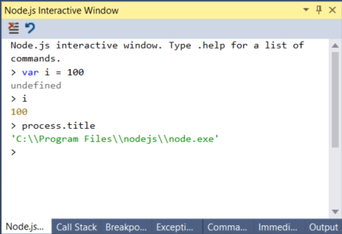

# Quickstart: use Visual Studio to create your first Node.js app
In this 5-10 minute introduction to the Visual Studio integrated development environment (IDE), you'll create a simple Node.js web application. If you haven't already installed Visual Studio, install it for free [here](http://www.visualstudio.com).  

## Create a project
First, you'll create an Node.js web application project.

1. Open Visual Studio 2017.  

2. From the top menu bar, choose **File** > **New** > **Project...**.  

3. In the **New Project** dialog box, in the left pane, expand **JavaScript**, then choose **Node.js**. In the middle pane, choose **Blank Node.js Web application**, then choose **OK**.   

     If you don't see the **Node.js** project templates, cancel out of the **New Project** dialog box and from the top menu bar, choose **Tools**, **Get Tools and Features...**. The Visual Studio Installer launches. Choose the **Node.js development** workload, then choose **Modify**.  

       

## Explore the IDE  

When Visual Studio creates the project, the project opens in **Solution Explorer** in the right pane, and **server.js** opens in the editor.

1. In the editor, choose `http.createServer` and then press **F12** or choose **Go To Definition** from the context (right-click) menu. This command takes you to the definition of the `createServer` function in index.d.ts.  

     

1. Put your cursor at the end of the string in this line of code, `res.end('Hello World\n');`, and modify it so that it looks like this:

    `res.end('Hello World\n' + res.connection.`

    Where you type `connection.`, IntelliSense provides options to auto-complete the code entry.

     

1. Choose **localPort**, and then type `);` to complete the statement so that it looks like this:

    `res.end('Hello World\n' + res.connection.localPort);`

## Run the application
1. Press **Ctrl+F5** to run the application. The app opens in a browser.  

1. In the browser window, you will see "Hello World" plus the local port number.

1. Open the Node.js Interactive Window by selecting **View > Other Windows > Node.js Interactive Window**.

     

    The interactive window supports everything you can do in code including the use of `require()` statements. The code in the following screenshot defines a variable and displays the location of the Node.js interpreter.

     

1. Close the web browser.  

Congratulations on completing this quickstart! We hope you learned a little bit about the Visual Studio IDE. If you'd like to delve deeper into its capabilities, please continue with a tutorial in the **Tutorials** section of the table of contents.  

## Next steps 

- Learn more about the [Visual Studio IDE](../ide/visual-studio-ide.md)
- Learn how to use the [Visual Studio debugger](../debugger/debugger-feature-tour.md)