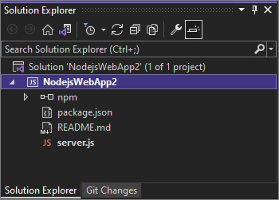
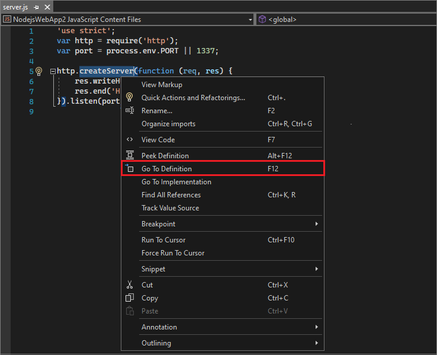
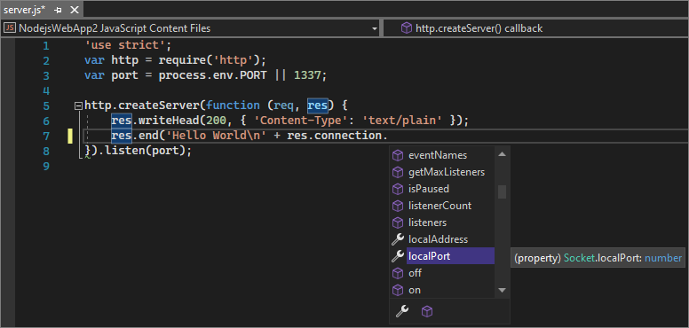

# Quickstart: Create your first Node.js app with Visual Studio

In this 5-10 minute introduction to the Visual Studio integrated development environment (IDE), you create a simple Node.js web app.

## Prerequisites

Before you begin, install Visual Studio and set up your Node.js environment.

::: moniker range=">=vs-2022"
### Install Visual Studio and the Node.js workload

If you haven't yet installed Visual Studio:

1. Go to the [Visual Studio downloads](https://visualstudio.microsoft.com/downloads) page to install Visual Studio 2022 for free.

1. In the Visual Studio Installer, select the **Node.js development** workload, and select **Install**.

   

If you have Visual Studio installed already.

1. In Visual Studio, go to **Tools** > **Get Tools and Features**.

1. In the Visual Studio Installer, choose the **Node.js development** workload, and select **Modify** to download and install the workload.

### Set up your Node.js environment

[Install the LTS version of the Node.js runtime](https://nodejs.org/en/download/). The LTS version has the best compatibility with other frameworks and libraries.

Although Node.js is built for 32-bit and 64-bit architectures, the Node.js installer only supports one version at a time.

Visual Studio usually detects your installed runtime, but if not, you can configure your project to reference the installed runtime:

   1. After [creating your project](#create-your-app-project), right-click the project node.

   1. Select **Properties**, and set the **Node.exe path**. You can use a global Node.js installation, or specify the path to a local interpreter for any Node.js project.

:::moniker-end
::: moniker range="vs-2019"
### Install Visual Studio

If you haven't already installed Visual Studio 2019, go to the [Visual Studio downloads](https://visualstudio.microsoft.com/downloads) page to install it for free.
::: moniker-end
::: moniker range="vs-2017"
### Install Visual Studio

If you haven't already installed Visual Studio 2017, go to the [Visual Studio downloads](https://visualstudio.microsoft.com/vs/older-downloads/?utm_medium=microsoft&utm_source=docs.microsoft.com&utm_campaign=vs+2017+download) page to install it for free.
::: moniker-end

::: moniker range="<=vs-2019"
### Set up your Node.js environment

Visual Studio can help set up your environment, including installing tools common with Node.js development.

1. In Visual Studio, go to **Tools** > **Get Tools and Features**.

1. In the Visual Studio Installer, choose the **Node.js development** workload and select **Modify** to download and install the workload.

    

1. Install the LTS version of the [Node.js runtime](https://nodejs.org/en/download/). We recommend the LTS version for best compatibility with outside frameworks and libraries.

    Although Node.js is built for 32-bit and 64-bit architectures, the Node.js installer only supports one version installed at a time.

1. If Visual Studio doesn't detect your installed runtime (it generally does), configure your project to reference the installed runtime:

   1. After you [create your project](#create-your-app-project), right-click the project node.

   1. Select **Properties** and set the **Node.exe path**. You can use a global installation of Node.js or specify the path to a local interpreter in each of your Node.js projects.

::: moniker-end
## Create your app project

In Visual Studio, create a new Node.js project.

::: moniker range=">=vs-2022"

1. Start Visual Studio, and then press **Esc** to close the start window.

1. Press **Ctrl**+**Q**, and then type *node.js* in the search box.

1. Select **Blank Node.js Web Application**.

1. In the dialog box, select **Create**.

::: moniker-end

::: moniker range="vs-2019"

1. Press **Esc** to close the start window.

1. Press **Ctrl + Q** to open the search box, then type **Node.js**.

1. Choose **Blank Node.js Web Application (JavaScript)**. In the dialog, select **Create**.

::: moniker-end

::: moniker range="vs-2017"
1. From the top menu bar, choose **File** > **New** > **Project**.

1. In the left pane of the **New Project** dialog, expand **JavaScript** and choose **Node.js**.

1. In the middle pane, choose **Blank Node.js Web application** and select **OK**.

::: moniker-end
Visual Studio creates and opens the project. The project's *server.js* file opens in the editor.

If you don't see the **Blank Node.js Web Application** project template, you need to add the **Node.js development** workload. For instructions, see [Prerequisites](#prerequisites).

## Explore the IDE

::: moniker range=">=vs-2022"
Visual Studio can help set up your environment, including installing tools common with Node.js development.

1. In the right pane, look at the **Solution Explorer**.
   
   - At the top level is a *solution*, which by default has the same name as your project. A solution, represented by a *.sln* file on disk, is a container for one or more related projects.
   - Your project, with the name you used when you set it up, is highlighted in bold. On disk, the project is represented by a *.njsproj* file in your project folder.
   - The **npm** node shows installed npm packages. You can right-click the **npm** node to search for and install npm packages by using a dialog.

   

1. To install npm packages or Node.js commands from a command prompt, right-click the project node and choose **Open Command Prompt Here**.

   

1. To test navigation to source code, in the open *server.js* file, select `createServer` and press **F12**, or right-click `createServer` and select **Go To Definition** from the context menu. This command takes you to the definition of the `createServer` function in *http.d.ts*.

   

1. Back in *server.js*, locate this line of code: `res.end('Hello World\n');`, and modify it to:

   `res.end('Hello World\n' + res.connection.`

   When you type `connection.`, IntelliSense provides options to autocomplete the code entry.

   

1. Choose `localPort`, and type `);` to complete the statement:

    `res.end('Hello World\n' + res.connection.localPort);`

::: moniker-end

::: moniker range="<=vs-2019"
1. In the right pane, look at the **Solution Explorer**.
   
   - At the top level is a *solution*, which by default has the same name as your project. A solution, represented by a *.sln* file on disk, is a container for one or more related projects.
   - Your project, with the name you used when you set it up, is highlighted in bold. On disk, the project is represented by a *.njsproj* file in your project folder.
   - The **npm** node shows installed npm packages. You can right-click the **npm** node to search for and install npm packages by using a dialog.

   

1. To install npm packages or Node.js commands from a command prompt, right-click the project node and choose **Open Command Prompt Here** from the context menu.

   

1. To test navigation to source code, in the open *server.js* file, select **http.createServer** and press **F12** or choose **Go To Definition** from the right-click context menu. This command takes you to the definition of the `createServer` function in *http.d.ts*.

   

1. Back in *server.js*, locate this line of code: `res.end('Hello World\n');`, and modify it to:

   `res.end('Hello World\n' + res.connection.`

   When you type **connection.**, IntelliSense provides options to autocomplete the code entry.

   

1. Choose **localPort**, and type `);` to complete the statement:

    `res.end('Hello World\n' + res.connection.localPort);`
:::moniker-end

## Run the app

1. Press **Ctrl**+**F5** or select **Debug** > **Start Without Debugging** to run the app.
 
   The app opens in a browser.

1. In the browser, verify that you see a **Hello World** message and the local port number.

Congratulations! You created a simple Node.js app with Visual Studio. To delve deeper, continue to the **Tutorials** section of the table of contents.

## Next steps

> [!div class="nextstepaction"]
> [Deploy the app to Linux App Service](../javascript/publish-nodejs-app-azure.md)

> [!div class="nextstepaction"]
> [Tutorial for Node.js and Express](../javascript/tutorial-nodejs.md)

> [!div class="nextstepaction"]
> [Tutorial for Node.js and React](../javascript/tutorial-nodejs-with-react-and-jsx.md)

