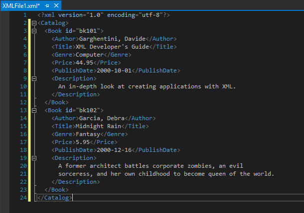
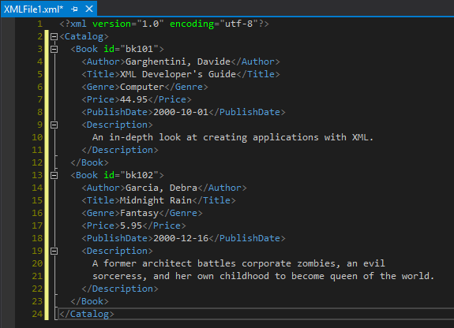

# How to: Personalize the Visual Studio IDE and the editor

::: moniker range="vs-2022"

In this how-to article, we'll customize the Visual Studio color theme. Then, we'll customize the colors for two different types of text in the code editor.

If you haven't already installed Visual Studio, go to the [Visual Studio downloads](https://visualstudio.microsoft.com/downloads) page to install it for free.

## Set the color theme for the IDE

The default color theme for Visual Studio's user interface is **Dark**. Here's how to change it to a different color theme.

1. On the menu bar, select **Tools** > **Options**.

1. In the options list, select **Environment** > **General**.

1. In the **Color theme** list, choose between the default **Dark** theme, the **Blue** theme, and the **Blue (Extra Contrast)** theme, and the the **Light** theme. Or, choose the **Use system setting** option to select the theme that Windows uses.

   :::image type="content" source="media/vs-2022/fonts-colors-theme.png" alt-text="Screenshot of the Options dialog box where you can change the color theme.":::

   > [!NOTE]
   > When you change a color theme, text in the IDE reverts to the default or previously customized fonts and sizes for that theme.

    > [!TIP]
    > Want even more themes to choose from? Check out the wide range of custom themes on the [**Visual Studio Marketplace**](https://marketplace.visualstudio.com/search?target=VS&category=Tools&vsVersion=&subCategory=Themes&sortBy=Installs). And to see examples of new Visual Studio 2022 custom themes based on VS Code, take a look at the [**Introducing a collection of new Visual Studio themes**](https://devblogs.microsoft.com/visualstudio/custom-themes/) blog post.

::: moniker-end

::: moniker range="vs-2019"

In this how-to article, we'll customize the Visual Studio color theme from the blue theme to the dark theme. Then, we'll customize the colors for two different types of text in the code editor.

If you haven't already installed Visual Studio, go to the [Visual Studio downloads](https://visualstudio.microsoft.com/downloads) page to install it for free.

## Set the color theme for the IDE

The default color theme for Visual Studio's user interface is **Blue**. Let's change it to **Dark**.

1. On the menu bar, which is the row of menus such as **File** and **Edit**, choose **Tools** > **Options**.

1. On the **Environment** > **General** options page, change the **Color theme** selection to **Dark**, and then choose **OK**.

   The color theme for the entire Visual Studio development environment (IDE) changes to **Dark**.

   

> [!TIP]
> You can create your own themes by installing the **Visual Studio Color Theme Designer** from the [Visual Studio Marketplace](https://marketplace.visualstudio.com/items?itemName=ms-madsk.ColorThemeDesigner).

::: moniker-end

::: moniker range="vs-2017"

In this how-to article, we'll customize the Visual Studio color theme from the blue theme to the dark theme. Then, we'll customize the colors for two different types of text in the code editor.

If you haven't already installed Visual Studio, go to the [Visual Studio downloads](https://visualstudio.microsoft.com/vs/older-downloads/?utm_medium=microsoft&utm_source=docs.microsoft.com&utm_campaign=vs+2017+download) page to install it for free.

## Set the color theme for the IDE

The default color theme for Visual Studio's user interface is **Blue**. Let's change it to **Dark**.

1. On the menu bar, which is the row of menus such as **File** and **Edit**, choose **Tools** > **Options**.

1. On the **Environment** > **General** options page, change the **Color theme** selection to **Dark**, and then choose **OK**.

   The color theme for the entire Visual Studio development environment (IDE) changes to **Dark**.

   

> [!TIP]
> You can install additional predefined themes by installing the **Visual Studio Color Theme Editor** from the [Visual Studio Marketplace](https://marketplace.visualstudio.com/items?itemName=VisualStudioPlatformTeam.VisualStudio2017ColorThemeEditor). After you install this tool, additional color themes appear in the **Color theme** drop-down list.

::: moniker-end

## Change text colors in the editor

Now we'll customize some text colors for the editor. First, let's create a new XML file to see the default colors.

1. From the menu bar, choose **File** > **New** > **File**.

1. In the **New File** dialog box, under the **General** category, choose **XML File**, and then choose **Open**.

1. Paste the following XML below the line that contains `<?xml version="1.0" encoding="utf-8"?>`.

   ```xml
   <Catalog>
     <Book id="bk101">
     <Author>Garghentini, Davide</Author>
     <Title>XML Developer's Guide</Title>
     <Genre>Computer</Genre>
     <Price>44.95</Price>
     <PublishDate>2000-10-01</PublishDate>
     <Description>
       An in-depth look at creating applications with XML.
     </Description>
   </Book>
   <Book id="bk102">
     <Author>Garcia, Debra</Author>
     <Title>Midnight Rain</Title>
     <Genre>Fantasy</Genre>
     <Price>5.95</Price>
     <PublishDate>2000-12-16</PublishDate>
     <Description>
       A former architect battles corporate zombies, an evil
       sorceress, and her own childhood to become queen of the world.
     </Description>
   </Book>
   </Catalog>
   ```

   Notice that the line numbers are a turquoise-blue color, and the XML attributes (such as `id="bk101"`) are a light blue color. We're going to change the text color for these items.

   

1. To open the **Options** dialog box, choose **Tools** > **Options** from the menu bar.

1. Under **Environment**, choose the **Fonts and Colors** category.

   Notice that the text under **Show settings for** says **Text Editor**&mdash;this is what we want. Expand the drop-down list just to see the extensive list of places where you can customize fonts and text color.

1. To change the color of the line numbers text, in the **Display items** list, choose **Line Number**. In the **Item foreground** box, choose **Olive**.

    :::image type="content" source="media/vs-2022/personalize-line-number-color.png" alt-text="Screenshot of the Fonts and Colors category in the Options dialog box.":::

   Some languages have their own specific fonts and colors settings. If you are a C++ developer and you want to change the color used for functions, for example, you can look for **C++ Functions** in the **Display items** list.

1. Before we exit out of the dialog box, let's also change the color of XML attributes. In the **Display items** list, scroll down to **XML Attribute** and select it. In the **Item foreground** box, choose **Lime**. Choose **OK** to save our selections and close the dialog box.

   The line numbers are now an olive color, and the XML attributes are a bright, lime green. If you open another file type, such as a C++ or C# code file, you'll see that the line numbers also appear in the olive color.

   

We explored just a couple ways of customizing the colors in Visual Studio. We hope that you'll explore the other customization options in the [**Options**](../ide/reference/fonts-and-colors-environment-options-dialog-box.md) dialog box, to truly make Visual Studio your own.

## See also

- [How to: Change fonts, colors, and themes in Visual Studio](../ide/how-to-change-fonts-and-colors-in-visual-studio.md)
- [How to: Change text case in the editor](../ide/how-to-change-text-case-in-the-editor.md)
- [Visual Studio IDE overview](../get-started/visual-studio-ide.md)
