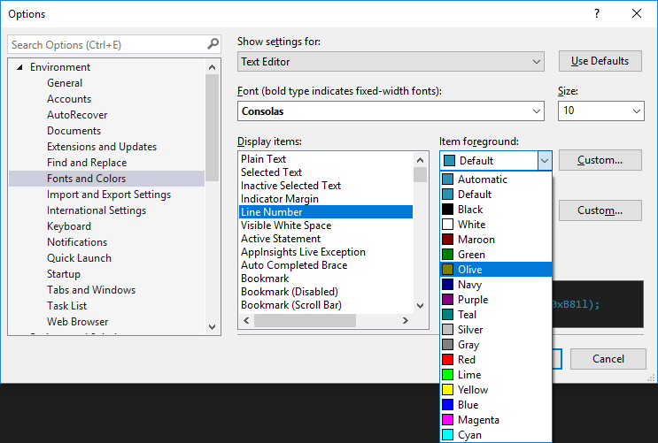

# Quickstart: Personalize the Visual Studio IDE and Editor

In this 5-10 minute quickstart, we'll customize the Visual Studio color theme and two text colors in the Text Editor.

## Set the color theme

The default color theme for Visual Studio 2017 is called **Blue**. Let's change it to **Dark**.

1. On the menu bar, choose **Tools**, **Options**.

1. On the **Environment**, **General** options page, change the **Color theme** selection to **Dark**, and then choose **OK**.

   The color theme for the entire IDE is changed to **Dark**.

   

> [!TIP]
> You can install additional predefined themes by installing the **Visual Studio Color Theme Editor** from the [Visual Studio Marketplace](https://marketplace.visualstudio.com/items?itemName=VisualStudioProductTeam.VisualStudio2017ColorThemeEditor). After you install this tool, additional color themes appear in the Color theme drop-down list.

## Change text color

Now we'll customize some text colors for the Editor. First, let's open an XML file to see the default colors.

1. From the menu bar, choose **File**, **New**, **File...**.

1. In the **New File** dialog box, under the **General** category, choose **XML File**, and then choose **Open**.

1. Paste the following XML below the line that contains `<?xml version="1.0" encoding="utf-8"?>`.

   ```xml
   <Catalog>
     <Book id="bk101">
     <Author>Garghentini, Davide</Author>
     <Title>XML Developer's Guide</Title>
     <Genre>Computer</Genre>
     <Price>44.95</Price>
     <PublishDate>2000-10-01</PublishDate>
     <Description>
       An in-depth look at creating applications with XML.
     </Description>
   </Book>
   <Book id="bk102">
     <Author>Garcia, Debra</Author>
     <Title>Midnight Rain</Title>
     <Genre>Fantasy</Genre>
     <Price>5.95</Price>
     <PublishDate>2000-12-16</PublishDate>
     <Description>
       A former architect battles corporate zombies, an evil
       sorceress, and her own childhood to become queen of the world.
     </Description>
   </Book>
   </Catalog>
   ```

   Notice that the line numbers are a turquoise-blue color, and the xml attributes are a light blue color. We are going to change the text color for these items.

   

1. To open the **Options** dialog box, from the menu bar, choose **Tools**, **Options**.

1. Under **Environment**, choose the **Fonts and Colors** category.

   Notice that the text under **Show settings for** says **Text Editor**&mdash;this is what we want. You might expand the drop-down list just to see the extensive list of places where you can customize fonts and text color.

1. To change the color of the line numbers text, in the **Display items** list, choose **Line Number**. In the **Item foreground** box, choose **Olive**.

   

   Some languages have their own specific fonts and colors settings. If you are a C++ developer and you want to change the color used for functions, for example, you can look for **C++ Functions** in the **Display items** list.

1. Before we exit out of the dialog box, let's also change the color of XML attributes. In the **Display items** list, scroll down to **XML Attribute** and select it. In the **Item foreground** box, choose **Lime**. Choose **OK** to save our selections and close the dialog box.

   The line numbers are now an olive color, and the XML attributes are a bright, lime green. If you open another file type, such as a C++ or C# code file, you'll see that the line numbers also appear in the olive color.

   

We explored just a couple ways of customizing the colors in Visual Studio. We hope that you'll explore the other customization options in the **Options** dialog box, to truly make Visual Studio your own.

## See also

[Quickstart: First look at the Visual Studio IDE](../ide/quickstart-ide-orientation.md)  
[Quickstart: Coding in the editor](../ide/quickstart-editor.md)  
[Quickstart: Projects and solutions](../ide/quickstart-projects-solutions.md)  
[Personalize the Visual Studio IDE](../ide/personalizing-the-visual-studio-ide.md)  
[Customizing the Editor](../ide/customizing-the-editor.md)  
[Visual Studio IDE Overview](../ide/visual-studio-ide.md)