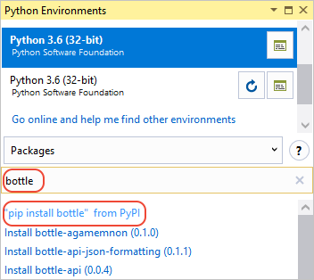

# Quickstart: use Visual Studio to create your first Python web app

In this 5-10 minute introduction to the Visual Studio integrated development environment (IDE), you create a simple Python web application. If you haven't already installed Visual Studio, install it for free [here](http://www.visualstudio.com).

## Create the project

1. Open Visual Studio 2017.

1. From the top menu bar, choose **File > New > Project...**.

1. In the **New Project** dialog box, in the left pane, expand **Other Languages**, then select **Python**. In the middle pane, choose **Web project**, give the project a name like "HelloPython", then choose **OK**.

    If you don't see the Python project templates, cancel out of the **New Project** dialog box and from the top menu bar, choose **Tools > Get Tools and Features...** to open the Visual Studio Installer. Choose the **Python development** workload, then choose **Modify**.

    

1. The new project opens in **Solution Explorer** in the right pane. The project is empty at this point because it contains no other files.

    

## Install the Bottle library

Web apps in Python almost always use one of the many available Python libraries, such as Bottle, to handle low-level details like routing web requests and shaping responses. For simplicity, the following steps install Bottle into the default global environment.

1. Expand the **Python Environments** node in the project to see the default environment for the project.

    

1. Right-click the environment and select **Install Python Package...**. This command opens the **Python Environments** window. Enter "bottle" in the search field and select **"pip install bottle" from PyPI**. Accept any prompts for administrator privileges and observe the **Output** window in Visual Studio for progress.

    

1. Once installed, the library appears in the environment in **Solution Explorer**, which means that you can make use of it in Python code.

    

Note that instead of installing libraries in the global environment, developers typically create a "virtual environment" in which to install libraries for a specific project. For more information, see [Python environments - Virtual environments](../python/python-environments.md#virtual-environments).

## Add a code file

You're now ready to add a bit of Python code to implement a minimal web app.

1. Right-click the project in **Solution Explorer** and select **Add > New Item...**. In the dialog that appears, select **Empty Python File**, name it `hello.py`, and choose **OK**. Visual Studio automatically opens the file in an editor window. (In general, the **Add > New Item...** command is a great way to add different kinds of files to a project, as the item templates often provide useful boilerplate code.)

1. Copy-paste or enter the following code into `hello.py`:

    ```python
    # Import the necessary modules from Bottle.
    from bottle import Bottle, run

    # Create the app object to handle requests.
    app = Bottle()

    # These Bottle decorators attach routes to the hello function, which
    # generates the response for those routes.
    @app.route('/')
    @app.route('/index')
    def hello():
        return "Hello, Python!"

    # Start the app on localhost port 8080 (a development port).
    run(app, host='localhost', port=8080)
    ```

For more information about Bottle and its routing mechanism, see the [Bottle tutorial](https://bottlepy.org/docs/dev/tutorial.html) (bottlepy.org).

## Run the application

1. Right-click `hello.py` in **Solution Explorer** and select **Set as startup file**. The command identifies the code file to launch in Python when running the app.

1. Select **Debug > Start Without Debugging** (Ctrl+F5) to run the app.

1. A command window appears with the contents shown below, indicating that the Bottle app is running and listening for requests. (If you see only the Python interactive shell in the window, or if a command window flashes on the screen briefly, ensure that you set `hello.py` as the startup file in step 1 above.)

    ```
    Bottle v0.12.13 server starting up (using WSGIRefServer())...
    Listening on http://localhost:8080/
    Hit Ctrl-C to quit.
    ```

1. Open a browser and navigate to `localhost:8080`, which should display "Hello, Python!" Notice that the Bottle app shows the request in the command window.

1. Stop the app by pressing Ctrl+C in the command window.

## Next steps

Congratulations on completing this quickstart, in which you've learned a little about the Visual Studio IDE with Python. To continue with a fuller tutorial on Python in Visual Studio, including using the interactive window, debugging, data visualization, and working with Git, select the button below.

> [!div class="nextstepaction"]
> [Tutorial: Getting Started with Python in Visual Studio](../python/vs-tutorial-01-01.md).

- Learn more about the [Visual Studio IDE](../ide/visual-studio-ide.md)
- Learn how to use the [Visual Studio debugger](../debugger/debugger-feature-tour.md)