# Quickstart: Create your first Python web app using Visual Studio

In this 5-10 minute introduction to Visual Studio as a Python IDE, you create a simple Python web application based on the Flask framework. You create the project through discrete steps that help you learn about Visual Studio's basic features.

::: moniker range="vs-2017"

If you haven't already installed Visual Studio, go to the [Visual Studio downloads](https://visualstudio.microsoft.com/vs/older-downloads/?utm_medium=microsoft&utm_source=docs.microsoft.com&utm_campaign=vs+2017+download) page to install it for free. In the installer, make sure to select the **Python development** workload.

::: moniker-end

::: moniker range="vs-2019"

If you haven't already installed Visual Studio, go to the [Visual Studio downloads](https://visualstudio.microsoft.com/downloads) page to install it for free. In the installer, make sure to select the **Python development** workload.

::: moniker-end

::: moniker range=">=vs-2022"

If you haven't already installed Visual Studio, go to the [Visual Studio downloads](https://visualstudio.microsoft.com/downloads) page to install it for free. In the Visual Studio Installer, select the **Python development** workload, and in the installation details, select **Python web support**.

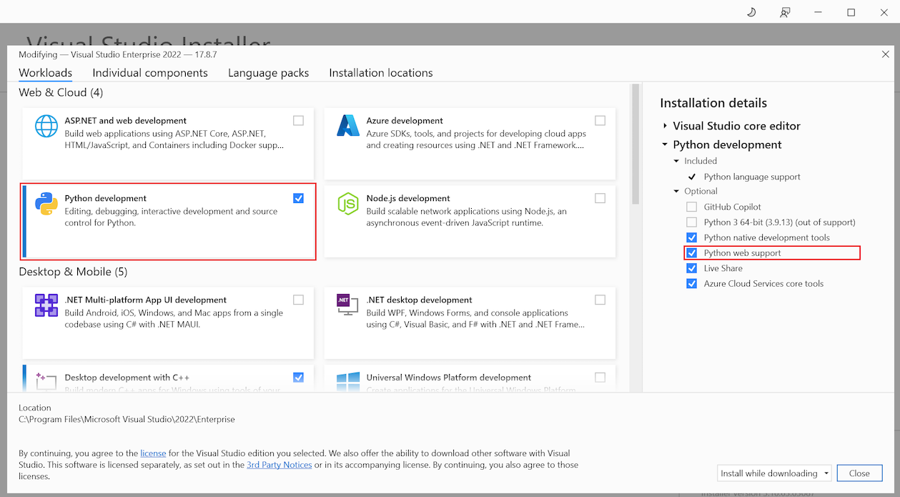

::: moniker-end

## Create the project

The following steps create an empty project that serves as a container for the application:

::: moniker range="vs-2017"
1. Open Visual Studio 2017.

2. From the top menu bar, choose **File > New > Project**.

3. In the **New Project** dialog box, enter "Python Web Project" in the search field on the upper right, choose **Web project** in the middle list, give the project a name like "HelloPython", then choose **OK**.

    

    If you don't see the Python project templates, run the **Visual Studio Installer**, select **More** > **Modify**, select the **Python development** workload, then choose **Modify**.

    

4. The new project opens in **Solution Explorer** in the right pane. The project is empty at this point because it contains no other files.

    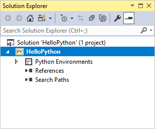
::: moniker-end

::: moniker range="vs-2019"
1. Open Visual Studio 2019.
2. On the start screen, select **Create a new project**.
3. In the **Create a new project** dialog box, enter "Python web" in the search field at the top, choose **Web Project** in the middle list, then select **Next**:

    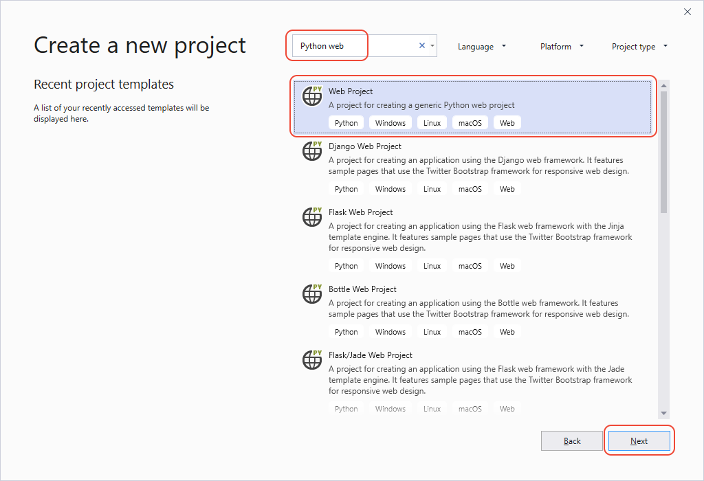
    If you don't see the Python project templates, run the **Visual Studio Installer**, select **More** > **Modify**, select the **Python development** workload, then choose **Modify**.

    

4. In the **Configure your new project** dialog that follows, enter "HelloPython" for **Project name**, specify a location, and select **Create**. (The **Solution name** is automatically set to match the **Project name**.)

    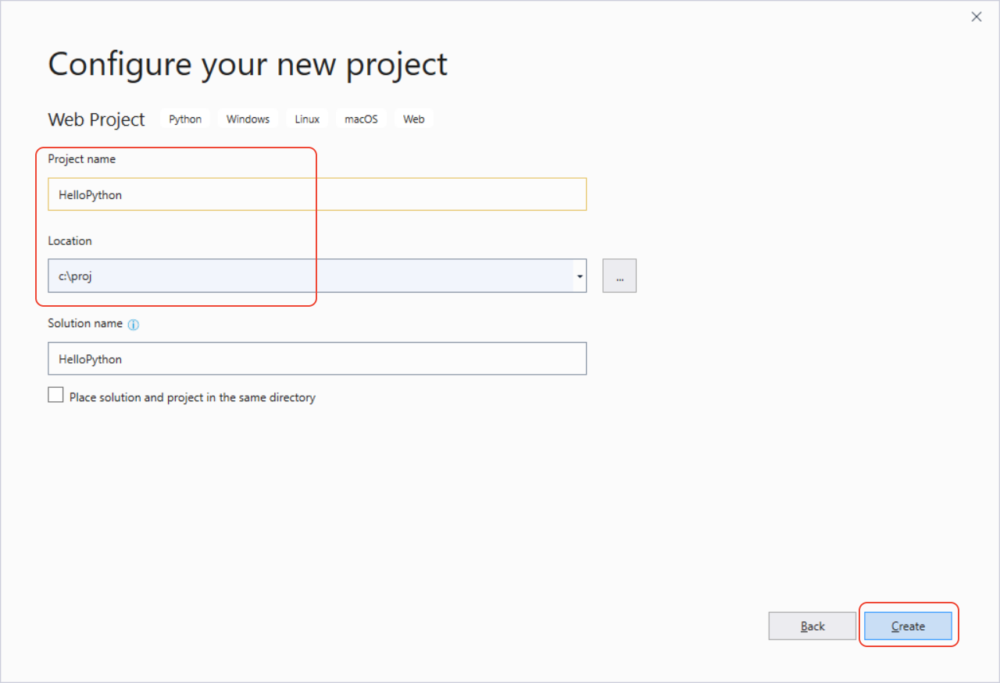

5. The new project opens in **Solution Explorer** in the right pane. The project is empty at this point because it contains no other files.

    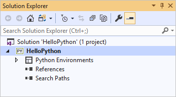

::: moniker-end

::: moniker range=">=vs-2022"
1. Open Visual Studio 2022.
1. On the start screen, select **Create a new project**.
1. In the **Create a new project** dialog box, enter "Python web" in the search field at the top. Choose **Web Project** from the list, and then select **Next**:
   
   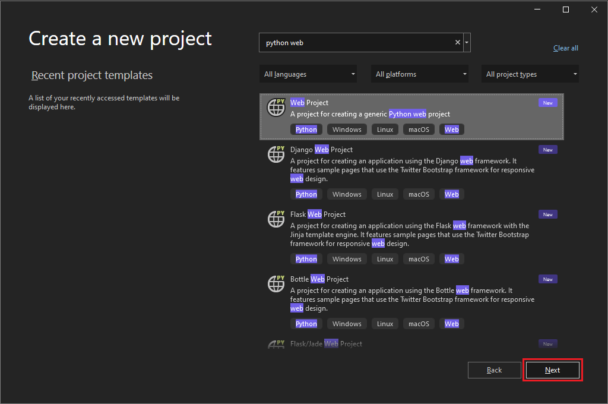
   
   If you don't see the Python web project templates, select **Tools** > **Get Tools and Features** to run the Visual Studio Installer. In the Installer, select the **Python development** workload, and under **Installation details**, select **Python web support**. Then select **Modify**.

1. In the **Configure your new project** dialog box, enter "HelloPython" for **Project name**, specify a location, and then select **Create**. The **Solution name** automatically updates to match the **Project name**.

   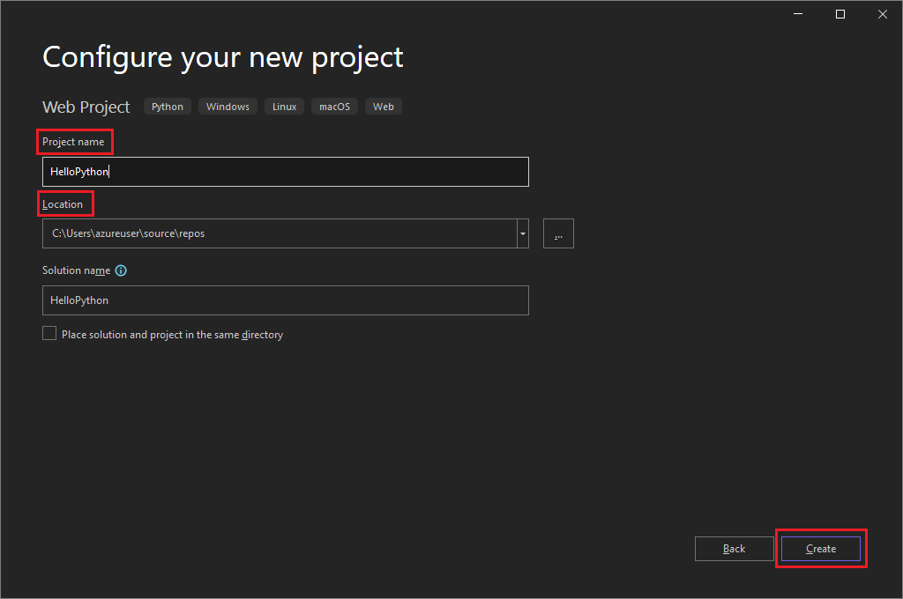

The new project opens in **Solution Explorer** in the right pane. The project is empty at this point because it contains no other files.

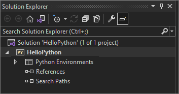
::: moniker-end

**Question: What's the advantage of creating a project in Visual Studio for a Python application?**

**Answer**: Python applications are typically defined by using only folders and files, but this simple structure can become burdensome as applications grow larger. Applications can involve auto-generated files, JavaScript for web applications, and other components. A Visual Studio project helps manage this complexity.

The project, a *.pyproj* file, identifies all the source and content files associated with your project. The *.pyproj* file contains build information for each file, maintains information to integrate with source-control systems, and helps organize your application into logical components.

**Question: What is the "solution" shown in Solution Explorer?**

**Answer**: A Visual Studio solution is a container that helps you manage one or more related projects as a group. The solution stores configuration settings that aren't specific to a project. Projects in a solution can also reference one another. For example, running a Python app project can automatically build a second project, like a C++ extension that the Python app uses.

## Install the Flask library

Web apps in Python almost always use one of the many available Python libraries to handle low-level details like routing web requests and shaping responses. Visual Studio provides many templates for web apps. You use one of these templates later in this Quickstart.

Use the following steps to install the Flask library into the default *global environment* that Visual Studio uses for this project.

::: moniker range="vs-2017"
1. Expand the **Python Environments** node in the project to see the default environment for the project.

    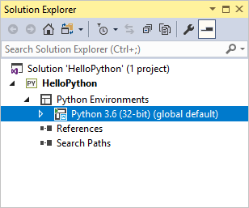

2. Right-click the environment and select **Install Python Package**. This command opens the **Python Environments** window on the **Packages** tab.

3. Enter "flask" in the search field and select **pip install flask from PyPI**. Accept any prompts for administrator privileges and observe the **Output** window in Visual Studio for progress. (A prompt for elevation happens when the packages folder for the global environment is located within a protected area like *C:\Program Files*.)

    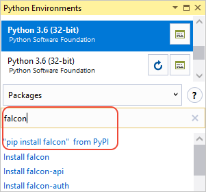
::: moniker-end
::: moniker range="vs-2019"
1. Expand the **Python Environments** node in the project to see the default environment for the project.

    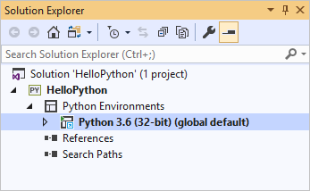

2. Right-click the environment and select **Manage Python Packages...**. This command opens the **Python Environments** window on the **Packages (PyPI)** tab.

3. Enter "flask" in the search field. If **Flask** appears below the search box, you can skip this step. Otherwise select **Run command: pip install flask**. Accept any prompts for administrator privileges and observe the **Output** window in Visual Studio for progress. (A prompt for elevation happens when the packages folder for the global environment is located within a protected area like *C:\Program Files*.)

    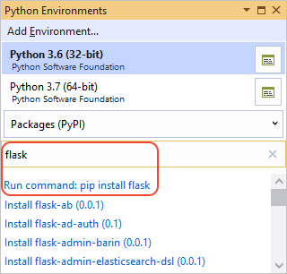
::: moniker-end

::: moniker range=">=vs-2022"
1. Expand the **Python Environments** node in the project to see the default environment for the project.

    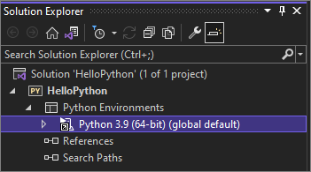

1. Right-click the environment and select **Manage Python Packages**. This command opens the **Python Environments** window on the **Packages (PyPI)** tab.

1. Enter "flask" in the search field. If **Flask** appears below the search box, you can skip this step. Otherwise, select **Run command: pip install flask**.

    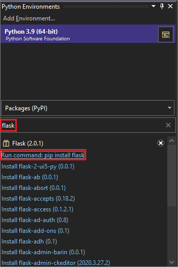

    An elevation prompt appears if the global environment packages folder is in a protected area like *C:\Program Files*. Accept any prompts for administrator privileges. Observe the Visual Studio **Output** window for progress.

::: moniker-end

Once installed, the library appears in the environment in **Solution Explorer**, which means you can use it in Python code.

::: moniker range="vs-2017"
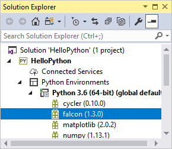
::: moniker-end
::: moniker range="vs-2019"
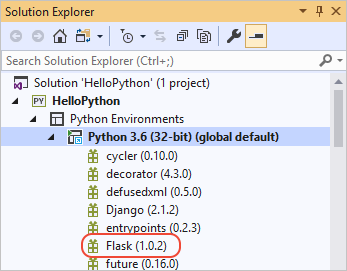
::: moniker-end
::: moniker range=">=vs-2022"
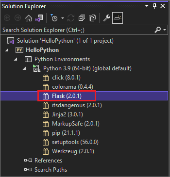
::: moniker-end

> [!Note]
> Instead of installing libraries in the global environment, developers typically create a "virtual environment" in which to install libraries for a specific project. Visual Studio templates typically offer this option, as discussed in [Quickstart - Create a Python project using a template](../python/quickstart-02-python-in-visual-studio-project-from-template.md).

**Question: Where do I learn more about other available Python packages?**

**Answer**: Visit the [Python Package Index](https://pypi.org/).

## Add a code file

You're now ready to add a bit of Python code to implement a minimal web app.

::: moniker range="<=vs-2019"
1. Right-click the project in **Solution Explorer** and select **Add** > **New Item**.

1. In the dialog that appears, select **Empty Python File**, name it *app.py*, and select **Add**. Visual Studio automatically opens the file in an editor window.

1. Copy the following code and paste it into *app.py*:

    ```python
    from flask import Flask

    # Create an instance of the Flask class that is the WSGI application.
    # The first argument is the name of the application module or package,
    # typically __name__ when using a single module.
    app = Flask(__name__)

    # Flask route decorators map / and /hello to the hello function.
    # To add other resources, create functions that generate the page contents
    # and add decorators to define the appropriate resource locators for them.

    @app.route('/')
    @app.route('/hello')
    def hello():
        # Render the page
        return "Hello Python!"

    if __name__ == '__main__':
        # Run the app server on localhost:4449
        app.run('localhost', 4449)
    ```
::: moniker-end
::: moniker range=">= vs-2022"

1. Right-click the project in **Solution Explorer** and select **Add** > **New Item**.

1. In the dialog that appears, select **empty**. For **Name**, enter *app.py*, and then select **Add**. Visual Studio automatically opens the file in an editor window.

1. Copy the following code and paste it into *app.py*:

    ```python
    from flask import Flask

    # Create an instance of the Flask class that is the WSGI application.
    # The first argument is the name of the application module or package,
    # typically __name__ when using a single module.
    app = Flask(__name__)

    # Flask route decorators map / and /hello to the hello function.
    # To add other resources, create functions that generate the page contents
    # and add decorators to define the appropriate resource locators for them.

    @app.route('/')
    @app.route('/hello')
    def hello():
        # Render the page
        return "Hello Python!"

    if __name__ == '__main__':
        # Run the app server on localhost:4449
        app.run('localhost', 4449)
    ```
::: moniker-end

You might have noticed that the **Add** > **New Item** dialog box displays many other types of files you can add to a Python project, including a Python class, a Python package, a Python unit test, *web.config* files, and more. In general, these *item templates* are a great way to quickly create files with useful boilerplate code.

**Question: Where can I learn more about Flask?**

**Answer**: Refer to the Flask documentation, starting with the [Flask Quickstart](https://flask.palletsprojects.com/quickstart/#quickstart).

## Run the application

1. In **Solution Explorer**, right-click *app.py* and then select **Set as Startup File** from the dropdown menu. This command identifies the code file to launch in Python when running the app.

    ::: moniker range="vs-2017"
    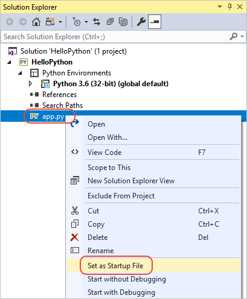
    ::: moniker-end
    ::: moniker range="vs-2019"
    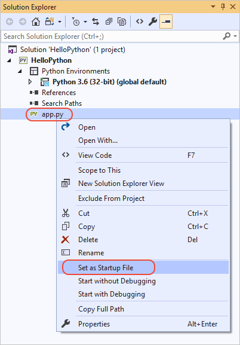
    ::: moniker-end
    ::: moniker range=">=vs-2022"
    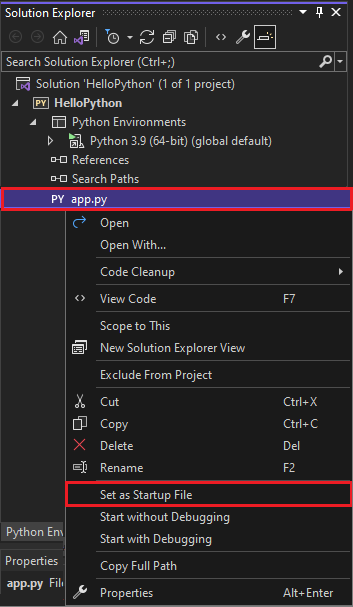
    ::: moniker-end

2. Right-click the project in **Solution Explorer** and select **Properties**. Select the **Debug** tab from the **Properties** menu, and set the **Port Number** property to `4449`. This setting ensures that Visual Studio launches a browser with `localhost:4449` to match the `app.run` arguments in the code.

3. Select **Debug** > **Start Without Debugging** or press **Ctrl**+**F5**, which saves changes to files and runs the app.

4. A command window appears with the message **Running in https:\//localhost:4449**. A browser window opens to `localhost:4449` and displays the message **Hello, Python!** The `GET` request also appears in the command window with a status of `200`.

    If a browser doesn't open automatically, start the browser of your choice and navigate to `localhost:4449`.

    If you see only the Python interactive shell in the command window, or if that window flashes on the screen briefly, make sure *app.py* is set as the startup file.

5. Navigate to `localhost:4449/hello` to test that the decorator for the `/hello` resource also works. Again, the `GET` request appears in the command window with a status of `200`. Try some other URLs as well to see that they show `404` status codes in the command window.

6. Close the command window to stop the app, and then close the browser window.

**Question: What's the difference between the Start Without Debugging and Start Debugging commands?**

**Answer**: You use **Start Debugging** to run the app in the context of the [Visual Studio debugger](../python/debugging-python-in-visual-studio.md). With the debugger, you can set breakpoints, examine variables, and step through your code line by line. Apps might run slower in the debugger because of the hooks that make debugging possible.

**Start Without Debugging** runs the app directly, as if you ran it from the command line, with no debugging context. **Start Without Debugging** also automatically launches a browser, and navigates to the URL specified in the project properties' **Debug** tab.

## Next steps

Congratulations on running your first Python app from Visual Studio. You've learned a little about using Visual Studio as a Python IDE!

> [!div class="nextstepaction"]
> [Deploy the app to Azure App Service](../python/publishing-python-web-applications-to-azure-from-visual-studio.md)

Because the steps you followed in this Quickstart are fairly generic, you've probably guessed that they can and should be automated. Such automation is the role of Visual Studio project templates. Go through [Quickstart - Create a Python project using a template](../python/quickstart-02-python-in-visual-studio-project-from-template.md) to create a web app similar to the one in this article, but with fewer steps.

To continue with a fuller tutorial on Python in Visual Studio, including using the interactive window, debugging, data visualization, and working with Git, follow [Tutorial: Get started with Python in Visual Studio](../python/tutorial-working-with-python-in-visual-studio-step-01-create-project.md).

To explore more that Visual Studio has to offer, select the links below.

- Learn about [Python web app templates in Visual Studio](../python/python-web-application-project-templates.md).
- Learn about [Python debugging](../python/debugging-python-in-visual-studio.md)
- Learn more about the [Visual Studio IDE](../get-started/visual-studio-ide.md) in general.
