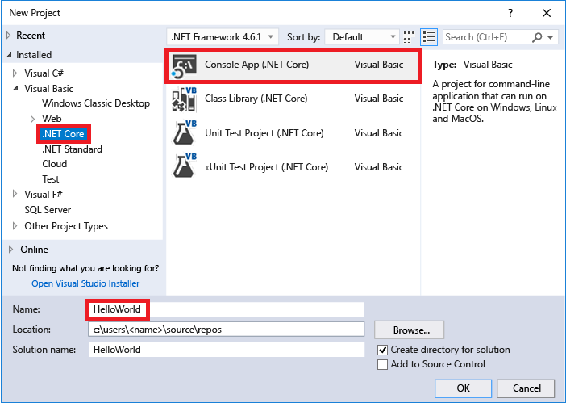
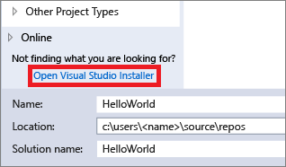
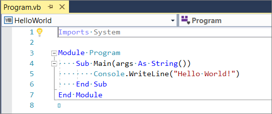
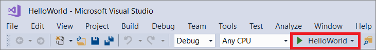

# Quickstart: Create your first console app in Visual Studio with Visual Basic

In this 5-10 minute introduction to the Visual Studio integrated development environment (IDE), you'll create a simple Visual Basic application that runs on the console.

::: moniker range="vs-2017"

If you haven't already installed Visual Studio, go to the [Visual Studio downloads](https://visualstudio.microsoft.com/vs/older-downloads/?utm_medium=microsoft&utm_source=docs.microsoft.com&utm_campaign=vs+2017+download) page to install it for free.

::: moniker-end

::: moniker range="vs-2019"

If you haven't already installed Visual Studio, go to the [Visual Studio downloads](https://visualstudio.microsoft.com/downloads) page to install it for free.

::: moniker-end

## Create a project

First, you'll create a Visual Basic application project. The project type comes with all the template files you'll need, before you've even added anything!

::: moniker range="vs-2017"

1. Open Visual Studio 2017.

2. From the top menu bar, choose **File** > **New** > **Project**.

3. In the **New Project** dialog box in the left pane, expand **Visual Basic**, and then choose **.NET Core**. In the middle pane, choose **Console App (.NET Core)**. Then name the project *HelloWorld*.

   

     If you don't see the **Console App (.NET Core)** project template, click the **Open Visual Studio Installer** link in the left pane of the **New Project** dialog box.

   

     The Visual Studio Installer launches. Choose the **.NET Core cross-platform development** workload, and then choose **Modify**.

     

::: moniker-end

::: moniker range="vs-2019"

> [!NOTE]
> Some of the screenshots in this Quickstart use the dark theme. If you aren't using the dark theme but would like to, see the [Personalize the Visual Studio IDE and Editor](quickstart-personalize-the-ide.md) page to learn how.

1. Open Visual Studio 2019.

1. On the start window, choose **Create a new project**.

   

1. On the **Create a new project** window, enter or type *console* in the search box. Next, choose **Visual Basic** from the Language list, and then choose **Windows** from the Platform list. 

   After you apply the language and platform filters, choose the **Console App (.NET Core)** template, and then choose **Next**.

   

   > [!NOTE]
   > If you do not see the **Console App (.NET Core)** template, you can install it from the **Create a new project** window. In the **Not finding what you're looking for?** message, choose the **Install more tools and features** link.
   >
   >  
   > 
   > Then, in the Visual Studio Installer, choose the **.NET Core cross-platform development** workload.
   >
   > 
   >
   > After that, choose the **Modify** button in the Visual Studio Installer. You might be prompted to save your work; if so, do so. Next, choose **Continue** to install the workload. Then, return to step 2 in this "[Create a project](#create-a-project)" procedure.

1. In the **Configure your new project** window, type or enter *WhatIsYourName* in the **Project name** box. Then, choose **Create**.

   

   Visual Studio opens your new project.

::: moniker-end

## Create the application

After you select your Visual Basic project template and name your project, Visual Studio creates a simple "Hello World" application for you. It calls the <xref:System.Console.WriteLine%2A> method to display the literal string "Hello World!" in the console window.



If you click the **HelloWorld** button in the IDE, you can run the program in Debug mode.

  

When you do this, the console window is visible for only a moment before it closes. This happens because the `Main` method terminates after its single statement executes, and so the application ends.

### Add some code

Let's add some code to pause the application and then ask for user input.

1. Add the following code immediately after the call to the <xref:System.Console.WriteLine%2A> method:

   ```vb
   Console.Write("Press any key to continue...")
   Console.ReadKey(true)
   ```

    This pauses the program until you press a key.

2. On the menu bar, select **Build** > **Build Solution**.

   This compiles your program into an intermediate language (IL) that's converted into binary code by a just-in-time (JIT) compiler.

## Run the application

1. Click the **HelloWorld** button on the toolbar.

   

2. Press any key to close the console window.

   

## Next steps

Congratulations on completing this Quickstart! We hope you learned a little bit about Visual Basic and the Visual Studio IDE. To learn more, continue with the following tutorial.

> [!div class="nextstepaction"]
> [Get started with Visual Basic in Visual Studio](../get-started/visual-basic/tutorial-console.md)
