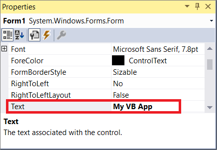

# Quickstart: Use Visual Studio to create your first Visual Basic app
In this 5-10 minute introduction to the Visual Studio integrated development environment (IDE), you'll create a simple Visual Basic application that has a Windows-based user interface (UI).

If you haven't already installed Visual Studio, go to the [Visual Studio Downloads](https://aka.ms/vsdownload?utm_source=mscom&utm_campaign=msdocs) page to install it for free.

## Create a project
First, you'll create a Visual Basic application project. The project type comes with all the template files you'll need, before you've even added anything!  

1. Open Visual Studio 2017.  

2. From the top menu bar, choose **File** > **New** > **Project...**.  

3. In the **New Project** dialog box in the left pane, expand **Visual Basic**, and then choose **Windows Classic Desktop**. In the middle pane, choose **Windows Forms App (.NET Framework)**. Then, name the file `HelloWorld`.  

     If you don't see the **Windows Forms App (.NET Framework)** project template, cancel out of the **New Project** dialog box and from the top menu bar, choose **Tools** > **Get Tools and Features...**. The Visual Studio Installer launches. Choose the **.NET desktop development** workload, then choose **Modify**.  

       

## Create the application
After you select your Visual Basic project template and name your file, Visual Studio opens a form for you. A form is a Windows interface.

We'll create a "Hello World" application by adding controls to the form, and then we'll run the application.   

### Add a button to the form  

1. Click **Toolbox** to open the Toolbox fly-out window.

       

     If you don't see the Toolbox fly-out option, you can open it from the menu bar. To do so, click **View** > **Toolbox**. Or, press **Ctrl**+**Alt**+**X**.
2. Click the **Pin** icon to dock the Toolbox window.

       
3. Click the **Button** control and then drag it onto the form.

     

4. In the **Appearance** section of the **Properties** window, type "Click this", and then press **Enter**.

       

     If you don't see the Properties window, you can you can open it from the menu bar. To do so, click **View** > **Properties Window**. Or, press **F4**.

5. In the **Design** section of the of the **Properties** window, change the name from "Button1" to "btnHelloWord", and then press **Enter**.

     

### Add a label to the form
Now that we've added a button control, which will create the action we want to happen, let's add a label control to send output text to.

1. Click the **Label** control and then drag it onto the form.

2. In the **Design** section of the of the **Properties** window, change the name from "Label1" to "LabelHelloWorld", and then press **Enter**.

### Change the name of the form (optional)

1. In the **Properties** window, type `My VB App` in the **Text** field, and then press **Enter**.

     

2. Notice that the form name changes from "Form1" to "My VB App".

## Add code to the form

1. Double-click the `Click this` button.


 ```vb
 Private Sub Form1_load(sender As Object, e As EventArgs) Handles MyBase.Load
     MessageBox.Show("Hello World!")
 End Sub
 ```  


## Run the application
1. Click **Start** to run the application.  
2. Notice that the label control in your form says "Hello World!"

Congratulations on completing this quickstart! We hope you learned a little bit about Visual Basic and the Visual Studio IDE. If you'd like to delve deeper, please continue with a tutorial in the **Tutorials** section of the table of contents.  

## See also   
* [Build a Visual Basic "Hello World" console app with .NET Core in Visual Studio 2017 ](https://docs.microsoft.com/dotnet/core/tutorials/vb-with-visual-studio)
* [Visual Basic IntelliSense](visual-basic-specific-intellisense.md)  
