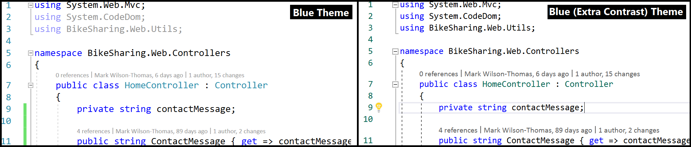
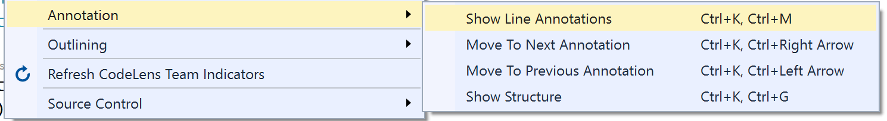
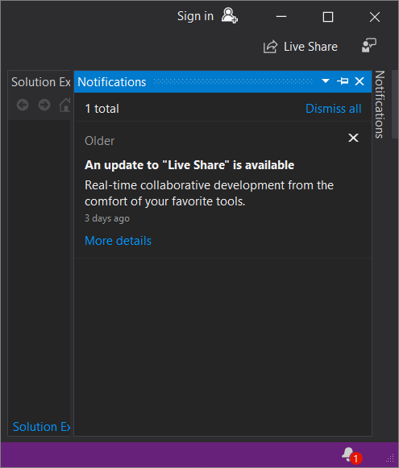
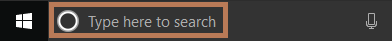
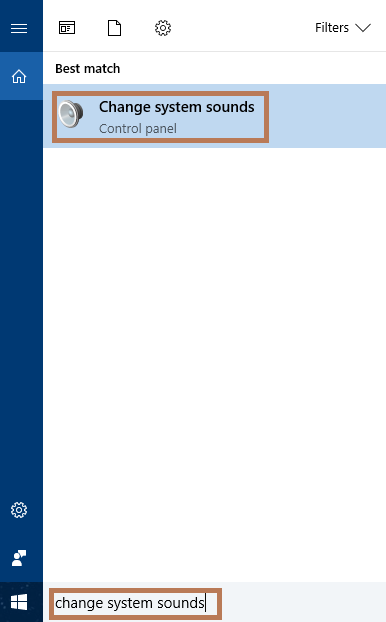
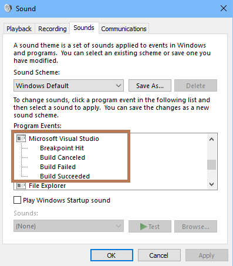

# Accessibility tips and tricks for Visual Studio

Visual Studio has built-in accessibility features that are compatible with screen readers and other assistive technologies. Whether you want to use keyboard shortcuts to navigate the IDE, or use high-contrast themes to improve visibility, you'll find several tips & tricks on this page about how to do so.

We also cover how to use annotations to reveal useful information about your code, and how to set sound cues for build and breakpoint events.

> [!NOTE]
> This topic applies to Visual Studio on Windows. For Visual Studio for Mac, see [Accessibility for Visual Studio for Mac](/visualstudio/mac/accessibility).

## Save your IDE settings

You can customize your IDE experience by saving your window layout, keyboard mapping scheme, and other preferences. For more information, see [Personalize the Visual Studio IDE](../../ide/personalizing-the-visual-studio-ide.md).

## Modify your IDE for high-contrast viewing

For some folks, some colors are more difficult to see. If you want more contrast as you code but don't want to use the typical "High Contrast" themes, we now offer a “Blue (Extra Contrast)” theme.

  

## Use annotations to reveal useful information about your code

The Visual Studio editor includes many text "adornments" that let you know about characteristics and features at particular points on a line of code, such as screwdriver and light bulb icons, error and warning "squiggles", bookmarks, and so on. You can use the "Show Line Annotations" command set to help you discover and then navigate between these adornments.

  

## Access toolbars by using keyboard shortcuts

The Visual Studio IDE has toolbars as do many tool windows. The following keyboard shortcuts help you access them.

|Feature|Description|Keyboard shortcut|
|-------------|-----------------| - |
|IDE toolbars|Select the first button on the Standard toolbar.|**Alt**, **Ctrl**+**Tab**|
|Tool window toolbars|Move focus to the toolbars in a tool window.     **NOTE:** This works for most tool windows, but only when the focus is in a tool window. Also, you must choose the SHIFT key before the ALT key. In some tool windows, such as Team Explorer, you must hold the SHIFT key for a moment before choosing the ALT key.|**Shift**+**Alt**|
|Toolbars|Go to the first item in the next toolbar (when a toolbar has focus).|**Ctrl**+**Tab**|

### Other useful keyboard shortcuts

Some other useful keyboard shortcuts include the following.

|Feature|Description|Keyboard shortcut|
|-------------|-----------------| - |
|IDE|Switch High Contrast on and off.     **NOTE:** Standard Windows keyboard shortcut|**Left Alt**+**Left Shift**+**PrtScn**|
|Dialog box|Select or clear the check box option in a dialog box.     **NOTE:** Standard Windows keyboard shortcut|**Spacebar**|
|Context menus|Open a context (right-click) menu.     **NOTE:** Standard Windows keyboard shortcut|**Shift**+**F10**|
|Menus|Quickly access a menu item by using its accelerator keys. Choose the **Alt** key followed by the underlined letters in a menu to activate the command. For example, to view the Open Project dialog box in Visual Studio, you would choose **Alt**+**F**+**O**+**P**.     **NOTE:** Standard Windows keyboard shortcut|**Alt** + **[letter]**|
|Search box|Use the search feature in Visual Studio.|**Ctrl**+**Q**|
|Toolbox window|Move among Toolbox tabs.|**Ctrl**+**Up arrow**   and   **Ctrl**+**Down arrow**|
|Toolbox window|Add a control from the Toolbox to a form or designer.|**Enter**|
|Options dialog box: Environment > Keyboard|Delete a key combination entered in the **Press shortcut keys** option.|**Backspace**|
|Notifications tool window|Open the Notifications tool window by using two keyboard shortcut key combinations, one followed by the other. Then, view a  notification by using the arrow keys to select it.| **Ctrl**+**&#92;**, **Ctrl**+**N**|

> [!NOTE]
> The dialog boxes and menu commands you see might differ from those described in Help, depending on your active settings or edition.

## Access notifications by using keyboard shortcuts

When a notification appears in the IDE, here's how you can access the Notifications window by using keyboard shortcuts:

1. From anywhere in the IDE, press the following two keyboard shortcuts in sequence, one after the other: **Ctrl**+**&#92;** and then **Ctrl**+**N**.

   The **Notifications** window opens.

   

1. Use either the **Tab** key or the arrow keys to select a notification.

## Use the Sound applet to set build and breakpoint cues

You can use the Sound applet in Windows to assign a sound to Visual Studio program events. Specifically, you can assign sounds to the following program events:

* Breakpoint hit
* Build canceled
* Build failed
* Build succeeded

Here's how:

1. In the **Search** box on a computer running Windows 10, type **Change system sounds**.

   

   (Alternatively, if you have Cortana enabled, say "Hey Cortana", and then say "Change system sounds".)

1. Double-click **Change system sounds**.

   

1. In the **Sound** dialog box, click the **Sounds** tab.

1. In **Program Events**, scroll to **Microsoft Visual Studio**, and then select the sounds that you want to apply to the events that you choose.

   

1. Click **OK**.

::: moniker range="vs-2017"

> [!TIP]
> To learn more about accessibility updates, see the [Accessibility improvements in Visual Studio 2017 version 15.3](https://devblogs.microsoft.com/visualstudio/accessibility-improvements-in-visual-studio-2017-version-15-3/) blog post.

::: moniker-end

## See also

* [Accessibility features of Visual Studio](../../ide/reference/accessibility-features-of-visual-studio.md)
* [How to: Customize menus and toolbars in Visual Studio](../../ide/how-to-customize-menus-and-toolbars-in-visual-studio.md)
* [Personalize the Visual Studio IDE](../../ide/personalizing-the-visual-studio-ide.md)
* [Accessibility (Visual Studio for Mac)](/visualstudio/mac/accessibility)
* [Microsoft Accessibility](https://www.microsoft.com/Accessibility)
