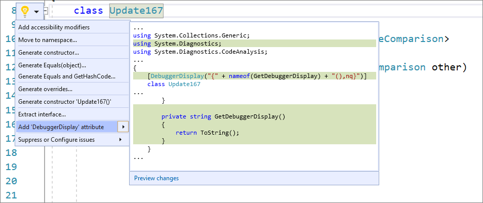

# Add DebuggerDisplay Attribute

This code generation applies to:

- C#

**What:** The [DebuggerDisplay Attribute](../../debugger/using-the-debuggerdisplay-attribute.md) controls how an object, property, or field is displayed in the debugger variable windows.

**When:** You want to [pin properties](../../debugger/view-data-values-in-data-tips-in-the-code-editor.md#pin-properties-in-data-tips) within the debugger programmatically in your code.

**Why:** Pinning properties allows you to quickly inspect objects by their properties by bubbling up that property to the top of the object's property list within the debugger. 

## How-to

1. Place your cursor on either a type, delegate, property, or field. 

2. Press **Ctrl**+**.** to trigger the **Quick Actions and Refactorings** menu and select **Add DebuggerDisplay attribute**.

    

3. The DebuggerDisplay attribute will get added along with an auto method that returns the default ToString(). 

## See also

- [Code Generation](../code-generation-in-visual-studio.md)
- [Preview Changes](../../ide/preview-changes.md)