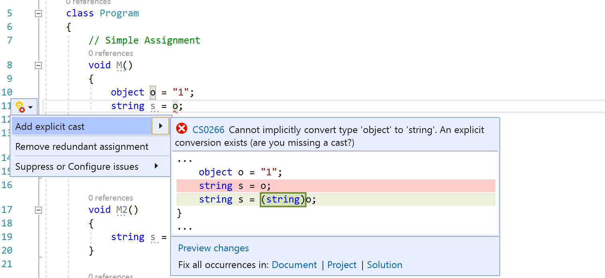
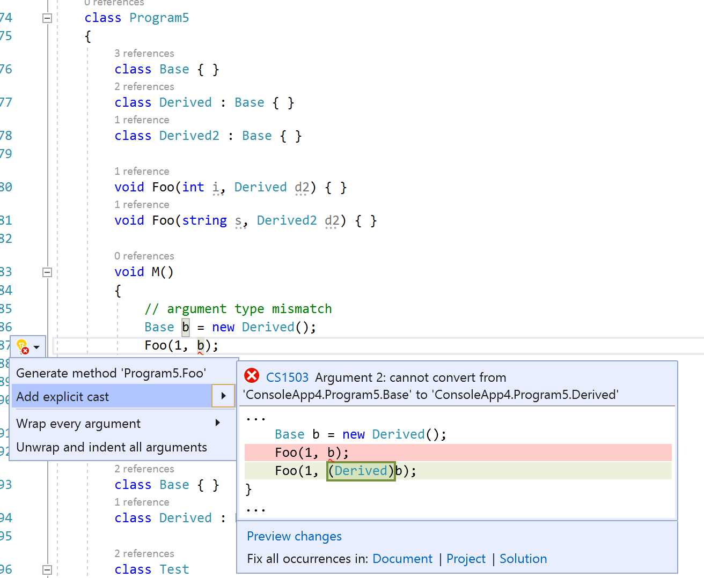

# Add explicit cast to an expression quick action

This code generation applies to:

- C#

**What:** Lets you automatically add explicit cast to an expression, based on usage.

**When:** You need to add explicit cast to an expression and want to properly assign it automatically.

**Why:** You could add explicit cast to an expression manually, however this feature adds it automatically based on the code context.

## How to use it

1. Whenever an expression cannot be implicitly converted to the type that applicable to the expression context,

   A red squiggle appears under the expression.

2. Place your pointer over the red squiggle until the Quick Actions menu appears. Select the **down arrow** on the Quick Actions menu, and then select **Add explicit cast**.

   

   

   > [!TIP]
   > You can also access the Quick Actions menu by placing your cursor on the expression with red squiggle, and then either pressing **Ctrl**+**.** (period) or selecting the light bulb icon in the file margin.

   Visual Studio adds the cast to the expression.

## See also

- [Refactoring](../refactoring-in-visual-studio.md)
- [Tips for .NET Developers](../csharp-developer-productivity.md)